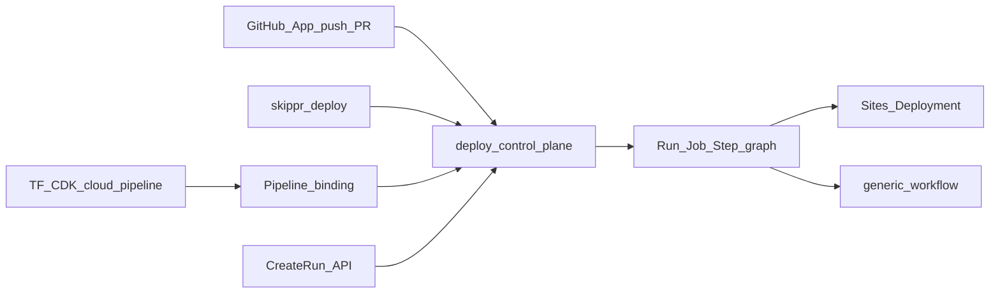
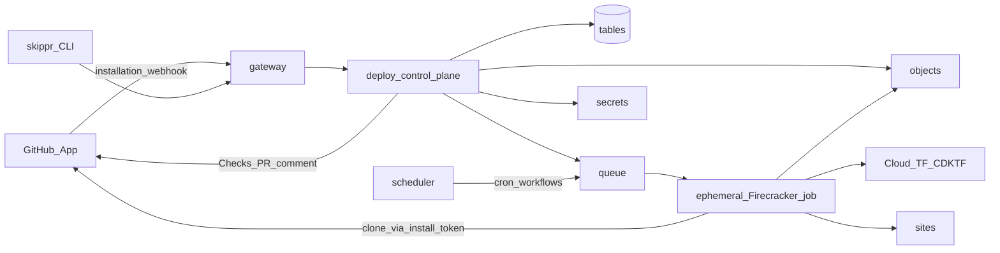
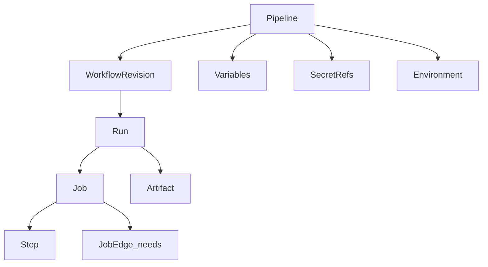

# Skippr Cloud Deploy

**Capability name:** `deploy`. **API prefix:** `CloudDeploy.*`. **Hostname:** `deploy.eu-central-1.cloud.skippr.io`. **Status when first documented:** Preview skeleton, then partial under the usual D42 gate.

This fills the existing Sites gap: [sites.md](cloud/specs/services/sites.md) already says builds run in customer CI, and [roadmap.md](cloud/specs/roadmap.md) calls managed remote builds a separate future contract. Deploy is that contract.

## Why this product

GitHub remaining the git host is acceptable for v1. The switcher value is **Actions compute + vendor lock-in**, not git:

- Independent control plane (queue, schedule, cancel, logs, DAG) even when Actions is degraded.
- Firecracker isolation instead of shared GitHub/Depot VMs.
- Same Cloud as Sites, secrets, objects, and `skippr/cloud` Terraform — one identity, one bill (vCPU + memory + storage + network per D52).
- Dogfood: run [skipprd `.github/workflows/build-publish.yml`](skipprd/.github/workflows/build-publish.yml) and Cloud service pipelines here instead of paying GitHub/Depot.

Honesty: with connect-only, a fully down `github.com` still blocks clone. Mirror/forge is a later phase, not v1.

## GitHub integration (steal the Vercel path)

Vercel, Netlify, Railway, Atlasflow, and Specific all do the same core trick: **the platform owns the build**, GitHub is only the source + review UI. None of them use “OAuth + a webhook secret the customer pastes.” Netlify even migrated off OAuth Apps to a GitHub App for scoped repos, 1-hour tokens, Checks, and PR comments.

### What each product actually does

| Product | Git connect | Happy path | CLI | IaC / policy |
|---------|-------------|------------|-----|--------------|
| **Vercel** | GitHub App | Every push → preview URL; merge to production branch → prod; PR comment + Checks + Deployments API | `vercel` preview, `vercel --prod`; `vercel link`; `vercel deploy --prebuilt` | `vercel.json`; env scoped Preview/Production; OIDC out to AWS |
| **Netlify** | GitHub App (new); OAuth legacy | Git CD; Deploy Previews on PRs; build hooks; Deploy-to-Netlify button | `netlify deploy --prod`; `netlify link` | `netlify.toml` |
| **Railway** | GitHub App | Autodeploy tracked branch; **PR environments** clone the stack; **Wait for CI**; watch paths | `railway up` | service settings; optional GHA |
| **Atlasflow** | GitHub App via `atlasflow github connect` | `projects create --repo` then `git push`; Dockerfile or Railpack detect; health check then traffic | CLI-first, API-equivalent | none really |
| **Specific** | GitHub in dashboard | `specific deploy` first; then GitHub autodeploy; humans lock “allow CLI to production” | `specific deploy --preview` | `specific.hcl`; agents stay inside human GitHub policy |

### Steal these (especially Vercel)

1. **GitHub App, not OAuth.** Install on user/org with all-or-selected repos. GitHub creates the webhook. Clone with a short-lived installation token. Post **Checks** and a **PR comment** with the preview URL. Drive GitHub **Deployments API** so other checks (Playwright, etc.) can consume the URL. Classic OAuth Apps, deploy keys, and customer-pasted webhook secrets are forbidden.
2. **Zero-config Site pipeline.** Connecting a repo to a Site does **not** require workflow YAML. Implicit graph: checkout → framework detect → install → build → `CreateDeployment` / `CompleteDeployment` → preview hostname; production branch also `PromoteDeployment`. This is the Vercel experience. GHA YAML is the power path for skipprd and generic CI.
3. **Production branch vs everything else.** One production branch (`main` default, configurable). Every other branch/PR is a preview. Sites already has `{deployment_id}--{site_id}.sites.skippr.io` and first-CLI-deploy-promotes; keep that contract.
4. **Latest-commit-wins queue.** New push on the same branch cancels queued older Runs (Vercel `autoJobCancellation`). Always ship HEAD.
5. **Fork protection.** PRs from forks do not get secrets and do not promote until a Cloud member authorizes (Vercel Git Fork Protection). Commit author on private org repos must map to a Cloud principal.
6. **Framework auto-detect** from the same adapters Sites already has (Vite/Next/Astro/…). Override with `skippr.toml`: install/build/output, root directory, production branch, ignore paths. Blank build command = static upload.
7. **System env on every job:** `SKIPPR=1`, `CI=1`, `SKIPPR_ENV=production|preview`, `SKIPPR_URL`, `SKIPPR_GIT_COMMIT_SHA`, `SKIPPR_GIT_REF`, `SKIPPR_DEPLOYMENT_ID` (Sites id when present). Env vars scoped Preview vs Production vs named Environment (not one flat bag).
8. **`[skip ci]` / `[skip skippr]`** in the commit message (Specific + GHA convention).
9. **Ignored build step / watch paths** for monorepos (Vercel skip unaffected + Railway watch paths). v1.1, not a blocker.
10. **Deploy hook URL** per Pipeline (Netlify/Vercel) for CMS rebuilds — `CreateRun` with a signed token, no git event.
11. **Instant rollback** = Sites `PromoteDeployment` of a previous READY Deployment. Do not rebuild to roll back.
12. **CLI is the same pipeline as git**, not a side door: `skippr deploy` creates a Run (or uploads a prebuilt SiteBundle like `vercel deploy --prebuilt`). Optional later: lock production to Git-only (Specific’s “allow CLI deploys” toggle).
13. **Shallow clone** (`--depth=10`) unless the workflow asks otherwise.

### Do not copy

- Railway **Wait for GitHub Actions** as the default — we *are* the CI. Optional later if a tenant still runs tests on GHA.
- Railway/Specific **full-stack PR copies of databases**. v1 previews are Sites (and declared Cloud resources), not branched FDB.
- Netlify Drop / anonymous claim as a v1 surface.
- Storing a user GitHub PAT in **secrets** for the platform clone path.

### GitHub App vs “OAuth hooks”

Two different OAuth-shaped things; only one is the git integration:

| Mechanism | Use |
|-----------|-----|
| **Skippr GitHub App** | Repo list, clone, webhooks, Checks, PR comments, Deployments API. This is the integration. |
| **Cloud directory login** | Existing **auth** SSO (“Log in with GitHub”) so commit authors map to Cloud users. Not how we clone. |
| **Installation token** | Minted per Run, ~1h, for `git clone` and GitHub API. Never a long-lived PAT. |

User OAuth Apps as the git connector are a known dead end (Netlify’s old path).

## Three entry points, one Run



- **Git push** — default for connected Pipelines.
- **CLI** — local, agents, and prebuilt uploads.
- **TF/CDK** — durable binding only (`cloud_pipeline`, variables, secret refs, which Site, production branch). Never the Run itself.
- **API / deploy hook** — CMS, custom systems.

## CLI (required, not a follow-up)

`skippr` becomes an AWS-style umbrella binary. Service name is the first subcommand. ELT moves under `elt` so Deploy/Sites can sit beside it without colliding.

Today the product CLI (`crates/skippr-cli`, [docs/docs/cli/overview.md](skipprd/docs/docs/cli/overview.md)) is flat: `skippr sync`, `skippr model`, `skippr discover`, `skippr user`, …. That was fine when ELT was the only product. It is not fine once `skippr deploy` exists.

### Target shape

```text
skippr login | logout | whoami        # identity (today: skippr user …)
skippr github connect                 # GitHub App install URL
skippr link                           # bind cwd → Cloud Pipeline + Site; .skippr/project.json
skippr deploy [--prod] [--prebuilt]
skippr env pull

skippr elt init | connect | doctor | config | reset
skippr elt discover | sync | query | metadata
skippr elt model | dbt | test | plan | ask | chat | lineage
skippr elt vector | thread | feedback | runs
```

Like `aws s3 ls` / `aws dynamodb query`: the binary is `skippr`, the product is the next word.

### Hard cutover (no aliases)

Same change deletes the old top-level ELT verbs. `skippr sync` MUST fail with a short “use `skippr elt sync`” error, then we can drop even that after docs settle — do **not** keep a silent alias that runs the old command. Update in the same change:

- [crates/skippr-cli/src/main.rs](skipprd/crates/skippr-cli/src/main.rs) `Cmd` enum: wrap today’s variants under `Elt { #[command(subcommand)] action: EltCmd }`
- [docs/docs/cli/](skipprd/docs/docs/cli/) and public `/elt/` VitePress pages
- E2E / AGENTS.md examples (`skippr doctor`, `discover`, `sync`, `model`)
- react data-engineer suite strings (`skippr sync --pipeline … --once`)
- GitHub workflows and getting-started that invoke the CLI

`skippr user` folds into top-level `login` / `logout` / `whoami` (shared by ELT workspace locks and Cloud). `skippr elt` still takes `--config skippr.yml` for pipeline work.

### What does not move

- **`skipprd`** stays the lightweight engine binary: `skipprd discover`, `skipprd sync`, … (Lambda images, plugin tests). It is not the customer product CLI.
- ELT `--pipeline` flag remains the skippr.yml pipeline name. Cloud **Pipeline** is a different resource, reached only via `skippr deploy` / `skippr link` / TF `cloud_pipeline`.

`link` + `.skippr/project.json` is Specific/Vercel “remember the project.” First `deploy` may create the Site + Pipeline if TF has not. After TF owns those resources, CLI only creates Runs.

This CLI reorg can land **before** Deploy runners exist. It unblocks docs and E2E, and makes `skippr deploy` an empty-or-stub subcommand until D2.5.

## Two Pipeline kinds

| Kind | When | Workflow |
|------|------|----------|
| **Site** (implicit) | Pipeline `site_id` set, no YAML required | checkout → detect → build → Sites Deployment |
| **Workflow** (explicit) | `.github/workflows/*.yml` or `.skippr/workflows/*.yml` | parsed GHA DAG (skipprd, terraform apply, arbitrary CI) |

A repo can have both: implicit Site build **and** a workflow that runs tests. They are separate Runs, same SHA, both reported as GitHub Checks.

## Naming lock (avoid Sites collision)

Sites already owns **Deployment** (immutable web artifact, `CreateDeployment` / `PromoteDeployment`). Deploy must not reuse that noun on the wire.

| Layer | Name | Meaning |
|-------|------|---------|
| Product | **Deploy** | CI/CD capability |
| Stable resource | **Pipeline** | Connected repo + variables + secret refs + defaults |
| Definition | **Workflow** | One YAML file (GHA-compatible) at a git SHA |
| Execution | **Run** → **Job** → **Step** | One graph expansion of one workflow |
| Sites artifact | **Deployment** | Unchanged; a Deploy job *creates* one |

Public copy: “Deploy runs your workflow. Sites serves the Deployment it published.”

## Architecture



**Control plane** is a Firecracker system fleet `deploy` (same pattern as sites/auth): loopback-only, gateway ingress, tenant from JWT (D31), desired state + effect rows in **tables**, competing consumers on **queue**.

**Execution** is **not** functions (too short, no toolchains) and **not** workers (D56 Sites SSR only). Each Job is a one-shot Firecracker guest from a platform **runner pool** system fleet (`deploy-runners`), allocated by D9. This does **not** wait on the public **machines** API (still skeleton). Tenant custom runner images / `runs-on: self-hosted` come later via machines.

Docker is **containers in the guest** (`runc`/`containerd`), never nested KVM. That is enough for GHA `container:` and most `uses:` Docker actions once those are in scope.

Logs and step output go to **objects** (run-scoped keys) until **logs** ships. Meter axes are the existing four (job vCPU-time, memory-time, artifact bytes, egress).

Tiger Style: enqueue of a Run and its Job rows is one tables transaction; runner lease is conditional; terminal Job status is immutable; retry is a new Job generation, not an in-place rewrite.

## Data model (DAG UI from day one)

Persist the **expanded graph**, not only the YAML. The future UI must not re-parse workflow files.



**tables** `cloud-deploy` (sketch):

- `PK=TENANT#{tid}` `SK=PIPELINE#{pid}` — GitHub App installation id + repo, `site_id?`, production branch, kind `site|workflow`, default `runs-on`, concurrency
- `PK=TENANT#{tid}` `SK=GHINSTALL#{installation_id}` — GitHub App install metadata (org, selected repos)
- `PK=TENANT#{tid}#PIPELINE#{pid}` `SK=VAR#{name}` — non-secret env (TF-manageable)
- `PK=TENANT#{tid}#PIPELINE#{pid}` `SK=SECRET#{name}` — **ref only** (`arn:cloud:secrets:…` + optional `VersionId`); ciphertext stays in **secrets**
- `PK=TENANT#{tid}#PIPELINE#{pid}` `SK=ENV#{name}` — `production` / `preview` scopes for later protection rules
- `PK=TENANT#{tid}#PIPELINE#{pid}` `SK=WF#{path}#SHA#{sha}` — parsed workflow IR
- `PK=TENANT#{tid}#RUN#{rid}` `SK=META` — trigger, SHA, status, concurrency key, client token
- `SK=JOB#{jid}` — name, `needs[]`, matrix instance, runner label, status, lease, machine id, timings
- `SK=EDGE#{from}#{to}` — materialized DAG edges after `needs` + matrix expansion
- `SK=STEP#{jid}#{n}` — `run` / `uses`, status, log object key, conclusion
- `SK=ARTIFACT#{aid}` — objects key + digest + retention
- `SK=EVENT#{seq}` — append-only run timeline for UI and `events` fan-out

GSI: pipeline+created_at (run list), status (queue dashboards), git SHA (Sites preview linkage).

Run lifecycle: `QUEUED → RUNNING → SUCCEEDED | FAILED | CANCELLED`. Job/step use the same enum plus `BLOCKED` (waiting on `needs` or a future approval node). Failed Jobs stay immutable; “rerun failed” creates new Job ids linked by `supersedes`.

This is the same shape GitHub/GitLab/Buildkite UIs need: graph of jobs, sequential steps inside a job, log pointers, artifacts, environments as future blocking nodes.

## GitHub Actions YAML: compatible subset, not a GitHub runner

**MUST NOT** register GitHub-hosted or GitHub self-hosted runners. That still dies when Actions is down and is not a Skippr product.

v1 **parses** `.github/workflows/*.yml` (and `.skippr/workflows/*.yml`) into IR.

**Supported in v1**

- `on.push` (branches/tags), `on.workflow_dispatch` (inputs), `on.schedule` (via **scheduler** → queue)
- `jobs.<id>.needs`, `if`, `name`, `runs-on`, `env`, `timeout-minutes`
- `steps[].run` (bash), `steps[].uses` on an **allowlist**, `with` / `env` / `id` / `name`
- `${{ secrets.X }}`, `${{ env.X }}`, `${{ github.sha|ref|ref_name|event_name|event.inputs }}`, `${{ needs.*.result }}`, `${{ steps.*.outputs }}`
- `concurrency` group (cancel-in-progress = v1.1)
- `defaults.run.shell` = bash only

**Mapped, not copied**

- `runs-on: ubuntu-latest` → platform label `skippr-linux-x64` (2 vCPU / 8 GiB default)
- skipprd’s `depot-ubuntu-22.04-16` → `skippr-linux-x64-16` (explicit larger label)
- `GITHUB_TOKEN` → ephemeral Run workload principal (below), **not** a GitHub PAT unless the tenant stored one in **secrets** for API calls to GitHub

**Not v1** (document as coming soon, do not parse-and-ignore silently — D20)

- Arbitrary marketplace `uses:` (JS/composite/Docker)
- Reusable workflows, `workflow_call`, `workflow_run`
- `services:` containers, Windows/macOS
- Environment protection / required reviewers
- GitHub OIDC to AWS (Skippr workload identity replaces this for Cloud)

**Native actions (the integration moat)**

- `skippr/checkout` — clone at Run SHA with the **GitHub App installation token** (not a tenant PAT)
- `skippr/cache` — objects-backed cache (cargo/npm keys)
- `skippr/sites-deploy` — `CreateDeployment` → signed upload → `CompleteDeployment` → optional `PromoteDeployment`
- `skippr/terraform` / `skippr/cdktf` — `init/plan/apply` with Run workload creds against `skippr/cloud`
- `skippr/setup-rust` / `skippr/setup-node` — pinned toolchains on the runner image

A tenant can keep `actions/checkout@v4` in YAML only after a compatibility shim exists; v1 docs tell them to switch those few `uses:` lines. That is a one-time migration, not a rewrite.

## Identity, secrets, env

Each Run mints an ephemeral workload principal `deploy/{pipeline_id}/{run_id}` ([auth workload identity](cloud/specs/services/auth-policies-and-workload-identity.md) already lists “CI deployer”). ABAC is scoped to declared resources (named Site, secret ARNs, object prefix, terraform ops). Creds die when the Run terminals. No long-lived `AKIAPREVIEW`, no `sk_live_` (D43/D44).

Pipeline **variables** are plaintext config (TF-manageable). Pipeline **secrets** are refs into **secrets**; the runner calls `GetSecretValue` at job start and injects env. Log scanner masks secret values. Environment-scoped overrides sit on `ENV#{name}` rows for the DAG UI later.

## Sites and Terraform integration

**Sites (release path)**

Today TF manages `cloud_site` / `cloud_site_domain_binding` only; Deployments stay API/CLI. Keep that split. Git + CLI become the **build** that produces those Deployments.

```text
GitHub App push / skippr deploy
  → Run (implicit Site pipeline or workflow YAML)
  → SiteBundle
  → CreateDeployment + CompleteDeployment
  → preview {deployment_id}--{site_id}.sites.skippr.io
  → GitHub Check + PR comment with that URL
production branch or skippr deploy --prod
  → same + PromoteDeployment (stable hostname)
rollback
  → PromoteDeployment of an earlier READY Deployment (no rebuild)
```

`GetRun` exposes `sites_deployment_id`. Fork PRs: no secrets, no promote, until a Cloud member authorizes.

**Three config layers** (do not collapse)

1. **TF/CDK** — `cloud_site`, `cloud_site_domain_binding`, `cloud_pipeline` (repo + `site_id` + production branch + secret refs + variables). Durable Cloud resources.
2. **`skippr.toml` in git** — framework, install/build/output, root dir, ignore paths, watch paths. Lives with the code (Vercel.json / netlify.toml / specific.hcl).
3. **CLI / dashboard** — trigger Runs, env overrides, `skippr env pull`. Cannot create a second production Site; that stays TF or first `skippr link`.

**Terraform/CDKTF (two directions)**

1. **IaC manages Deploy:** `cloud_pipeline`, optional `cloud_pipeline_variable`. Secret values stay `cloud_secret`; the pipeline holds the name/ARN only. Runs are **not** TF resources (same rule as Sites Deployments). GitHub App installation is created by `skippr github connect` or dashboard; TF references `installation_id` / repo, it does not OAuth as the operator.
2. **Deploy applies IaC:** a workflow job uses `skippr/terraform` with the Run principal to apply the rest of Cloud. State: tenant **objects** backend (design in the spec; do not invent a fifth state product).

D42 still applies when the service ships: catalog + TF + CDKTF TS/Python + `examples/acme` in the same change.

## API surface (v1 ops)

| Op | Role |
|----|------|
| `CreateGitHubInstallation` / `ListGitHubInstallations` | Complete GitHub App install handshake |
| `CreatePipeline` / `Get` / `List` / `Update` / `Delete` | Repo + optional `site_id`, production branch, kind, runner defaults |
| `PutVariable` / `DeleteVariable` / `ListVariables` | Non-secret env (Preview/Production/named) |
| `PutSecretRef` / `DeleteSecretRef` / `ListSecretRefs` | Bind `secrets` ARNs per environment |
| `CreateRun` | CLI, deploy hook, `workflow_dispatch`; client token for idempotency |
| `AuthorizeForkRun` | Member approval for fork PRs |
| `GetRun` / `ListRuns` / `CancelRun` | Run control |
| `GetJob` / `ListJobs` / `GetJobGraph` | DAG payload for UI |
| `GetStepLog` | Signed objects URL |
| `ListArtifacts` | |

GitHub App webhooks hit **gateway** (`CloudDeploy.GitHubWebhook`), verified with the App secret, then `CreateRun`. No tenant-configured webhook secret. `on.schedule` = **scheduler** → deploy queue. GitLab App is the same shape, v1.1.

## Phasing

Depends on shipping **queue**, **scheduler**, **secrets**, **objects**, **auth** workload keys (all Preview partial) and a new runner guest image. Does **not** depend on public machines, logs, streams, or elt.

| Phase | Exit |
|-------|------|
| **D0 spec lock** | `specs/services/deploy.md`, catalog row, candidate **D57**, matrix skeleton, public Preview stub. Roadmap sentence: managed remote builds = Deploy. |
| **D0.5 CLI namespace** | Hard-cutover `skippr elt …` for all current ELT verbs; top-level `login`/`logout`/`whoami`; no `skippr sync` alias. Public `/elt/` docs + E2E in the same change. Can ship before runners. |
| **D1 control plane** | Pipeline + Run + Job graph in tables; `CreateRun` expands YAML `needs` into EDGE rows; no guest yet (fake runner in tests). |
| **D2 hosted runners** | System fleet `deploy-runners`; `run:` bash jobs; log/artifact objects; cancel; concurrency. |
| **D2.5 GitHub App + CLI** | App install, installation-token clone, Checks + PR comment, `skippr login/link/deploy`, implicit Site pipeline, latest-commit-wins, fork protection. |
| **D3 native actions** | `skippr/sites-deploy`, `skippr/terraform`, secret injection, Run workload identity. ACME e2e: git push or CLI → Site preview URL on the PR. |
| **D4 dogfood** | skipprd `build-publish.yml` subset on Deploy (Linux rustc + objects cache + install CDN publish). Larger `runs-on` label. |
| **Later** | JS marketplace shim, matrix, PR checks API, eager git mirror, tenant machines runners, DAG UI, environment approvals, Windows/macOS. |

Do not mark matrix ops `supported` until D42 (API + TF + CDKTF + ACME) is green.

## Non-goals (v1)

- Git forge, PRs, or code search (GitHub remains the review UI)
- GitHub OAuth App / deploy keys / customer webhook secrets as the git connector
- GitHub self-hosted runner protocol
- Full Actions marketplace
- Requiring workflow YAML for a Site preview (the Vercel path must work with zero YAML)
- Replacing Sites Deployment with a Deploy resource
- Running CI inside **functions** or **workers**
- Billing invoices (D28); emit dark meters only
- Claiming GitHub-down clone resilience

## First files when implementation starts

- [cloud/specs/services/deploy.md](cloud/specs/services/deploy.md) (new)
- [cloud/specs/services.md](cloud/specs/services.md) registry row
- [cloud/specs/decisions.md](cloud/specs/decisions.md) **D57**
- [cloud/compat/matrix.yaml](cloud/compat/matrix.yaml) `deploy:` skeleton
- [cloud/specs/roadmap.md](cloud/specs/roadmap.md) replace “managed remote builds remain separate”
- Later same change as code: `services/deploy/`, `deploy/fleets/deploy.json` + `deploy-runners.json`, TF `cloud_pipeline`, `docs/public/deploy.md`

Recommended first implementation slice after spec lock: D1 (graph in tables + tests) before any runner image work.
