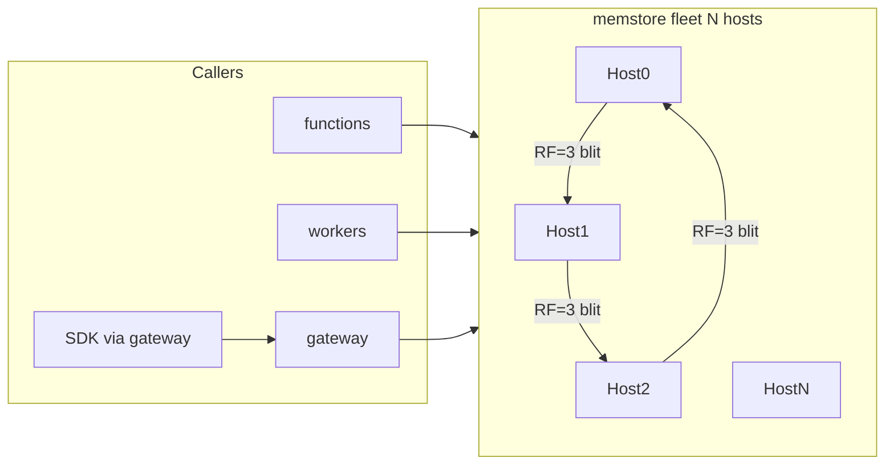
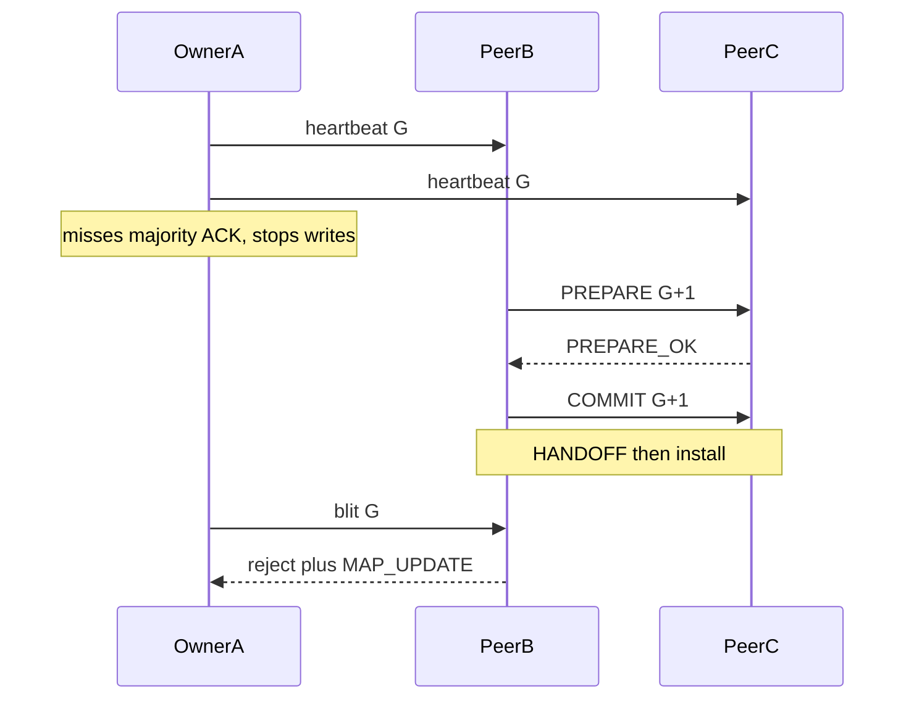

# Memstore implementation plan

Region-local in-memory K/V for Skippr Cloud. Complements [tables](specs/services/tables.md) (durable documents) and [queue](specs/services/queue.md) (work handoff). Durability is **RAM + replica**, TTL required.

Callers: **functions**, **workers**, **gateway** over the private mesh; public `CloudMemstore.*` JSON via gateway (D30).



## 1. Product

**Name (locked):** `memstore`. Wire `CloudMemstore.*`, SigV4 `memstore`, host `memstore.{region}.cloud.skippr.io`, Terraform `cloud_memstore_namespace`. Public sentence: “Put hot keys in memstore.” Docs MAY say in-memory; MUST NOT claim CPU-cache storage; MUST NOT name the product Memory, L1, or Cache.

**v1 ops**

- `Get` / `Put` / `Delete` with `ExpectedVersion` (or must-not-exist).
- `Increment(key, delta, op_id)` — owner-serialized i64; `last_op_id` stored **in the record**.
- Namespace create: quota + `ConsistentRead` (create-time bool, default `false`, not a per-request header).

**Caps**

- Key ≤ **256 B**. Value ≤ **16 KiB**. Header + key + value fit **one** size class.
- Size classes: **128 / 256 / 512 / 1 KiB / 4 KiB / 16 KiB**, each `n × 64` (x86 cache line). Smallest fit wins. No 32 KiB class.
- TTL required or default 24h, cap ≤ 7d. Expiry publishes a tombstone, then deferred-free.
- Default namespace **32 MiB**. Hard cap **256 MiB**. Platform namespaces ~**256 MiB** combined.
- Arena full → admission **fail-closed** (no eviction of other tenants).

**Consistency**

Hash-partitioned **SWMR per key**: one owner serializes writes (OCC there). Distinct keys proceed concurrently (partition concurrency). Not multi-writer. Not distributed OCC. Not LWW across replicas. Blind Put (no expected version) is last-packet-at-the-owner → `vN+1`.

- `ConsistentRead=false` (default): write on owner, ACK after local publish, blit async to the other members of the **slot replica set**. Get may be served by **any replica of that slot** (may be stale). If this host is not in the replica set, forward.
- `ConsistentRead=true`: write on owner, blit to the other RF−1 replicas, ACK after **one replica ApplyACK** (majority of RF; v1 RF=3 ⇒ 2 of 3). Get **owner only**. Do not wait for a fenced/dead replica. Timeout → client error; retry is idempotent Put.

CR=false RMW (`Get` then `Put(expected=got.version)`) can mismatch until the blit lands — correct OCC. Clients that need RMW without extra retries use CR=true.

Public docs MUST say: CR=false may lose the last ACK if the owner dies before the blit.

**Out of v1**

- Redis RESP; RDMA/RoCE; `isolcpus` / DPDK / customer NUMA knobs; PTP/TrueTime; tables owner leases; seqlock; 128-byte hardware CAS; `bytes::Bytes` in the engine; Query/GSI/400 KiB items/cross-key txns (tables); competing-consumer queue (queue/streams); tables CacheMode overlay; WAL/snapshots to objects (later optional).
- **RF=5 / RF=7** as a product knob (same algorithm, larger replica set, majority 3 of 5 or 4 of 7). v1 is RF=3. MUST NOT invent a second engine for that.

## 2. Topology and routing

**Hosts N ≥ 3.** One memstore guest per Ready host. Preview ships 3; a 4th (and later) host is allowed. **MUST NOT** full-copy the working set onto every host once N > RF.

**Replica factor (v1 locked):** **RF=3** per slot. Data quorum = majority of RF = **2 of 3** (owner + one ApplyACK). Cluster membership quorum = **majority of N** (2 of 3, 3 of 4, 3 of 5, 4 of 7, …). Same algorithm later supports RF=5/7 (majority 3/4) without a rewrite; that is a product config, not v1.

**Placement:** Firecracker system fleet, one guest per Ready host, **1 vCPU**, **4 GiB** RAM (8 GiB ceiling later). D9 allocator places it. Not a host systemd unit. Not in the ClusterSpec cold set (`fdb + tables`).

**Slot map** (ownership only, not the key directory):

- `slot = siphash(cluster_key, tenant_id, namespace_id, key) & 16383`
- `cluster_key` from **secrets** / sealed ClusterSpec. MUST NOT be a compile-time constant. v1 does not rotate it.
- `slot_owners[slot]` → packed `(host_index, core_index)` — 16 384 × 2 B ≈ **32 KiB**. Same array on every guest. Lock-free reads.
- v1: `core_index` always `0`. Field exists so later auto-tune can add cores via a generation bump (D35, no `MEMSTORE_CORES` env).
- **Replica set is computed, not stored.** `f(live_members, G, slot)`:
  - `live` = sorted Ready host indexes in view `G`
  - `owner = live[slot % |live|]`
  - `replicas = [owner, next, next]` walking the ring (length RF=3, wrap)
  - N=3 ⇒ every host is a replica of every slot (today’s full copy)
  - N>3 ⇒ each slot lives on 3 of N hosts
- Same `(live, G)` ⇒ same owner map digest. Peer table: `host_index` → pre-authenticated fd.

Routing: compute slot → if local owner, CAS on this core; else send on the owner’s peer fd with `G`, `core_index`, slot. CR=false Get: if local host ∈ replica set, serve local; else forward to a replica (or owner). No gossip on the data path. Packet header always carries `map_generation G`. Stale `G` → reject + **MAP_UPDATE**.

**Handoff (join/leave):** view-change installs `G+1` and a new `live`. Replica sets move. A host newly in a slot’s set **catch-up** that slot from an overlapping Ready replica (per-key max version). A host that left the set MUST NOT serve that slot; it MAY drop those keys (quota). Catch-up/MERGE is **chunked across owner ticks** (control ring still heartbeats); the guest is not Ready for **affected slots** until catch-up finishes. MUST NOT catch-up from a non-Ready peer.

## 3. Engine

Two indexes plus slabs, all guest DRAM (`mmap` / huge pages, not `malloc` per Put). CPU cache is residency, not a second store. No spill-to-heap. Admission = arena full.

- Slot map 32 KiB — routing.
- Key directory — `AtomicU64` buckets, pre-sized `max_keys = quota / 128` (32 MiB → 262 144 × 8 B ≈ 2 MiB). v1 MUST NOT resize. Directory full → fail-closed.
- Size-class slabs — tenant bytes. Index math `base + index * class_size`.

**Record (one aligned block, the wire image):**

```text
0     version: u64
8     flags: u16, klen: u16
12    vlen: u32
16    expire_at: u64          // unix ms
24    last_op_id: [u8; 16]    // Increment; zero otherwise
40    key[klen]
40+klen  value[vlen]
      pad to class
used = 40 + klen + vlen       // pad stays in DRAM, not on the wire
```

Flags include **TOMBSTONE**. D10 packed connection record uses the **512 B** class. Counters use **128**. MUST NOT JSON-encode inside the engine. MUST NOT use `bytes::Bytes` (Arc) in the engine.

**Publish (owner):**

```text
if published.version != expected { mismatch }
# idempotent retry (CR=true timeout):
if published.version == expected+1 and payload matches { ACK that version }
slot = alloc_from_size_class()     // fail-closed if empty
fill slot (payload, expected+1)
old = directory.cas(bucket, new_slab)   // 8-byte publish
deferred_free.push(old)
```

Never mutate a published record. Never 128-byte `cmpxchg`. Never seqlock. Replica apply is fill-new-slot + cas **only if** `incoming.version > published.version` (complete records, not deltas; v6 after v7 is rejected).

**Directory buckets:** `EMPTY | LIVE(slab) | DIR_TOMBSTONE`. Get: load, probe, follow slab, compare key. Concurrent Get sees old or new pointer. Sweeper that frees a **value** tombstone MUST write **DIR_TOMBSTONE**, not EMPTY (open-addressing probe chain). Insert MAY reuse DIR_TOMBSTONE. Owner/apply is the only mutator.

**Delete:** tombstone `{version: expected+1, flags: TOMBSTONE}` in the smallest class that fits the key. Get → not-found. Recreate: `Put` with `expected = tombstone.version`. MUST NOT leave a directory hole.

**TTL:** lazy Get of `expire_at < now` is a miss (does not free). Owner sweeper publishes tombstone (`version++`), then deferred-free. Replica applies tombstone via version rule; a late blit of the live record is rejected. Tombstones occupy quota until swept. Grace is a fixed ceiling (seconds), auto-tuned, not an env knob.

**Increment:** i64 in the 128 B class. Duplicate `last_op_id` returns the current value without bumping. Missing key creates.

**Deferred-free / pin:**

```text
on swap: old.free_after_epoch = epoch+2; pin_count as tracked
sweeper: if now >= free_after_epoch && pin_count == 0 → free list
```

Mesh Get/blit pins the slab index in the in-flight table until send CQE, and until **ApplyACK** for CR=true. Gateway JSON (D30): pin, copy-out, unpin — a Tokio worker MUST NOT hold a raw slab pointer across `await`. Owner OCC that only reads `header.version` on the same tick needs no pin.

**Owner loop** (one per host in v1). Control frames MUST NOT be dropped (shed data instead):

```text
loop:
  drain_control_ring()       # heartbeat, PREPARE, COMMIT, MAP_UPDATE — first, cap 32
  maybe_send_heartbeat()     # if due, even when the data ring is full
  drain_data_ring(fair_batch)
  harvest_CQEs_and_ApplyACKs()
  sweep_deferred_free()
```

Fair data batch: auto-tuned under a ceiling, **per-tenant cap inside the batch** (e.g. max 64). Ingress quotas (ops/s + in-flight) at mesh/gateway; excess never enters the ring.

**In-flight table:** pre-allocated (e.g. 4096), `u16` index, no heap per op.

- CR=false: ACK client on local publish; blit fire-and-forget to the other RF−1 replica-set members; send CQE only unpins.
- CR=true: occupy slot with client cookie + slab pin; blit to the **other RF−1 replicas**; **ACK client only on first replica ApplyACK**. Local send CQE MUST NOT ACK the client.
- At most **one outstanding CR=true write per key**. Different keys pipeline. CR=false may pipeline same key (v6 then v7); replica still `incoming.version > local`.
- Cap outstanding CR=true writes to table size; excess waits at ingress.

v1 I/O: Tokio + pinned owner thread + bounded rings is allowed. **io_uring** is an optimization after a Firecracker/jailer proof, not a correctness gate. Not RDMA.

## 4. Cluster protocol

Safety = epoch `G` on every packet. Clocks are not in the safety argument. Liveness = heartbeat + timeouts (partial synchrony; FLP). MUST NOT tables owner leases. MUST NOT successor `sleep(ttl)` as the fence. MUST NOT PTP.

Namespace **config** (quota, CR flag) lives in **tables**. Slot map / ownership does not. Data is RAM only: restart = empty arena + rehydrate config.

**Heartbeat:** cluster-wide among Ready memstore peers. Majority ACK = **majority of N**. Owner that misses that **stops writes immediately** (holder TTL on *its* clock). MUST NOT keep ACKing CR=false after it knows it is not in the membership majority. Period = hundreds of ms, auto-tuned, not an env knob.

**View-change** (not on the Put path). View id = `(G, membership_bitmap, slot_map_digest)` with `digest = siphash(cluster_key, f(membership))`.

- Data quorum is majority of **RF** (v1: 2 of 3). Membership quorum is majority of **N**. Self-only PREPARE MUST NOT install.
- Proposer = lowest `host_index` among putative live. If silent for one heartbeat period, next-lowest. Higher `G` wins. Same `G` different digest → **abort**. A replica that prepared `G+1` MUST NOT propose `G+2` until a backoff tick.

```text
On missed heartbeat from P for T_fail: mark P suspect
live = Ready memstore hosts minus suspects
if |live| < majority(N): do nothing

if I am proposer:
  new_G = local.G + 1
  new_map = f(live)                              # owners; replica sets derived
  digest = siphash(cluster_key, new_map)
  send PREPARE(new_G, live, digest) to live ∪ {self}
  wait PREPARE_OK from majority of N
  send COMMIT(new_G, live, digest)
  on majority COMMIT_OK: HANDOFF then install then serve

if I receive PREPARE:
  if PREPARE.G < local.G: REJECT
  if PREPARE.G == local.G and digest != prepared: REJECT
  if digest != siphash(cluster_key, f(PREPARE.live)): REJECT
  fence writes for T_prepare
  PREPARE_OK
if COMMIT matching prepared (G, digest):
  HANDOFF: catch-up slots newly in this host's replica sets
           from overlapping Ready replicas (per-key max version)
  install map; COMMIT_OK
if no COMMIT before T_prepare:
  unfence; remain on old G
```

PREPARE/COMMIT with the same `(G, digest)` is idempotent ACK.

**HANDOFF before serve:** W=2 of RF means a write may live on owner+B while C is the new owner, or D is a new replica. Chunked catch-up/MERGE on the data ring; **control ring still first every tick**. Not Ready for affected slots until done. Skipping handoff ⇒ silent miss after failover or after a 4th host joins (breaks D10).

**JOIN:** empty arena. Learn `(G, map)` from **membership majority**. Catch-up **only slots for which this host is in the replica set**, from every overlapping Ready replica (per-key max version). MUST NOT catch-up from a non-Ready peer. MUST NOT serve those slots during catch-up. Heartbeat/view-change MAY run. New Puts apply if `incoming.version > local`.

**CR=true:** blit to the other RF−1 members of the slot replica set; wait for **one ApplyACK**. Do not wait for a fenced member. Timeout → client error; retry uses idempotent Put. After `G+1`, the old owner cannot get ApplyACK from the new replica set (self-fencing). CR=false can still ACK locally until holder TTL; those keys are lost to the surviving replica set.

**MAP_UPDATE:** reject `G` mismatch with `{G, membership, slot_map}` (32 KiB is fine on mesh). Client (gateway/functions/workers) caches `(G, slot_owners)`, installs, recomputes owner, retries to the **new** owner. At most **3** hops per request, then fail. MUST NOT retry the dead primary. MUST NOT drop silently. Malformed reject without a map: fail; client MAY `GetMap` from a live peer.



## 5. Auth and mesh

**Not in the owner loop.** Unauthenticated bytes never enter the ring.

- Tenant `CloudMemstore.*`: gateway hop + JWT; service-front ABAC (`memstore:Get` / `Put` / …) like tables (D31). Empty PolicySet ⇒ Deny.
- Peer blit / heartbeat / PREPARE / COMMIT / MAP_UPDATE / JOIN: existing [`peer_auth.rs`](crates/api/src/peer_auth.rs) (`x-cloud-peer-token` / GuestCredentialBroker). Add `PeerRole::Memstore`.
- Engine reads/writes **pre-authenticated fds** only (handshake at the service front). MUST NOT raw UDP. MUST NOT invent memstore mTLS in the core. MUST NOT trust the vSwitch.
- Guests: `GuestMeshCatalog`; MUST NOT hairpin public hostnames (D37).
- Platform namespaces (D10, D29, OTP): D43 mesh creds + peer identity. MUST NOT wait on tenant PolicySet.
- CreateNamespace does not run on the CAS loop.

## 6. Fleet, NUMA, bring-up

**Bring-up:** `fdb → tables → allocator (OCC snapshot in tables) → secrets → memstore → auth → gateway → …`

- Cold ClusterSpec set stays **fdb + tables** (tables `desired_count: 1` per Ready host, not allocator-placed).
- memstore **before auth** (OTP fail-closed) and **before gateway** (D10/D29).
- Gateway MUST NOT go Ready until a memstore Get/Put on that host succeeds.
- memstore MUST NOT wait on auth.
- **Platform namespaces cold-seeded** by fleet-agent from ClusterSpec/tables once memstore is listening (not Terraform — otherwise Ready deadlocks).
- Allocator snapshot: **one** tables item, conditional Put on `revision` / lease owner. `MAX_ENCODED_SNAPSHOT_BYTES` **≤ 400 KiB**. `MAX_ASSIGNMENTS` derived; fail-closed if over. MUST NOT chunk. MUST NOT keep 1 MiB. Local file cache = crash-recovery only. MUST NOT store allocation in memstore. MUST NOT use the R2 ClusterSpec OCC slot for the 15s lease.

**NUMA (fleet-agent, before jailer exec).** TDD against a fake sysfs tree. Today [jailer.rs](services/fleet-agent/src/jailer.rs) `build_jailer_argv` has no `--cgroup`.

```text
nodes = /sys/devices/system/node/nodeN   (skip offline)
if nodes.len() <= 1:
    Placement::NoOp          # Preview Ryzen 5 3600
else:
    node = one node with memory + online CPU
    cpu  = one CPU from node/cpulist
    Placement::Bind { cpuset.cpus, cpuset.mems }
```

On Bind add `--cgroup cpuset.cpus=<cpu>` and `--cgroup cpuset.mems=<node>`. NoOp leaves argv unchanged. MUST NOT treat CCX/L3 as NUMA. MUST NOT add `MEMSTORE_NUMA_NODE` / `isolcpus`. Missing sysfs → log and NoOp (dev/macOS); Linux metal with `node1` → Bind **required** for the memstore fleet only. First-touch the arena on the owner thread. Later multi-core still one NUMA node. Replica blits still cross hosts.

**Capacity (4 GiB guest, ~3.5 GiB usable):** each host stores keys for slots where it is in the RF=3 replica set. N=3 ⇒ full copy (~RF/N = 1). N=6 ⇒ about half the working set per host. 30 × 32 MiB logical + 256 MiB platform still fits Preview. 30 tenants × 1M keys does not — quotas stop it. D10 at 100k connections × 256 B ≈ 25 MiB logical. L2/L3 do not extend product capacity.

**Billing (D52):** memstore-time (reserved arena) + network bytes + a little vCPU-time.

## 7. Platform cutovers (same change; hard-delete; no shim)

**main MUST NOT** contain a half-wired memstore. Allocator state lives in tables. Gateway sockets are process-local RAM (D10).

- `cloud-gateway-ws` (D10) → memstore, CR=true platform namespace
- `CLOUD_ALLOCATION` (D9) → tables, ≤ 400 KiB snapshot

**D10** — key = 16-byte `ConnectionId`. Packed **512 B** record, not JSON:

- `connection_id` 16 B UUID; `tenant_id` 64 B; `api_id` 64 B; `gateway_node_id` 32 B; `connected_at` u64 ms; `authorizer_type` enum; `user_pool_id` 64 B; `principal_id` 128 B.
- MUST NOT store JWT, PolicySet, or request bodies. CONNECT overflow → fail-closed.
- JWT stays on the owning gateway process ([`run_socket`](services/gateway/src/ws.rs)). PolicySet stays in auth. v1 does not re-auth per frame. Other nodes only PostToConnection.
- TTL ≥ max connection duration (24h). Memstore or process loss → connections drop; clients reconnect.

**D48** — form `rl/…` buckets MAY live in memstore (`Increment` + TTL), fail-closed if down. WorkersEdgeState in tables remains authority for routes, ISR pointers, share records, control nonces. memstore MUST NOT hold those.

**D51** — Ready/recover evidence uses the **tables allocation snapshot**, not `KV_CLOUD_ALLOCATION`.

**Named consumers** (each MUST appear in the owning service spec: engine, key shape, TTL, fail-closed vs open, CR):

- Gateway D10 — CR=true, 512 B, fail-closed for CONNECT/PostToConnection miss semantics as specified.
- Gateway D29 — `Increment` + TTL; **fail-closed 429** if memstore down ([`ratelimit.rs`](services/gateway/src/ratelimit.rs)).
- Workers form buckets — `Increment` + TTL; fail-closed; D48 amend.
- Auth OTP / confirm throttles — short TTL counters; **fail-closed reject** (must not loosen security).
- Data-plane idempotency / replay nonces — tiny keys, seconds-to-hours TTL. Durable control-plane idempotency stays in tables.

**Keep out of memstore:** GuestCredentialBroker / function workload keys (G6); gateway TLS private keys; assembled PolicySet (256 KiB); WorkersEdgeState pointers; scheduler; queue/streams/events; secrets plaintext; billing ledgers; skipprd offsets.

## 8. Specs, D42, and code map

**D42 in the same change:** Rust catalog + handlers + [compat/matrix.yaml](compat/matrix.yaml) + specs + [docs/public](docs/public/) Preview + Terraform `cloud_memstore_namespace` (Create/Read/Update-or-replace/Delete/Import + inventory) + CDKTF TS **and** Python + [examples/acme](examples/acme) e2e.

**Specs to add/amend**

- New: [specs/services/memstore.md](specs/services/memstore.md); matrix row; [specs/services.md](specs/services.md); [docs/public/memstore.md](docs/public/memstore.md) (Preview; no Firecracker/vSwitch/io_uring).
- Amend: [decisions.md](specs/decisions.md) D9, D10, D38, D48, D51; [cluster-lifecycle.md](specs/cluster-lifecycle.md); [substrate.md](specs/substrate.md); [gateway.md](specs/services/gateway.md) §13.9; [workers.md](specs/services/workers.md); [sites.md](specs/services/sites.md); [cloudflare.md](specs/cloudflare.md) ISR row; [docs/internal/system-fleets.md](docs/internal/system-fleets.md); [docs/internal/fleet-agent.md](docs/internal/fleet-agent.md); [AGENTS.md](AGENTS.md).

**New code:** `services/memstore/`; `PeerRole::Memstore` in [peer_auth.rs](crates/api/src/peer_auth.rs); jailer `--cgroup` on Bind only.

**Hard-delete:** leftover allocator KV stores; gateway `cloud-gateway-ws`; fleet-agent assignment loaders/comments; `crates/fleet-spec/tests/{cluster_spec,d47_protocol,runtime_proofs}.rs`; `services/fleet-agent/tests/control.rs`; `services/metal/src/qemu_flash_fixture.rs` `critical_streams`.

## 9. TDD (failing tests first)

Engine: OCC mismatch; idempotent Put (`expected+1` + matching payload); Increment duplicate `op_id`; Delete/TTL tombstone Get; DIR_TOMBSTONE probe after free; directory full fail-closed; quota; pin across a fake await (UAF); CR=false same-key v7 then v6 apply reject.

Cluster: PREPARE same-G different digest abort; PREPARE timeout unfence; HANDOFF-before-serve (write on A+B, C becomes owner, Get hits); JOIN catch-up only replica-set slots; host 4+ join changes replica sets without full-copy; CR=true ACK only on ApplyACK (send CQE must not ACK); CR=true Get-to-owner (replica miss after W=2); stale `G` + MAP_UPDATE ≤3; unauthenticated blit rejected at the front; holder TTL stops CR=false writes; membership minority no `G+1`.

Fleet: fake-sysfs `Placement::NoOp` vs `Bind`; Bind-only cgroup flags.

Cutover: allocator snapshot OCC + 400 KiB fail-closed; D10 CONNECT overflow; OTP/D29 fail-closed if memstore down; gateway Ready requires memstore proof.

## 10. Implementation order

1. Specs + matrix stub + the failing tests in §9 (no feature code).
2. Engine (arena, directory, publish, tombstones, pin, owner loop) until unit tests green.
3. Cluster protocol (view-change majority of N, HANDOFF, JOIN replica-set catch-up, ApplyACK, MAP_UPDATE, heartbeat) until unit tests green.
4. Service front + mesh codec + pre-auth fds + ABAC.
5. Fleet: jailer Bind, `cluster_key`, cold-seed platform namespaces, bring-up order.
6. D42 catalog / TF / CDKTF / ACME.
7. Wire D10, D9, D29, OTP, form buckets; D51 evidence.
8. Public docs (Preview, honest CR=false).

Stacked PRs are fine; do not land a half-wired service on main.

## 11. Residual contracts (do not “fix” with tables)

- CR=false island false-ACK until holder TTL.
- Process death without catch-up = empty replica (not Ready for its slots).
- OTP/D29 fail-closed if memstore is down.
- io_uring in jailer unknown — Tokio+pinned thread allowed in v1.
- Allocator 400 KiB cap is its own fail-closed.
- Liveness is not a theorem (FLP / heartbeat timeouts).
- HANDOFF copies up to the slots this host newly owns — rare, not the Put path. Chunked so heartbeat is not starved.
- Gateway JSON will not see cache-line latency; mesh callers will.
- RF=5/7 is the same code path later; not a v1 product knob.
