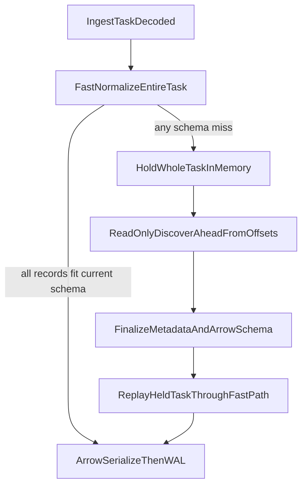

# Discover-Ahead Schema Finalization

## Feasibility

This is feasible and reasonably safe if implemented as a staged refactor rather than a direct reuse of `main.rs -> discover()`. The current code already has three useful pieces to build on:

- A serialized schema mutation lane in `[/Users/huders2000/Documents/sites/skippr/skipprd/src/ingest_work.rs](`src/ingest_work.rs`)` via `EVOLUTION_LOCKS` and `ensure_slow_ingest_worker()`.
- A discovery engine in `[/Users/huders2000/Documents/sites/skippr/skipprd/src/discover/mod.rs](`src/discover/mod.rs`)` that aggregates type evidence across many records and only finalizes `determined_type` after repeated observations.
- A discover-mode branch in `[/Users/huders2000/Documents/sites/skippr/skipprd/src/ingest_work.rs](`src/ingest_work.rs`)` that already avoids WAL/output writes by short-circuiting before sync-mode persistence.

The main safety caveat is that `main.rs -> discover()` is not currently read-only enough to call in-band. It opens the real offsets DB, boots output plugins, may sync external schemas, and persists metadata on completion. A new pure discover-ahead runner should be extracted instead.

## Current Risks To Address

- Schema mutation and value repair are currently coupled in `[/Users/huders2000/Documents/sites/skippr/skipprd/src/ingest_work.rs](`src/ingest_work.rs`)`, `[/Users/huders2000/Documents/sites/skippr/skipprd/src/ingest/ingest.rs](`src/ingest/ingest.rs`)`, and `[/Users/huders2000/Documents/sites/skippr/skipprd/src/discover/evolution.rs](`src/discover/evolution.rs`)`.
- `ensure_slow_ingest_worker()` clones and later replaces the whole `METADATA` snapshot, which can overwrite concurrent metadata changes.
- The existing discover path is not a correct “ahead from offsets” pass because source plugins mostly filter by `Closed`, while per-record `Position` handling only happens later inside sync ingest.
- `Offsets` is not a real snapshot API today; it lacks a typed immutable read view and currently stores `Position`/`Closed` in a lossy way.

## Target Flow




## Implementation Strategy

### 1. Separate schema mutation from slow value fixing

Refactor the current slow path so schema discovery/mutation is a distinct phase from per-record repair.

Files:

- `[/Users/huders2000/Documents/sites/skippr/skipprd/src/ingest_work.rs](`src/ingest_work.rs`)`
- `[/Users/huders2000/Documents/sites/skippr/skipprd/src/ingest/ingest.rs](`src/ingest/ingest.rs`)`
- `[/Users/huders2000/Documents/sites/skippr/skipprd/src/discover/evolution.rs](`src/discover/evolution.rs`)`

Key changes:

- Extract a pure “mutate metadata + rebuild schema” helper out of `ensure_slow_ingest_worker()`.
- Keep `slow_ingest_blocking()` as the fallback value normalizer after schema is finalized, not the place that decides schema.
- Remove hidden metadata mutation from the value-fixing path where possible, especially the paths in `Evolution::apply_evolution_factory()` that call `discover_ingest()` opportunistically.

Essential code seam:

```15:20:src/ingest_work.rs
static SCHEMA_PREP_LOCKS: once_cell::sync::Lazy<DashMap<String, Arc<std::sync::Mutex<()>>>> =
    once_cell::sync::Lazy::new(|| DashMap::new());
static EVOLUTION_LOCKS: once_cell::sync::Lazy<DashMap<String, Arc<std::sync::Mutex<()>>>> =
    once_cell::sync::Lazy::new(|| DashMap::new());
```

Use these locks to serialize the new schema-finalization step per namespace.

### 2. Add task-wide holdback in `process_batch()`

When any record in an ingest task hits a schema miss, freeze the whole task before WAL/offset advancement.

File:

- `[/Users/huders2000/Documents/sites/skippr/skipprd/src/ingest_work.rs](`src/ingest_work.rs`)`

Key changes:

- Split `process_batch()` into clearer phases:
  - decode source records
  - first fast-pass attempt
  - detect schema-pending condition
  - hold entire task in memory
  - finalize schema
  - replay held task
  - Arrow serialize and flush
- Introduce a task-local pending structure that stores source records and their offset context for replay.
- Do not enqueue any part of the task into `buf` / `raw_values` for WAL until schema finalization succeeds.

Essential code seam:

```1241:1278:src/ingest_work.rs
if METADATA.load().metadata.get(&skpr_namespace).is_none() {
    let mut new_pm = METADATA.load().as_ref().clone();
    new_pm
        .metadata
        .insert(skpr_namespace.clone(), Metadata::new().unwrap());
    METADATA.store(Arc::new(new_pm.clone()));
}

let msg = match METADATA.load().metadata.get(&skpr_namespace) {
    Some(metadata) => fast_path_ingest(...),
    None => Err(...),
};
```

This is the place to convert “single-record fallback” into “whole-task holdback + schema finalization”.

### 3. Extract a pure read-only discover-ahead runner

Do not call `main.rs -> discover()` directly. Extract the record-sampling logic into a reusable bounded runner that observes source data without writing offsets, WAL, or output.

Files:

- `[/Users/huders2000/Documents/sites/skippr/skipprd/src/main.rs](`src/main.rs`)`
- `[/Users/huders2000/Documents/sites/skippr/skipprd/src/ingest_work.rs](`src/ingest_work.rs`)`
- `[/Users/huders2000/Documents/sites/skippr/skipprd/src/discover/mod.rs](`src/discover/mod.rs`)`

Key changes:

- Lift the discover-mode sampling logic out of `discover()` / `ingest_file()` into a pure function such as `discover_ahead_from_batches(...)` or `discover_ahead_from_offsets(...)`.
- Keep side effects separate:
  - source reading and schema inference in one layer
  - metadata publish / schema rebuild in another layer
- Bound the discover-ahead pass by record count, bytes, and maybe wall-clock time.

Essential code seam:

```754:815:src/ingest_work.rs
match CLI_MODE.read().clone() {
    Mode::Sync(_) => {}
    _ => {
        let max_records = 1000;
        /* schema inference only */
        return ThroughputMetrics { ... };
    }
}
```

This existing discover branch is the best starting point, but it needs to be detached from CLI mode and made callable from sync ingest.

### 4. Make source scanning truly offset-aware for discover-ahead

A discover-ahead pass must start from current ingest progress, not from whole files/objects that are merely not closed.

Files:

- `[/Users/huders2000/Documents/sites/skippr/skipprd/src/helpers/offsets.rs](`src/helpers/offsets.rs`)`
- `[/Users/huders2000/Documents/sites/skippr/skipprd/src/plugins/file_input.rs](`src/plugins/file_input.rs`)`
- `[/Users/huders2000/Documents/sites/skippr/skipprd/src/plugins/s3_input.rs](`src/plugins/s3_input.rs`)`

Key changes:

- Add a typed read API to `Offsets`, e.g. `get_state()` returning both `position` and `closed` together.
- Preserve both fields on update instead of the current lossy overwrite behavior.
- Add a read-only snapshot or explicit captured state passed into discover-ahead at start.
- Update source readers so discover-ahead can trim input to “ahead of current cursor” rather than just “not closed yet”.

Reason this matters:

- Current source plugin filtering is mostly `Closed == 1`, which is too coarse.
- Current per-record `Position` logic lives later in sync ingest and cannot be reused directly for discover-ahead.

### 5. Rebuild schema once, then replay the held task

After discover-ahead finishes:

- merge updated namespace metadata into `METADATA`
- rebuild Arrow schema with `prepare_arrow_schema_with_metadata`
- replay the entire held task through `fast_path_ingest()` again
- only then proceed to Arrow serialization and WAL

Files:

- `[/Users/huders2000/Documents/sites/skippr/skipprd/src/ingest_work.rs](`src/ingest_work.rs`)`

This preserves the all-or-nothing rule the user wants and keeps exactly-once semantics simple because offsets/WAL stay behind the replay barrier.

### 6. Keep the old slow path as final fallback only

After the refactor, `slow_ingest_blocking()` should remain only as a rare fixer-upper when:

- bounded discover-ahead did not gather enough evidence
- replay still finds an edge-case coercion failure

That reduces the hot-path overhead while still retaining a recovery tool.

## Safety Assessment

This is safe enough to implement if staged in this order:

- first separate schema mutation from value repair
- then add task-wide holdback
- then extract a pure discover-ahead runner
- then tighten offsets/source-reader semantics

The highest-risk part is not the holdback itself. It is ensuring the discover-ahead pass is genuinely read-only and truly starts from current progress rather than re-sampling stale earlier records.

## Verification Plan

- Unit tests for extracted schema-finalization helper: no WAL/output/offset mutation, metadata changes only.
- Unit tests for task holdback: if one record in a task triggers schema pending, none of the task reaches WAL until replay succeeds.
- Offset-aware discover-ahead tests for file input and S3 input.
- Concurrency test: two ingest tasks hitting the same new field serialize schema finalization and both replay successfully.
- Regression test for sparse-field discovery: early empty strings followed by later date/timestamp samples should finalize to the stronger type.
- End-to-end exactly-once test: schema-miss pause + replay + crash/restart should not duplicate or lose records.

