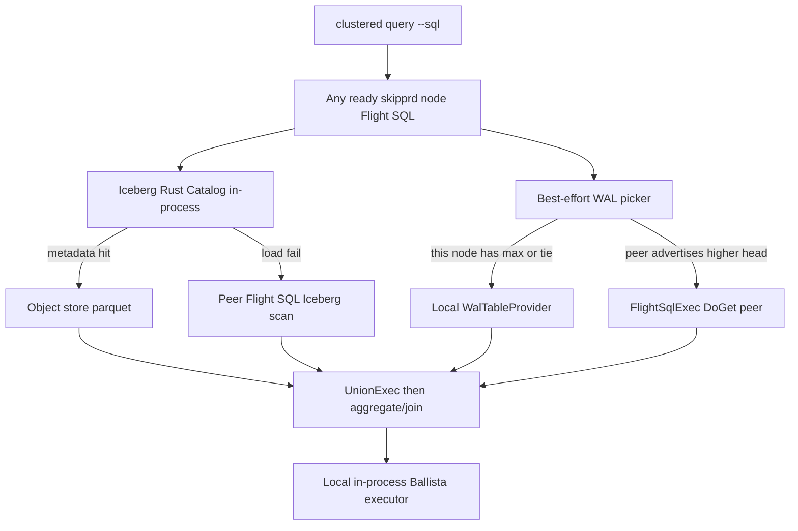

# Embedded Ballista + Flight SQL on every Skippr node

Style: [AGENTS.md](AGENTS.md) — types over runtime checks, one path, no extra cluster knobs, hard cutover (delete framed TCP and standalone Ballista bins in the same change).

Normative contract after this work: [docs/docs/maintainers/hla-flight-sql-ballista.md](docs/docs/maintainers/hla-flight-sql-ballista.md). This plan **replaces** the wrapper-binary / `query-scheduler#` client-gate model.

## Goal

Every clustered `skipprd` process is a query node:

- **Iceberg Rust** (vendored `third_party/iceberg`) is linked into `skipprd`. The node loads table metadata through the in-process Catalog and scans parquet from object storage.
- **Arrow Flight SQL 58.3** is linked into `skipprd` and bound on the existing membership `flight_addr`.
- **Ballista 53** (matching DataFusion 53.1) is linked into `skipprd`. The node runs an executor and a query frontend. There are no `skippr-ballista-scheduler` / `skippr-ballista-executor` processes.
- A query is **Iceberg parquet UNION live WAL**. WAL is taken from this node if it has a copy, otherwise from a peer that **advertises the highest `committed_index`**. That advertisement is **best effort** (gossip hint, then Status). It is not a quorum, pin, or guarantee of the global max.

`clustered query` never takes an ingest lease. `CURRENT_PROTOCOL` stays 1.

## Query path



## Locked decisions (hard cutover)

| Decision | Lock |
|---|---|
| Process model | Flight SQL + Ballista executor + query frontend start inside `run_clustered` next to replica/gossip. Delete standalone bins. |
| Iceberg | Direct `iceberg` crate in `skipprd` (`third_party/iceberg`). No REST facade. No parquet `ListingTable`. |
| Iceberg metadata | `Catalog::load_table` in this process first. If that fails, ask another ready node's Flight SQL to scan Iceberg (complete Iceberg result, not a partial file list). Parquet bytes stay on the shared warehouse. |
| WAL selector | Unchanged: `select_live_ordinals`. Unpinned. DoGet re-selects now. |
| WAL placement | Among ready members that advertise a head for that pipeline, pick **max `committed_index`**. Tie → prefer **local**. If the winner is unreachable, try the next-highest, then Iceberg-only. Gossip can be stale. |
| User SQL | `SELECT ... FROM <namespace>` on any node's Flight SQL. `live_wal_scan(...)` stays **internal**. |
| UNION | Dumb concat before aggregate/join. No DISTINCT, pin, or wait. Missing WAL file skips that ordinal. |
| Knobs | None. Ephemeral binds. No `BALLISTA_*`, no scheduler URL, no query port env. |
| Dual protocol | Forbidden. Framed `query_socket` is deleted when Flight SQL ships. |
| Host DynamoDB | Default `skipprd` still MUST NOT pull `aws-sdk-dynamodb`. `arrow-flight`, `ballista`, and `iceberg` **may** be default-host deps. Dynamo catalog stays `offset-store-dynamodb`. |
| `query-scheduler#` | Not used. Delete `put_query_scheduler` / `query_schedulers` (dead). |

## Non-goals

- Guaranteeing the globally latest WAL.
- Query pins / reclaim nack.
- TLS/token auth, Chitchat, Iceberg REST, custom WAL tickets.
- Embedding a second ingest path or changing replica protobuf.
- Partial distributed results (retry peer or Iceberg-only or fail closed).

---

## Step 0 — Lock docs

Update [docs/docs/maintainers/hla-flight-sql-ballista.md](docs/docs/maintainers/hla-flight-sql-ballista.md), WU-7.3/7.5 in the WBS, architecture query section, remaining-gaps, e2e checklist remarks, and offset-store membership copy.

Delete from the contract: wrapper binaries, “MUST NOT embed scheduler”, “`clustered query` must submit to `query-scheduler#`”.

**Done when:** those files describe the embedded-node model and no longer describe standalone Ballista processes as the ship path.

---

## Step 1 — Compile into `skipprd`

**Files:** [Cargo.toml](Cargo.toml), [crates/skippr-query-ballista/Cargo.toml](crates/skippr-query-ballista/Cargo.toml), [crates/skippr-query-ballista/src/bin/](crates/skippr-query-ballista/src/bin/), [src/lib.rs](src/lib.rs)

1. Add workspace/host deps: `arrow-flight` 58.3 with `flight-sql`, `ballista` 53 matching DataFusion 53.1, keep `iceberg` via `[patch.crates-io]` → `third_party/iceberg`.
2. `skipprd` depends on `skippr-query-ballista` (lib only).
3. Delete `[[bin]]` `skippr-ballista-scheduler` and `skippr-ballista-executor` and their `src/bin/*.rs` stubs.
4. Confirm `python3 .github/scripts/check_host_dependency_boundaries.py` still passes without `offset-store-dynamodb` (no `aws-sdk-dynamodb` leak). Iceberg + Flight + Ballista are allowed on the default host.
5. `cargo check -p skipprd` and `cargo check -p skipprd --features offset-store-dynamodb`.

**Done when:** one `skipprd` binary links Iceberg Rust, Flight SQL, and Ballista; the two wrapper binaries are gone; default-host DynamoDB boundary still holds.

---

## Step 2 — Best-effort WAL advertisement and picker

Gossip is a hint, not authority. Status remains head truth when the picker needs to confirm.

**Files:** [src/cluster/gossip.rs](src/cluster/gossip.rs), [src/cluster/membership.rs](src/cluster/membership.rs), [src/cluster/peer.rs](src/cluster/peer.rs) (`StatusOk` already has `committed_index`), new `src/cluster/wal_head.rs`

1. Add a bounded hint on `GossipAd`:

   ```rust
   pub struct WalHeadHint {
       pub pipeline: String,
       pub committed_index: u64,
   }
   // GossipAd.wal_heads: Vec<WalHeadHint>  // cap 32, drop extras
   ```

2. On replica ready / primary ingest / after committed apply, refresh that node's ad with heads from local `MutationLog` / replica registry sessions (all pipelines this process holds).
3. Implement `pick_wal_endpoint(pipeline, local_flight, local_committed, ads) -> Option<SocketAddr>`:
   - consider ready ads with a hint for that pipeline, plus local if this process has a log;
   - choose max `committed_index`;
   - tie → local if local is in the max set, else lowest `node_id`;
   - if no hints, `query_status` ready `replica_addr` values and pick the same way (best effort, bounded parallelism, skip failures);
   - if nothing reachable, `None` (Iceberg-only).
4. Unit tests: local wins tie; higher peer wins; missing hint falls back to Status; all Status fail → `None`; stale higher hint that fails Status falls through to next.

**Done when:** picker is pure and tested; gossip round-trips `wal_heads`; ingest/replica paths publish hints without new env knobs.

---

## Step 3 — Flight SQL 58.3 replaces framed TCP

**Files:** add `src/query_flight/{mod,service,live_wal,sql.rs}`; delete `src/query_socket/` in the same change; [src/cluster/scheduler.rs](src/cluster/scheduler.rs) bind site; [src/sqlrt/query_socket_table.rs](src/sqlrt/query_socket_table.rs) → Flight leaf.

1. Move `select_live_ordinals` to `src/query_flight/live_wal.rs` (same function, no second selector).
2. Implement Arrow Flight SQL 58.3 read-only service on `0.0.0.0:0`, advertise as `flight_addr`:
   - Handshake: `ClusterIdentity` tenant/workspace.
   - Metadata: prefix-filtered Iceberg tables (`catalog_table_to_namespace`).
   - `CommandStatementQuery` / prepared statements for user `SELECT`.
   - Reject INSERT/UPDATE/DELETE/CREATE/DROP/ALTER/MERGE and `CommandStatementUpdate`.
   - Internal TVF `live_wal_scan(tenant, workspace, pipeline, namespace, exclude_segment_ids)` for peer WAL DoGet.
   - DoGet for WAL: open local log, `select_live_ordinals` **now**, stream WAL batches. Unknown pipeline / foreign tenant fail closed. Missing file skips ordinal.
   - SQL/message size ≤ `CONTROL_FRAME_MAX_BYTES`.
3. Keep metric names `cluster_flight_request` / `cluster_flight_fail`.
4. Drain Flight SQL on SIGTERM after in-flight DoGet (same lifecycle slot as today's query socket).
5. Delete `QuerySocketServer`, length-prefixed SQL+IPC, `fetch_query_socket`.

**Tests:** bind ephemeral; reject DDL; parse/reject `live_wal_scan`; foreign tenant; unknown pipeline; oversized SQL; reclaim between GetFlightInfo and DoGet skips file.

**Done when:** clustered nodes speak only Flight SQL on `flight_addr`; framed protocol is gone from the crate.

---

## Step 4 — Iceberg Rust on every node (local metadata, network fallback)

**Files:** [src/sqlrt/iceberg_table.rs](src/sqlrt/iceberg_table.rs), [src/sqlrt/tables.rs](src/sqlrt/tables.rs), [crates/skippr-iceberg-catalog](crates/skippr-iceberg-catalog), [crates/skippr-iceberg-catalog-dynamodb](crates/skippr-iceberg-catalog-dynamodb)

1. Query frontend on the serving node calls in-process Iceberg `Catalog` (`DynamoDbCatalog` when clustered) and `TableScan::to_arrow` — already the WU-7.1 provider. Keep snapshot pin + schema/field ID authority.
2. **Local:** `load_table` + current snapshot on this process. Object-store parquet may be remote; metadata + planning are local Iceberg Rust.
3. **Fallback:** if `load_table` / list / scan setup fails, do not parquet-list. Retry the Iceberg **scan** by sending the same `SELECT` Iceberg-only (or a prepared Iceberg ticket) to another ready `flight_addr`. If no peer can load the table either, fail closed (“no Iceberg snapshot”).
4. Two-pipeline prefix filter stays. Empty catalog for one pipeline must not fail another.

**Tests:** missing catalog fails closed (no ListingTable); load success uses this process; injected load error uses a peer Flight mock; both fail → error, not empty success.

**Done when:** Iceberg planning is Iceberg Rust in `skipprd`; the only fallback is another node's Flight SQL Iceberg scan.

---

## Step 5 — `FlightSqlExec` actually streams

**Files:** [crates/skippr-query-ballista/src/lib.rs](crates/skippr-query-ballista/src/lib.rs)

1. Replace ad-hoc `FLSQ` bytes with prost:

   ```text
   message FlightSqlExecNode {
     string endpoint = 1;
     bytes prepared_handle = 2;
     bytes arrow_schema_ipc = 3;
   }
   ```

2. Encode schema in the node (leaf has no children). Delete decode-from-`inputs.first()`.
3. `FlightSqlExec::execute`: gRPC Flight SQL client to `endpoint`, DoGet `prepared_handle`, return `SendableRecordBatchStream`. Transport errors are `DataFusionError::Execution`, never empty success.
4. `endpoint` is `host:port` of `flight_addr`, not `http://`.

**Tests:** codec round-trip including schema; truncated buffer fails; execute against a test Flight SQL server streams batches; killed server is `Execution`.

**Done when:** `NotImplemented` is gone; Ballista can ship this leaf.

---

## Step 6 — Embed Ballista in `run_clustered`

**Files:** [src/cluster/scheduler.rs](src/cluster/scheduler.rs) `run_clustered`, new `src/query_flight/ballista.rs`, [src/cluster/gossip.rs](src/cluster/gossip.rs)

1. After replica + Flight SQL + gossip start, start **in-process**:
   - Ballista executor on `0.0.0.0:0`;
   - query frontend that can submit to that executor and to peer executors discovered from gossip.
2. Advertise `executor` bind on `GossipAd` (ephemeral, no knob). Same ad as replica/flight/gossip.
3. Register `SkipprPhysicalCodec` and Iceberg object store on the executor.
4. Any node accepting Flight SQL `SELECT` uses this frontend. There is no elected cluster-wide scheduler and no DDB scheduler SK.
5. Single-node cluster: local executor only (still Ballista or local DataFusion execute of the same physical plan — one code path that works with zero peers).
6. Peer executor unreachable: run that partition locally or fail the query (complete retry), never return a subset of UNION.

**Tests:** clustered start logs executor bind; gossip carries executor addr; two-node frontend sees both executors; one executor killed still completes via the other or local.

**Done when:** `skipprd sync --wal-storage clustered` is a Ballista query node without extra processes.

---

## Step 7 — UNION Iceberg parquet + WAL (local or latest advertised)

**Files:** [src/sqlrt/tables.rs](src/sqlrt/tables.rs) `IcebergWalUnionProvider`, picker from Step 2, `FlightSqlExec`

For each registered namespace on the serving node:

1. Iceberg child: local Iceberg Rust scan (Step 4), scheduled on Ballista so parquet reads can run on any executor (shared warehouse).
2. WAL child:
   - `pick_wal_endpoint`;
   - if local: `WalTableProvider` (no Flight hop);
   - if peer: `FlightSqlExec` with `live_wal_scan(...)` prepared handle and Iceberg `skippr.wal-segment-ids` excludes;
   - if `None`: omit WAL (Iceberg-only).
3. `UnionExec` then `GlobalLimitExec`. Downstream aggregate/join/sort are **parents** of UNION.
4. UNION remains a dumb concat.

**Tests:** physical plan shape (UNION below aggregate); local WAL when local head is max; remote `FlightSqlExec` when peer head is higher; Iceberg-only when picker returns `None`; missing WAL file skipped; no double-count of Iceberg-named segments.

**Done when:** one SELECT hits lake parquet + best-effort latest WAL without a second query protocol.

---

## Step 8 — `clustered query` is a Flight SQL client

**Files:** [src/cluster/scheduler.rs](src/cluster/scheduler.rs) `run_clustered_query`, HLA harness query helpers

1. Discover ready `flight_addr` from membership (existing table). Sort by `node_id` only as a **contact** order, not as WAL choice (the contacted node runs the picker).
2. Open Flight SQL, run the user `--sql`, print batches.
3. If the first node fails, try the next ready `flight_addr`. If none work, fail closed (do not silently skip to a second protocol).
4. Remove `query_schedulers` from the client path. Update `clustered_query_is_one_flight_or_iceberg_only` (Iceberg-only happens **inside** the serving node when WAL picker is `None`, not as a client-side second protocol).
5. HLA `run_query` / `query_flight_ids`: Flight SQL GetFlightInfo/DoGet. Delete framed handshake helpers.

**Done when:** CLI and harness speak Flight SQL to any node; WAL freshness is the serving node's best-effort picker.

---

## Step 9 — Tests and e2e

**In-process**

- `cargo test -p skippr-query-ballista`
- `cargo test -p skipprd --lib query_flight::`
- `cargo test -p skipprd --features offset-store-dynamodb --lib cluster::` (gossip heads, picker, clustered start)
- `cargo test -p skipprd --lib sqlrt::` (UNION shape, prefix filter, Iceberg fallback)

**HLA harness** ([tests/hla_e2e/run.py](tests/hla_e2e/run.py), [tests/hla_e2e/test_run.py](tests/hla_e2e/test_run.py))

- `ingest_and_query_union`, `query_from_every_ready_replica`, `query_each_replica_socket`, `query_retry_lagging`, `two_pipelines` over Flight SQL.
- Add: three-node query where WAL is served from the replica that gossiped the higher `committed_index` (best effort; assert unique ids, not a specific node).
- Add: Iceberg still returns rows when all WAL sockets are SIGSTOP (Iceberg-only inside the serving node).
- Do **not** start extra Ballista OS processes.

**CI**

- Keep default-host DynamoDB boundary.
- `cargo check --all-features`
- After Flight SQL lands, `query_socket::` CI lines become `query_flight::`.

**Done when:** `python3 tests/hla_e2e/test_run.py` matches the new helpers; `python3 tests/hla_e2e/run.py` exit 0 with Flight SQL UNION (user-run gate, same as today).

---

## Implementation order (do not skip)

```text
0 spec lock
1 compile-in + delete bins
2 WAL ads + picker
3 Flight SQL cutover (delete framed TCP)
4 Iceberg local + peer fallback
5 FlightSqlExec execute + prost codec
6 embed Ballista in run_clustered
7 UNION wiring
8 clustered query client
9 tests / harness
```

3 before 7 (WAL leaf needs Flight). 2 can land before 3 (picker used by framed code briefly is **not** desired — land 2 and 3 together if that avoids two protocols). Prefer **2+3 in one change**, then 4–5, then 6–8, then 9.

## Out of scope until later

- Chitchat (WU-5.1)
- First GitHub Actions HLA run (workflow already exists; still deferred as a “first live Actions” tick)
- TLS on Flight SQL
- Guaranteeing latest WAL under partition
