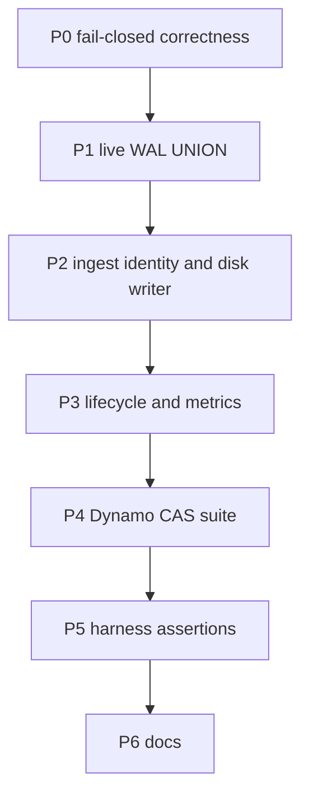

# HLA remaining close-out

Excluded (locked): Ballista, Arrow Flight SQL 58.3, Chitchat/UDP swap, first GitHub Actions HLA run.

Style: [AGENTS.md](AGENTS.md) — types over runtime checks, one path, no extra cluster knobs. Failpoints stay a named enum + `{pipeline root}/failpoint`. Do **not** run `python3 tests/hla_e2e/run.py` until the user asks; prove each slice with unit tests / `python3 tests/hla_e2e/test_run.py` / `python3 tests/hla_e2e/ddb_cas.py`.

---

## P0 — Fail closed (no more silent success)

**Replica assign/ready** — [src/cluster/peer.rs](src/cluster/peer.rs)

- `ReplicaSession::new`: `ready` starts `false`.
- Unparseable `AssignReplica.primary_endpoint`: Nack, leave `ready=false` (delete the `else { ready = true }` at ~716).
- Unknown pipeline Assign: Nack, do not ACK success (~719).
- Tests: unassigned session is not ready; bad endpoint / unknown pipeline Nack.

**Promote hash** — [src/cluster/promote.rs](src/cluster/promote.rs) `statuses_from_gossip`

- Non-32-byte `head_hash` is skipped or `PromoteError`, not coerced to `GENESIS_HASH`. Empty hash may remain genesis. Reuse `replica_status_hash` from [src/cluster/scheduler.rs](src/cluster/scheduler.rs).

**Catch-up** — [src/cluster/catchup.rs](src/cluster/catchup.rs)

- If local `committed_index > donor`: compare hashes; mismatch → `DurableError::Diverged`. Do not `Ok(())` on “ahead”.

**Prepared unknown outcome** — [src/buffer/durable/store.rs](src/buffer/durable/store.rs) `recover_unknown_prepared`

- If no peer proves the Prepared hash: keep the record, mark node ineligible / fence ingest, do **not** `abort_pending_prepared`. Matches WU-3.4.

**`entry_hash`** — [src/buffer/durable/mutation.rs](src/buffer/durable/mutation.rs)

- `encode_envelope_proto` failure is `Result` / panic-free `DurableError`, never `unwrap_or_default()` empty bytes.

**Disk pressure** — [src/cluster/disk.rs](src/cluster/disk.rs)

- `available_bytes` `None` → under pressure (`true`). Unmeasurable volume is not a placement target.

**Lease store connect** — [src/cluster/scheduler.rs](src/cluster/scheduler.rs)

- Dynamo lease connect `Err` fails clustered `sync` startup. Delete replica-only warn path (~189–196).

**Log compare fail-open** — [src/buffer/durable/log.rs](src/buffer/durable/log.rs) `compare`

- Missing historical envelope at `index < committed` is `Diverged` / `Gap`, not `AlreadyAppliedSameHash` (~137–138).

**Baseline hashes** — [src/cluster/baseline.rs](src/cluster/baseline.rs)

- Hash payload bytes (or refuse migration). No `[0u8; 32]` placeholders.

**Shutdown** — [src/cluster/lifecycle.rs](src/cluster/lifecycle.rs)

- `release_after_drain` `Err` is returned/logged. Failed drain still leaves the lease held (do not retry-release). Drop `.ok()` swallow on `shutdown_cluster` in the scheduler.

---

## P1 — Live WAL UNION after snapshot prune

Single reconstruction path used by [src/query_flight/live_wal.rs](src/query_flight/live_wal.rs), [src/query_flight/service.rs](src/query_flight/service.rs), and [src/sqlrt/tables.rs](src/sqlrt/tables.rs):

1. Live ids = `StateSnapshot.segments` ∪ `CommitSegment` envelopes still in the suffix log.
2. Exclude by **ordinal ledger** + Iceberg `skippr.wal-segment-ids` (already on the Iceberg snapshot).
3. `CompleteSlices` must **not** drop a whole `segment_id` from the scan. `wal_table` already skips complete ordinals ([src/sqlrt/wal_table.rs](src/sqlrt/wal_table.rs) ~140–146); keep the segment in `segment_ids` until every ordinal is complete or `ReclaimSegment`.
4. Populate `StateSnapshot.completions` from the ledger in [src/buffer/durable/snapshot.rs](src/buffer/durable/snapshot.rs) `build_live_snapshot` (today always `Vec::new()`).
5. Delete the dead `wal_table` retry that re-calls `read_segment_batches` on empty-batch error (~225–232).
6. `IcebergWalUnionProvider::scan`: DataFusion union of the two plans (limit on the union), not eager collect with Iceberg-only `limit`.

Unit tests: scan after `retain_live_snapshot` still lists uncompacted segments; partial `CompleteSlices` keeps remaining ordinals; Iceberg ancestry still excludes compacted ids.

---

## P2 — One ingest identity, one disk writer

**Clustered ingest key** — [src/buffer/wal_store.rs](src/buffer/wal_store.rs), [src/cluster/scheduler.rs](src/cluster/scheduler.rs)

- `ingest_durable_store()` resolves the installed store for the **active** `PipelineKey`, not `Config::get_pipeline_name()`.
- Stop writing `PIPELINE_NAME` in the scheduler (~448–452). Clustered `engine::run_sync` takes the pipeline name / `PipelineConfigView` for that lease. Replica/query/catch-up stay free of process-global lookup (existing guard test).
- Use `renew_until_lost` from [crates/skippr-lease/src/protocol.rs](crates/skippr-lease/src/protocol.rs); delete the duplicated renew loops in scheduler/promote.

**WU-2.5 disk cutover** — [src/buffer/wal_store.rs](src/buffer/wal_store.rs)

- Disk mode already calls `ensure_disk_durable_store` from [src/engine.rs](src/engine.rs) ~865. Delete `DiskWalStore` and the factory fallback (~254–261). Disk and clustered share `PipelineDurableStore` + `ClusteredWalStore::for_key`; clustered keeps tenant `PipelinePaths`, disk keeps `legacy_disk`.

**Two pipelines, one process** — scheduler + harness

- At most one `ActivePrimary` per process (`if ran { break }` stays). Replica server already accepts `AssignReplica` for other pipelines while ingest is blocked.
- Harness `two_pipelines`: two processes, **two-pipeline yml**, do **not** pass `--pipeline hla_events` (today [tests/hla_e2e/run.py](tests/hla_e2e/run.py) `start_node` always does). Query `hla_events` **and** `hla_events_b` (`evt-b1`/`evt-b2`). Assert each process has at most one `"clustered primary ingest started"`; the non-primary still serves replica/query for the other pipeline.

---

## P3 — Lifecycle and metrics

**Finite pipeline (WU-8.1)** — [src/cluster/scheduler.rs](src/cluster/scheduler.rs) after source `Ok(())`

- File sources keep today’s mtime wait (HLA e2e copies more JSONL).
- Non-file finite sources: drain, `release_after_drain`, return so the loop can try the next pipeline. Do not hold the lease until SIGTERM.

**Metrics (WU-8.3)** — [src/metrics/counters.rs](src/metrics/counters.rs)

Add and increment (no partition/compaction-id labels): committed/applied/published indexes, replica lag, quorum nack/timeout, catch-up bytes (exists) + snapshot install (exists), divergence/purge. Wire at commit, replicate Nack, catch-up, `purge_diverged_replica`.

**Typed Dynamo CAS errors** (same change as P4 helpers)

- Replace `err.to_string().contains("ConditionalCheckFailed")` in [crates/skippr-lease-store-dynamodb/src/lease.rs](crates/skippr-lease-store-dynamodb/src/lease.rs) (and offset/catalog equivalents) with SDK `is_conditional_check_failed_exception()` / a shared helper. Same condition strings the Python suite will copy.

**Proto** — [proto/cluster.proto](proto/cluster.proto): `ClientHello.role` unused string → drop or enum. Hard cutover.

---

## P4 — Dedicated DynamoDB Local CAS/OCC

New [tests/hla_e2e/ddb_cas.py](tests/hla_e2e/ddb_cas.py): Dynamo Local only, **no** `skipprd`. Reuse `start_dynamodb` / `stop_dynamodb` from `run.py` (creates `skippr-hla-e2e-offsets` and `skippr-hla-e2e-catalog`). Lease/membership/offset CAS uses the offset table; catalog OCC uses the catalog table. Same condition expressions as Rust.

| Case | Contract |
|---|---|
| Lease create | missing-item CAS |
| Steal stale heartbeat | exact owner+epoch+heartbeat+released; epoch+1, heartbeat=1 |
| Steal matching observation | same |
| Renew wrong owner | CCF |
| Release then acquire_released | epoch bump |
| Membership delete stale heartbeat | no-op (item remains; Rust maps CCF → Ok) |
| Membership matching heartbeat | delete |
| Offset create CAS | first write |
| Offset stale fence | rejected |
| Offset matching fence | advances |
| Catalog pointer create | CAS |
| Catalog generation OCC | winner gen=2, loser CCF |

Catalog keys: `warehouse_pk = catalog#{sha256(warehouse.rstrip('/'))}`, `encode_name = f"{len}:{name}"` matching [crates/skippr-iceberg-catalog/src/lib.rs](crates/skippr-iceberg-catalog/src/lib.rs).

Extend [tests/hla_e2e/test_run.py](tests/hla_e2e/test_run.py) so `ddb_cas.CASES` equals that list. Add a step in [`.github/workflows/hla-e2e.yml`](.github/workflows/hla-e2e.yml) **before** `run.py` (`python3 tests/hla_e2e/ddb_cas.py`) and include catalog crate paths in `on.pull_request.paths`. That is workflow wiring, not “first Actions run”.

---

## P5 — Harness: hard assertions (no soft-pass)

Tighten existing names in [tests/hla_e2e/run.py](tests/hla_e2e/run.py); add `rolling_protocol_replacement`. Update `SCENARIOS` + `test_run.py` contract.

- `truncated_log_restart` — actually truncate `mutation.log` tail **and** STATE-ahead; restarted process refuses; cluster query still unique.
- `enospc_during_prepared` — keep failpoint `prepared_disk_full` (product fail-closed, not harness abort); process stays up; `evt-27`/`evt-28` unpublished.
- `hash_conflict_no_majority` — three disagreeing initialized heads (not one wiped replica); no promote; query fail-closed until a consistent copy exists.
- `corrupt_replica_purge` — membership `ready=false` / ads stop; segs empty for **that** pipeline only (two-pipeline yml or isolated dirs).
- `query_pin_delays_reclaim` — **fail** if reclaim nack/`pinned` is not observed (delete the log-and-pass branch ~1554–1557).
- `query_each_replica_socket` — framed query on **each** `flight_addr` at the same pinned head; compare row ids (not TCP connect + one clustered client).
- `query_retry_lagging` — assert skip/retry of SIGSTOP replica; second variant: no equivalent copy → query fails closed.
- `rolling_protocol_replacement` — inject Dynamo membership `protocol_min=max=2` with a dummy `replica_addr`; that addr is never `AssignReplica`; protocol-1 spare is. Do **not** bump `CURRENT_PROTOCOL` (still 1). Keep `mixed_protocol_handshake` as Hello reject.
- `failed_drain_holds_lease` — keep SIGTERM+SIGKILL; `released=false`; optional: steal only after `LEASE_TIMEOUT`.
- `cold_start_membership` — already Dynamo-seeded; keep.

---

## P6 — Docs (tick only what this change proves)

Update [docs/docs/maintainers/hla-e2e-checklist.md](docs/docs/maintainers/hla-e2e-checklist.md) and [docs/docs/maintainers/hla-remaining-gaps.md](docs/docs/maintainers/hla-remaining-gaps.md):

- Process items above: present in harness; leave `[ ]` until `run.py` is actually run.
- Remaining deferred: Ballista, Flight SQL, Chitchat, first Actions run.
- Dynamo CAS: `python3 tests/hla_e2e/ddb_cas.py` (tick after that command is run, not after ingest side-effects).
