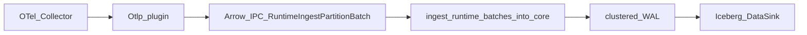

# OTel binary→Arrow ingest (no ingest_work serde)

This amends [otel_observability_wbs_f1bfcd16.plan.md](/Users/huders2000/.cursor/plans/otel_observability_wbs_f1bfcd16.plan.md). Core skipprd stays unchanged except a ~15-line SDK helper.

## Lock

Do **not** add a fast-path serde in [`src/ingest_work.rs`](skipprd/src/ingest_work.rs). `IngestBatch.data` is NDJSON `String`; nested bronze OTel (attribute maps, histogram arrays) is ineligible for [`src/ingest/exact_arrow.rs`](skipprd/src/ingest/exact_arrow.rs). Putting OTLP through that path would still JSON-parse then Arrow-JSON encode.

**Use the path that already exists** (link-graph plugin):

1. Plugin: protobuf (or OTLP JSON→proto) → bronze structs → **Arrow builders** (no `serde_json::Value`, no `IngestBatch.data`).
2. Plugin: `encode_record_batches` → [`RuntimeIngestPartitionBatch`](skipprd/src/runtime_plugins/protocol.rs) → `submit_arrow_ipc_batches_accepted`.
3. Host: [`ingest_runtime_batches_into_core`](skipprd/src/runtime_plugins/host.rs) (~749) decodes IPC, `apply_runtime_source_schema_state`, `wal_writer::submit`. Same WAL/compaction/leases as JSON ingest.

OTLP HTTP JSON (A.12) still exists for Collectors; it joins the **same** bronze→Arrow builders. The JSON we avoid is skipprd ingest NDJSON.

## Zero-copy (honest bound)

Plugin is a **separate process**. Shared-memory / mmap between plugin and host is out of scope (that would be a large core change).

In-plugin (where the work belongs):

- Decode `prost` from request `&[u8]` / `Bytes` (no extra body copy).
- Append `&str` / scalars into reused Arrow builders; do not `serde_json::to_string` bronze.
- Encode Arrow IPC once per flush (`skippr_runtime_sdk::sdk::encode_record_batches`).
- Host `StreamReader` already consumes that IPC; do not add a second decode in ingest_work.

True “zero copy” stops at the process boundary. The win vs current plan A.15 is: **no JSON Value tree, no ingest_work flatten, no Arrow JSON decoder**.

## Schema evolution (normal, Arrow path)

- Clustered discover stays rejected. Seeded `OutputMetadata` (A.23) remains SoT.
- Host Arrow ingest already publishes schema from the RecordBatch ([`apply_runtime_source_schema_state`](skipprd/src/runtime_plugins/schema_state.rs)). Additive bronze columns = plugin emits them + seed bump; host detects non-equivalent schema and syncs.
- Plugin Arrow schema **must equal** seed / `otel_columns.txt` (test). Do not rely on JSON `slow_ingest_worker`.

## Dead letters (normal, plugin-emitted)

JSON ingest deadletters on Arrow-serialize bisect. That never runs here.

Plugin:

- Invalid protobuf / OTLP JSON → **400 / gRPC invalid argument** (no WAL). Same as A.11–A.13.
- Decoded row that fails builder/schema → Arrow batch on namespace `_dl_{pipeline}` with the existing deadletter columns (`id`, `namespace`, `record`, `error`, `failure_code`, `event_time`, `processed_time`, `source_uri`, `offset_key`, `offset_pos`) from [`src/ingest/deadletter.rs`](skipprd/src/ingest/deadletter.rs). Host registers schema from the batch (same as any Arrow namespace).
- `record` column: compact diagnostic (hex prefix / JSON of failed fields), not a second full ingest payload.
- Do not silently drop.

## `inject_fields`

JSON path applies `Transform.inject_fields` in ingest_work. Arrow path skips that.

Plugin fills empty promoted columns from `Config::get_transform_inject_fields()` (child already gets `PIPELINE_NAME` / cwd Config, same as HttpServer). Promotion still owns `service.name` → `service_name`; inject only fills **missing** `tenant_id` (and other statics). Do not add ingest_work code for this.

## Minimal core touch (SDK only)

[`crates/skippr-runtime-sdk/src/source_compat.rs`](skipprd/crates/skippr-runtime-sdk/src/source_compat.rs) + [`source_sync.rs`](skipprd/crates/skippr-runtime-sdk/src/source_sync.rs): add `submit_arrow_ipc_batches` mirroring `submit_payload_batches` (accepted + wait ACK). Re-export `RuntimeIngestPartitionBatch` (already exported). Use existing `encode_record_batches`.

**Do not** change `IngestBatch`, ingest_work JSON flatten, or `exact_arrow`.

Pattern: [`plugins/data_source/upfoundry_link_graph_wat_index/src/ingest_pipeline.rs`](skipprd/plugins/data_source/upfoundry_link_graph_wat_index/src/ingest_pipeline.rs) `queue_arrow_batch` / `submit_arrow_ipc_batches_accepted`. Copy the submit/windowing idea; do not copy WAT-index domain types.

## WU changes vs previous A.15

- **A.15** — contracts + `sync` emit **Arrow IPC** per namespace (not `IngestBatch` JSON). OffsetKey still namespace + monotonic partition. `partition_key` still `hour`+`service_name`+`tenant_id`.
- **A.25** — `plugins/data_source/otlp/src/arrow.rs`: bronze → `RecordBatch` builders; schema constants shared with seed; reuse builders across flushes.
- **A.26** — deadletter Arrow batches on builder failure; 400 still for wire decode failure.
- **A.27** — SDK `submit_arrow_ipc_batches` helper + unit test (empty / one batch).
- **A.6 / A.17** — plugin applies `inject_fields` for empty `tenant_id`.
- **A.18** — goldens from bronze/Arrow schema + `otel_columns.txt`, not ingest_work JSON inference.

Layout add: `plugins/data_source/otlp/src/arrow.rs`. Strike “ingest_work.rs; Otlp must not bypass” → “Otlp must not write Iceberg; lake writes are host WAL via existing Arrow IPC.”

## Tests (named)

- Fixture ExportTracesRequest → IPC round-trip: decode host-side with `decode_record_batch_stream`, column names == `otel_columns.txt`, no JSON in `RuntimeRawIngestBatch`.
- Seeded schema ≡ plugin Arrow schema.
- Builder failure → `_dl_*` batch with `failure_code`.
- `inject_fields.tenant_id` appears when resource `tenant.id` absent.
- Logs-only config does not emit spans contracts (unchanged).
