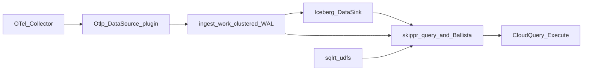
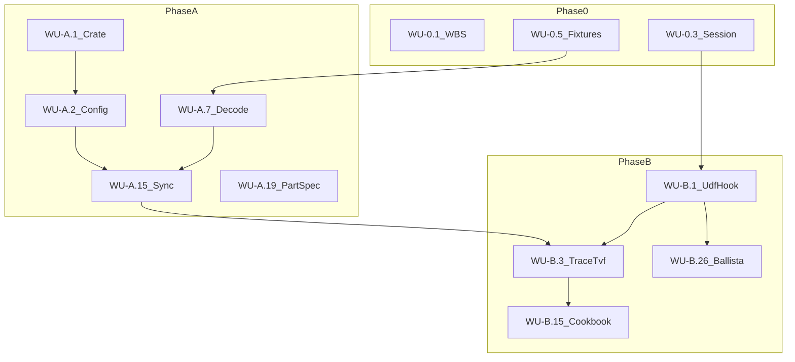

# Observability implementation WBS (small work units)

**Spec:** [docs/docs/maintainers/hla-observability-otel-console.md](docs/docs/maintainers/hla-observability-otel-console.md)
**Predecessor (done before this work):** [skippr_fleet_cloudquery_1adf8bee.plan.md](/Users/huders2000/.cursor/plans/skippr_fleet_cloudquery_1adf8bee.plan.md) — skippr fleet, isolated fabric, CloudQuery JSON front, pipeline registry, shared platform L/M/T rows.
**Substrate (in skipprd, treat as complete):** clustered WAL + leases, Iceberg catalog/scans, Flight SQL live WAL, in-process Ballista, `IcebergWalUnionProvider` UNION. Proof re-run of `tests/hla_e2e/run.py` after mTLS is **not** this plan.
**Style:** [AGENTS.md](AGENTS.md)

This plan is **skipprd internals only**: OTLP ingest into Iceberg, plus generic SQL + UDFs for traces, logs, and metrics. Charts, alarms, and consoles are **CloudQuery Execute** of those UDFs on a schedule (predecessor fleet + a later Cloud UI). There is **no** `skippr observe`, no skipprd HTTP o11y API, no skipprd console, no skipprd alarm evaluator.

Fully functional on `skippr sync` + `skippr query` (and clustered Flight / CloudQuery). skipprd stays JWT-ignorant (D31).

After approval, land WU-0.1 as `docs/docs/maintainers/hla-observability-implementation-wbs.md`, then implement in WU order. No work unit is complete without its named tests.

## Architecture



**What this plan adds (skipprd)**

1. **Source plugin:** `plugins/data_source/otlp`. Push OTLP → bronze `IngestBatch`. Stock `DataSource` path. Does not write Iceberg.
2. **Dest:** existing Iceberg sink (platform pipelines configured to Iceberg). Partition-spec work (A.19/A.20) is generic. No `plugins/data_sink/otel`.
3. **Ingest:** `skippr sync`. Shared Cloud pipelines `otel-traces` / `otel-logs` / `otel-metrics` are registered by the predecessor.
4. **Query module:** `src/sqlrt/udfs/` on every user-SQL `SessionContext` (`skippr query`, Flight SQL, Ballista). Dual-plane is `IcebergWalUnionProvider` (already shipped). UDFs are generic (columns + ScanBudget + optional `tenant_id`), not Cloud types.

**What Cloud does (not this plan)**

- CloudQuery Execute of the SQL/UDF cookbook (charts, log explorer, waterfall, alarm probes).
- Scheduler / tables for alarm state, webhooks, consoles.
- JWT / ABAC in the query guest.

**Out of this plan**

- `skippr observe`, skipprd console, skipprd alarm OCC/webhooks
- HA WAL, Ballista scheduler, CloudQuery guest, fleet fabric (already done or predecessor)
- PromQL, Flight-as-o11y-HTTP, SSE/websocket tail

## Audit (2026-08-17) — what changed since the first WBS

Treat as **already done**. This plan must not rebuild them.

- **Clustered WAL + quorum replica** — [`src/buffer/durable/`](src/buffer/durable/), [`src/cluster/`](src/cluster/), `skippr-lease`. No new WAL/lease protocol.
- **Iceberg catalog + scans** — DynamoDB **or** Cloud tables catalog; [`IcebergScanTableProvider`](src/sqlrt/iceberg_table.rs). Partition-spec work (A.19/A.20) is still missing (`Struct::empty()`). Generic Iceberg enhancement.
- **Dual-plane UNION** — [`IcebergWalUnionProvider`](src/sqlrt/tables.rs) `register_iceberg_union_view`; WAL child is Flight `live_wal_scan`. **B.9 is not a gate.** UDFs run on this provider. No listing fallback. No `IcebergQueryUnavailable`.
- **Ballista + Flight SQL** — [`src/query_flight/ballista.rs`](src/query_flight/ballista.rs) `start` builds `SessionStateBuilder` (~214) then `BallistaFunctionRegistry::from(&state)` (~324); [`query_context()`](src/query_flight/ballista.rs). **B.26 is real work:** register UDFs on that state **before** the registry is taken. Do not add a second scheduler.
- **CloudQuery + skippr fleet** — Predecessor [skippr_fleet_cloudquery_1adf8bee](/Users/huders2000/.cursor/plans/skippr_fleet_cloudquery_1adf8bee.plan.md). Shared pipelines `otel-traces` / `otel-logs` / `otel-metrics`, partition on `tenant_id`. skipprd JWT-ignorant. **This plan is the skipprd UDF + OTLP work that plan deferred.**
- **UDFs** — [`query.rs`](src/sqlrt/query.rs) still `// UDFs omitted in this build` (~1064). Same `register_observability_udfs` on every user-SQL context.
- **Iceberg create/write** — No `PartitionSpec`; writes `.partition(Struct::empty())`. A.19/A.20 still required.
- **`skippr observe` / skipprd console / skipprd alarms** — **not in this plan.** CloudQuery Execute + Cloud scheduler own product UX.

HLA spec header still says Ballista/Flight are deferred — WU-0.1 must correct that.

## Completion rules (every WU)

- Compile-time invariants first: newtypes, enums, exhaustive matches, typed errors.
- Host must not depend on `plugins/data_source/otlp`.
- Do not add `plugins/data_sink/otel` or any o11y-only dest crate. Iceberg is the dest.
- OTLP plugin must not call Iceberg `Catalog` / `DataSink` APIs. Lake writes go through ingest_work only.
- UDF code is keyed by `PipelineConfigView` / `register_namespace_view` — never `Config::get_pipeline_name()` or `PIPELINE_NAME`.
- No env/config knobs for payload ceilings, series caps, lookback, or timeouts (code constants).
- No `skippr observe`, `src/observe/`, `console/`, or skipprd alarm store.
- No one-implementor trait hierarchy for telemetry.
- Console never exists in skipprd (Cloud UI later).
- No new WAL, lease protocol, catalog, or Ballista scheduler. Registering UDFs on the existing `SessionStateBuilder` is in scope (B.26).

## Style guide (every WU — [AGENTS.md](AGENTS.md))

Priority order: **compile-time guarantees** → **simplest design** → **DRY**. Favour compile errors over runtime convention.

**Compile-time (must):**

- Signals, metric kinds, ScanBudget errors are `enum`s, not `&str` after parse.
- IDs, windows, lookbacks, payload sizes are newtypes or named constants. Reject invalid values in `TryFrom` / `new()`.
- Library/plugin paths return `Result`; no `unwrap`/`expect`/`panic` on user input. Do **not** copy `DataSourceHttpServerPlugin::new()` which panics on decode ([plugins/data_source/http_server/src/http_server.rs](plugins/data_source/http_server/src/http_server.rs) ~76–88). Use `with_runtime_config` + `decode().map_err` as [http_server/src/main.rs](plugins/data_source/http_server/src/main.rs) does.
- Exhaustive `match` on `OtlpSignal`, metric kind, `WalStorage`. Adding a variant must fail compile until handled.

**Simplicity (must):**

- Copy the nearest existing pattern (HttpServer listener, Bing contracts, `PipelineConfigView::for_name`). Do not introduce `TelemetrySource` / `ObserveBackend` trait hierarchies with one implementor.
- Do not add `src/observe/`, `crates/skippr-observe`, or `Mode::Observe`.
- UDFs live in `src/sqlrt/udfs/` and register through `register_observability_udfs` (`build_query_context` + Ballista B.26).
- Do not add YAML `wal_storage`, lease TTL, series-cap, or alarm knobs. Product config = Otlp plugin block + existing Iceberg sink.

**DRY (must):**

- One decode function shared by HTTP protobuf, HTTP JSON, and gRPC (A.7–A.9). Listeners only frame + auth.
- One `ScanBudget` used by every o11y TVF (B.2). One `register_observability_udfs` used by `skippr query` and Flight/Ballista (B.1 + B.26).
- Bronze serde field names are the discover/SQL names. Do not keep a second mapping table.

**Anti-patterns to refuse:**

- A second lake writer (OTLP plugin calling Iceberg).
- A new dest plugin that duplicates Iceberg.
- `skippr observe`, SSE/websocket o11y APIs, or skipprd alarm evaluators.
- Process-global `PIPELINE_NAME.write()` from UDF code (query.rs still does this for SHOW; **do not extend that**).
- Iceberg listing fallback when `view.iceberg` ([src/sqlrt/tables.rs](src/sqlrt/tables.rs) `register_namespace_view` already rejects listing).
- Partial results on timeout (cluster HLA: no partial query).
- Silent drop of disallowed signals or unknown metric types — typed error or counted drop that tests assert.

## Locked decisions (spec §13 + red team + 2026-08-17)

**Ingest / query**

1. Native OTLP **DataSource** plugin (`plugin_name = "Otlp"`), HTTP `:4318` and gRPC `:4317`. Collector is the agent. Dest is **existing Iceberg DataSink**. No new dest crate.
2. Three signal pipelines: `otel-traces`, `otel-logs`, `otel-metrics`. Ingest via `skippr sync --pipeline …`. SQL catalog schema = pipeline name (quote hyphens). UDFs take `PipelineConfigView` — do not hardcode names except tests/examples.
3. **SQL + UDFs only.** No PromQL. No skipprd o11y HTTP. Cloud charts/alarms/consoles = CloudQuery Execute of the cookbook (B.15). `skippr query` is the OSS path. No SSE/websocket; Cloud re-executes `otel_logs_tail`.
4. Iceberg partition = **identity** on bronze `hour` + `service_name` + `tenant_id` (A.19/A.20). No Iceberg `hour()` transform.
5. `trace_id` lookup is **time-bounded** (ScanBudget, default 24h). No trace-id index in v1. Callers pass search-hit `from`/`to` into `otel_trace`. Optional bloom is E.5.
6. Clustered discover stays rejected. Schema from **host-seeded `OutputMetadata`** (A.23).
7. Dual-plane is **shipped**. B.9 = UDFs on `IcebergWalUnionProvider`. B.26 registers the same catalog on Ballista.

**AuthZ / product**

8. skipprd JWT-ignorant (D31). Tenant on Flight is Basic `tenant/workspace`. Shared-pipeline prune is SQL `WHERE tenant_id = …` (CloudQuery guest supplies it). No Cedar, no observe middleware.
9. **No skipprd console.** Visualization is Cloud later.
10. **No skipprd alarms.** Cloud schedules the cookbook SQL (log count, root-span quantile, `otel_rate` / `otel_increase` / `otel_histogram_quantile`), stores state, sends webhooks.
11. Retention = existing `ENABLE`/`DISABLE PIPELINE` + object-store lifecycle. Exponential histogram is E.9.

## Key implementation details

### Constants (code, not env)

- `OTLP_MAX_REQUEST_BYTES`: 16 MiB
- `OTEL_DEFAULT_LOOKBACK`: 24h
- `OTEL_QUERY_TIMEOUT`: 30s (session collect, B.19)
- `MAX_SERIES`: 1000
- `MAX_TRACES`: 100
- `MAX_LOG_ROWS`: 1000
- `MAX_SERVICES`: 500
- `MAX_EDGES`: 200

TVFs that would overflow set a `truncated` boolean column (or a single-row side column) rather than returning unbounded results.

### Bronze `hour` + `tenant_id`

Every span/log/metric record sets `hour: u32` = `timestamp / 3_600_000_000_000` and `tenant_id: String` (resource `tenant.id` or `inject_fields`; never JWT). Partition spec identity(`hour`) + identity(`service_name`) + identity(`tenant_id`). Queries MUST include `hour` BETWEEN … and, on shared pipelines, `tenant_id = …`.

### Seeded schema (A.23)

`src/sqlrt/schema_seed.rs` (not `src/observe/`) builds `OutputMetadata`. On `skippr sync` start, if namespace metadata is missing, write the seed then continue. `examples/otel/otel_columns.txt` is the DRY name list.

### Process topology (A.24)

OSS: three ingest processes, **no observe process**. Query is `skippr query` or CloudQuery.

```text
DATA_DIR=/data/traces skippr sync --pipeline otel-traces
DATA_DIR=/data/logs   skippr sync --pipeline otel-logs
DATA_DIR=/data/metrics skippr sync --pipeline otel-metrics
skippr query   # or CloudQuery Execute
```

Cloud: one leased pipeline per signal (`PIPE#system#platform#otel-{traces,logs,metrics}`), Iceberg dest, `tenant_id` partition (predecessor).

### SQL / UDF contract (CloudQuery + skippr query)

Stable function names. Cookbook in B.15 is the Cloud integration surface.

**Traces**

```sql
SELECT * FROM otel_trace_search('checkout', from_ns, to_ns, true, NULL);
SELECT * FROM otel_trace('4bf92f3577b34da6a3ce929d0e0e4736', from_ns, to_ns);
SELECT * FROM otel_waterfall('4bf92f3577b34da6a3ce929d0e0e4736', from_ns, to_ns);
```

Search returns `{trace_id, root_name, start_time_unix_nano, end_time_unix_nano, duration_nano, error, truncated}`. Fetch/waterfall use the hit’s time window. Empty window overlap → 0 rows (fail closed, not a missing-index bug).

**Logs**

```sql
SELECT * FROM otel_logs_tail('checkout', from_ns, to_ns, 'timeout');
SELECT * FROM otel_logs_for_trace(trace_id, from_ns, to_ns);
```

**Metrics / charts / alarm probes**

```sql
SELECT service_name, attrs, otel_rate(value, time_unix_nano, window) AS rate
FROM "otel-metrics".sum
WHERE tenant_id = ? AND metric_name = ? AND hour BETWEEN ? AND ?;

SELECT count(*) FROM "otel-logs".log_records
WHERE tenant_id = ? AND service_name = ? AND severity_number >= 17
  AND time_unix_nano BETWEEN ? AND ?;

SELECT duration_nano FROM otel_trace(...) WHERE parent_span_id IS NULL;
```

Empty/null rate → Cloud maps to insufficient data. skipprd does not store alarm state.

**Services / map**

```sql
SELECT * FROM otel_services(from_ns, to_ns);
SELECT * FROM otel_service_map('checkout', from_ns, to_ns);
```

Optional `tenant_id` is a TVF argument or a `WHERE` on the underlying scan (B.2 `TenantFilter`).

## Red team vs spec

Do not re-open skipprd observe/console/alarms, ABAC-in-skipprd, SNS, Flight-as-o11y-HTTP, websocket, fifth ingest process, Iceberg `hour()` transforms, rebuilding Ballista, or implementing CloudQuery in skipprd.

## Dependency graph



- Phase A: ingest on disk/s3 **and** Iceberg.
- B.9 correctness (UNION). B.26 Ballista names.
- No Phase C/D in skipprd.

## Layout

```text
plugins/data_source/otlp/          # NEW DataSource only
  src/{lib,main,config,bronze,decode,http,grpc,sync}.rs
  tests/fixtures/{traces,logs,metrics}.{bin,json}
plugins/data_sink/iceberg/         # EXISTING dest; A.19/A.20 only
src/ingest_work.rs                 # EXISTING; Otlp must not bypass
src/sqlrt/session.rs
src/sqlrt/schema_seed.rs           # clustered discover replacement
src/sqlrt/udfs/{mod,budget,trace,waterfall,logs,search,services,rate,increase,histogram}.rs
examples/otel/{skippr.yml,otel_columns.txt,collector.yaml,cookbook.sql}
docs/docs/connectors/inputs/otlp.md
docs/docs/query/observability-udfs.md
docs/docs/maintainers/hla-observability-implementation-wbs.md
```

---

# Phase 0 — Contract, session

## WU-0.1 Land WBS + nav

**Touch:** `docs/docs/maintainers/hla-observability-implementation-wbs.md`, [docs/mkdocs.yml](docs/mkdocs.yml) (`nav:` ~line 29), HLA spec header

**Reference:** Cluster contract pattern in [hla-implementation-wbs.md](docs/docs/maintainers/hla-implementation-wbs.md) (completion rules, WU numbering, “no work unit complete without named tests”). Maintainer nav siblings under `docs/docs/maintainers/`.

**Style:** Docs are the contract, not a second design. Do not invent knobs or services in the WBS that AGENTS.md would reject. Keep MUST language aligned with the HLA; no “optional fallback” wording for Iceberg listing or PromQL.

**Must:** Add `Implementation:` link at the top of [hla-observability-otel-console.md](docs/docs/maintainers/hla-observability-otel-console.md). Rewrite **Depends on** / §2 so Ballista + Flight + UNION are shipped. Product front is CloudQuery Execute of UDFs — **no skippr observe**. Do not write the user connector page (WU-A.21).

**Tests:** none (docs).

## WU-0.2 Cancelled — no `Mode::Observe`

Do not add `Mode::Observe`. Query path remains `skippr query` / Flight / CloudQuery.

## WU-0.3 Shared session factory

**Touch:** [src/sqlrt/query.rs](src/sqlrt/query.rs) (~84, ~483, ~1062, ~1512 `SessionContext::new_with_config`; `// UDFs omitted in this build`), [src/engine.rs](src/engine.rs) ~506, new `src/sqlrt/session.rs`, [src/sqlrt/mod.rs](src/sqlrt/mod.rs). **Do not** change Ballista here (B.26) or Flight live-WAL scan in [service.rs](src/query_flight/service.rs) ~639 (scan-only, no user SQL UDFs).

**Reference:** Table registration stays in [src/sqlrt/tables.rs](src/sqlrt/tables.rs) `register_namespace_view`. Dual-plane already goes through `IcebergWalUnionProvider` when `view.iceberg`.

**Style:** Flat function `build_query_context(config: SessionConfig) -> SessionContext`. No `SessionFactory` trait. Every **user-SQL** host site must call it (DRY): `query.rs`, `engine.rs`. Do not read `PIPELINE_NAME` inside the factory — callers pass pipeline names into `register_namespace_view`.

**Must:** Behavior of `skippr query` unchanged. UDF hook is a no-op until B.1. Keep `session.rs` owning construction only (not a re-export barrel).

**Tests:** `SELECT 1` on factory context; existing query tests pass; grep that `query.rs` / `engine.rs` do not call `SessionContext::new_with_config` directly.

## WU-0.4 UDF module must not mutate `PIPELINE_NAME`

**Touch:** `src/sqlrt/udfs/` (when it exists), guard test under `src/sqlrt/`

**Reference:** [src/sqlrt/tables.rs](src/sqlrt/tables.rs) `register_namespace_view` already uses `PipelineConfigView::for_name` and must not touch global pipeline state. query.rs SHOW still mutates `PIPELINE_NAME` — UDFs must not copy that.

**Style:** A grep/guard test fails CI if `src/sqlrt/udfs` mentions `PIPELINE_NAME` / `get_pipeline_name`. Missing pipeline is `ConfigError::PipelineNotFound`, not `unwrap`.

**Must:** `for_name(&Config::get(), "otel-traces")` works once YAML exists (A.17). Iceberg vs non-Iceberg is `view.iceberg`.

**Tests:** resolves named pipeline; missing → error; guard test.

## WU-0.5 Fixture corpus

**Touch:** `plugins/data_source/otlp/tests/fixtures/` — **blocked on A.1**

**Reference:** OTLP proto messages `ExportTraceServiceRequest` / `ExportLogsServiceRequest` / `ExportMetricsServiceRequest` (crate `opentelemetry-proto`). Keep fixtures as checked-in bytes, not generated in every test (DRY + hermetic).

**Style:** Fixtures are the golden input type; decode tests must not rebuild proto in ad-hoc JSON that drifts. Document generator command in `fixtures/README.md`.

**Must:** Cover: parent+child span; log with `trace_id`; sum with two points; histogram with `explicit_bounds` + `bucket_counts`. No PII in fixtures.

**Tests:** parse with `opentelemetry-proto` in A.7–A.9.

---

# Phase A — Ingest + schemas

## WU-A.1 Plugin crate skeleton

**Touch:** `plugins/data_source/otlp/Cargo.toml`, `src/lib.rs`, `src/main.rs`

**Reference:** [plugins/data_source/http_server/Cargo.toml](plugins/data_source/http_server/Cargo.toml) (`[package.metadata.skippr-plugin]`, `source_capability`), [http_server/src/main.rs](plugins/data_source/http_server/src/main.rs) (`run_append_data_source_main`, `expect_plugin("HttpServer")`, `with_runtime_config`). Trait: [src/plugins/traits.rs](src/plugins/traits.rs) `DataSource` (`sync`, required `execution_contract`, default empty `source_namespace_contracts`). Runtime: [crates/skippr-runtime-sdk/src/append_source_runtime.rs](crates/skippr-runtime-sdk/src/append_source_runtime.rs). Workspace already globs `plugins/data_source/*`.

**Style:** `plugin_name = "Otlp"` must match CLI later (A.16) **exactly**. Capability enums not strings: `StreamOnly`, `UserSuppliedIdentityOnly`, `checkpoint_style = None`. `execution_contract()` = `SourceExecutionContract::stream(SourceOnceContract::HostIdleBounded)` like HttpServer (push listener). Do not implement `new()` that panics on Config. Host `Cargo.toml` must not depend on this crate ([repository-map.md](docs/docs/maintainers/repository-map.md)).

**Must:** `sync()` may idle on a channel until A.15. Binary name `skippr-plugin-data-source-otlp`.

**Tests:** crate builds; metadata `plugin_name == "Otlp"`.

## WU-A.2 Typed `OtlpConfig`

**Touch:** `plugins/data_source/otlp/src/config.rs`

**Reference:** `DataSourceHttpServerPluginConfig` + `TryFrom<PluginConfigEntry>` via `decode_for_plugin("HttpServer")` in [http_server.rs](plugins/data_source/http_server/src/http_server.rs). Plugin YAML field names = serde snake_case (CLI JSON keys must match — A.16).

**Style:** `OtlpSignal { Traces, Logs, Metrics }` with `#[serde(rename_all = "snake_case")]`. `signals: Vec<OtlpSignal>` non-empty via constructor/`TryFrom`, not a later `if signals.is_empty()`. Unknown YAML keys: `#[serde(deny_unknown_fields)]`. `OTLP_MAX_REQUEST_BYTES` is `const` in this module — not a config field (Tiger/AGENTS: no impl knobs).

**Must:** Defaults `0.0.0.0:4317` / `0.0.0.0:4318`. `auth_token` and `attribute_allowlist` optional. Empty allowlist `Some(vec![])` means drop all attributes (distinct from `None` = keep all) — encode that in the type comment and tests.

**Tests:** decode defaults; reject empty signals; reject unknown signal string; deny unknown keys.

## WU-A.3 Bronze traces types

**Touch:** `plugins/data_source/otlp/src/bronze.rs`

**Reference:** OTel span identity is 16-byte trace / 8-byte span, hex on the wire. Skippr bronze is JSON for discover ([src/discover/mod.rs](src/discover/mod.rs) `SkipprDataType`). Do not flatten resource keys (cardinality).

**Style:** `TraceId`/`SpanId` newtypes: `new([u8; 16])` / `from_hex(&str) -> Result`. Do not store IDs as unvalidated `String`. `SpanKind`/`StatusCode` as enums. Attributes: `BTreeMap<String, String>` (deterministic serde). Private fields + constructors so a span cannot lack `trace_id`.

**Must:** Stable serde names: `trace_id`, `span_id`, `parent_span_id`, `name`, `kind`, `start_time_unix_nano`, `end_time_unix_nano`, `duration_nano`, `status_code`, `service_name`, `tenant_id`, `http_route`, `hour`, `resource_attributes`, `span_attributes`. `hour` = `start_time_unix_nano / 3_600_000_000_000` (UTC). Events/links are **separate records**, not nested arrays.

**Tests:** hex round-trip; odd-length hex fails; serde field-name golden.

## WU-A.4 Bronze logs types

**Reference:** Same `bronze.rs`. OTel log record optional trace context.

**Style:** `trace_id: Option<TraceId>`, `span_id: Option<SpanId>` — not empty strings. `severity_number` as `i32` newtype or raw i32 with documented range; `body` as `String` (stringify non-string AnyValue in decode, A.8).

**Must:** Fields: `time_unix_nano`, `observed_time_unix_nano`, `severity_text`, `severity_number`, `body`, `service_name`, `tenant_id`, `hour` (from `time_unix_nano`), attribute maps. Missing trace is valid.

**Tests:** serde golden; `trace_id: None` allowed.

## WU-A.5 Bronze metrics types

**Reference:** OTel metric data points: Gauge / Sum / Histogram. Histogram quantile UDF (B.8) needs **explicit** buckets — do not store only `count`/`sum`.

**Style:** Three structs, not a string `metric_type`. `enum MetricPoint { Gauge(...), Sum(...), Histogram(...) }` if it keeps decode DRY; or three record types matching three namespaces (prefer **three structs** matching three Iceberg tables — simpler, matches HLA). Histogram without `explicit_bounds` cannot be constructed (`HistogramRecord::new(...) -> Result`).

**Must:** Common: `metric_name`, `unit`, `time_unix_nano`, `start_time_unix_nano`, `service_name`, `tenant_id`, `hour`, attributes. Sum: `value`, `is_monotonic`, `aggregation_temporality` as enum. Histogram: `count`, `sum`, `bucket_counts: Vec<u64>`, `explicit_bounds: Vec<f64>` (bounds.len() + 1 == counts.len()). Optional `exemplar_trace_id: Option<TraceId>` on points (spec §6). Exponential histogram out of scope (E.9); decode must not coerce it into HistogramRecord.

**Tests:** serde golden; bounds/counts mismatch fails `new`.

## WU-A.6 Resource column promotion

**Reference:** HLA partition/filter columns. Transform `inject_fields` is for statics ([src/helpers/configuration.rs](src/helpers/configuration.rs) `Transform.inject_fields`, applied in ingest_work) — **not** for `service.name`. Predecessor Cloud shared pipelines partition on `tenant_id`; bronze must carry that column on OSS too (generic).

**Style:** Fixed allowlist as `const PROMOTED_RESOURCE_KEYS` including `(service.name, service_name)`, `(deployment.environment, deployment_environment)`, `(http.route, http_route)`, `(tenant.id, tenant_id)`. No HashMap of arbitrary promotions. Wrong-type AnyValue → `None` for that column, do not stringify into `service_name`. Missing `tenant.id`: leave `tenant_id` empty string **or** fill later via `inject_fields` (A.17). Empty `tenant_id` is valid for OSS demos; Cloud Collector/inject must set it.

**Must:** Do not copy other resource keys onto top-level columns. Original map still stored in `resource_attributes`. `http_route` may be None on most spans. No Cloud JWT types in the plugin.

**Tests:** present / absent / wrong-type; `tenant.id` → `tenant_id`.

## WU-A.7 Decode traces proto → bronze

**Touch:** `plugins/data_source/otlp/src/decode.rs`

**Reference:** `opentelemetry-proto` `ExportTraceServiceRequest`. Resource spans → scope spans → spans. Hex encode via TraceId newtype. Parent-less spans are roots (`parent_span_id: None`).

**Style:** Pure functions `decode_traces(&[u8]) -> Result<DecodedTraces, DecodeError>`. Typed `DecodeError` enum (truncated, invalid id, empty). No listener types here (DRY with A.11–A.13).

**Must:** One span with two events → 1 `SpanRecord` + 2 `SpanEventRecord` sharing ids. Links similarly. Dropped counts from proto copied onto records. Events/links copy parent `tenant_id`, `service_name`, and `hour`.

**Tests:** WU-0.5 traces fixture → counts and IDs.

## WU-A.8 Decode logs proto → bronze

**Reference:** Same `decode.rs`. `ExportLogsServiceRequest`.

**Style:** Same `DecodeError`. Body AnyValue → string via one helper used for all AnyValue stringification (DRY with attributes).

**Must:** Log without trace context ingest. `severity_number` preserved.

**Tests:** fixture with and without `trace_id`.

## WU-A.9 Decode metrics proto → bronze

**Reference:** `ExportMetricsServiceRequest`. NumberDataPoint / HistogramDataPoint.

**Style:** `match` on metric data oneof; `ExponentialHistogram` / `Summary` → `DecodeDrop::UnsupportedMetricKind` counted, not mapped to gauge. Exhaustive match so a new proto kind fails compile.

**Must:** Temporality enum from proto. Histogram bounds required for HistogramRecord.

**Tests:** sum + histogram fixture; exponential → counted drop.

## WU-A.10 Attribute allowlist

**Reference:** Plugin-local privacy in `plugins/data_source/sumup/src/privacy.rs` (allowlist mode). HLA: Collector is primary redaction; this is extra.

**Style:** `fn filter_attrs(map, allowlist: Option<&[String]>)`. `None` = identity. `Some(list)` = retain listed keys only. Do not build a Redaction trait. Increment `dropped_attribute_count` by keys removed (u32, saturating).

**Must:** Apply to resource, span, log, and metric attribute maps after promotion (promotion reads unfiltered resource, then filter maps). `service_name` column still filled from original resource even if `service.name` not in allowlist? **Lock:** promotion runs first from raw resource; allowlist then filters maps only. Promoted columns remain (needed for partition). Document that.

**Tests:** keeps `http.route`, drops `user.email`; `None` keeps both.

## WU-A.11 HTTP OTLP protobuf

**Touch:** `plugins/data_source/otlp/src/http.rs`

**Reference:** Axum POST + Bearer in [http_server.rs](plugins/data_source/http_server/src/http_server.rs) `ingest_handler`, `Router`, `TcpListener`, `RUNNING` loop, `mpsc` channel. OTLP HTTP paths are `/v1/traces|logs|metrics` (spec), not a configurable `path` like HttpServer.

**Style:** Paths are an enum/`match` on route, not string concat from config. Handler reads `Bytes`, enforces ceiling (A.14 can land together or stub 413 later — prefer constant check here). Push `DecodedBatch` enum `{ Traces, Logs, Metrics }` on the channel — not raw strings (HttpServer uses `String`; **do not copy that** — we already have bronze types).

**Must:** `Content-Type: application/x-protobuf`. Success body OTLP Export*ServiceResponse with 0 rejected. Empty body 400. Do not bind in `sync` until A.15 wires it; this WU can unit-test the router with `oneshot`.

**Tests:** fixture bytes → channel items; empty 400; wrong path 404.

## WU-A.12 HTTP OTLP JSON

**Reference:** Same router. OTLP JSON mapping of the same proto messages.

**Style:** After JSON parse, call the **same** bronze constructors as protobuf decode (convert JSON → proto struct or shared intermediate). Do not maintain a second field mapping. Malformed `trace_id` → 400 `DecodeError`, not skip row.

**Must:** `Content-Type: application/json`. Unknown identity fields fail closed.

**Tests:** JSON fixture; malformed JSON 400.

## WU-A.13 gRPC OTLP

**Touch:** `plugins/data_source/otlp/src/grpc.rs`

**Reference:** `tonic` generated TraceService/LogsService/MetricsService from `opentelemetry-proto` (or `tonic-build` on otlp protos). HttpServer has no gRPC — this is new but still a thin listener over A.7–A.9.

**Style:** Service impls only: auth interceptor + decode + channel send. No business logic. Do not wrap tonic in a custom `GrpcSource` trait.

**Must:** Bind `listen_address_grpc`. Signal not in config → `Status::failed_precondition` (or unimplemented), not OK empty. Same channel type as HTTP.

**Tests:** tonic client + fixture; disabled signal errors; does not hang.

## WU-A.14 Auth, ceiling, signal filter

**Reference:** HttpServer Bearer compare (`Authorization: Bearer {token}`). Cluster replica frames cap length **before** alloc ([hla-remaining-gaps.md](docs/docs/maintainers/hla-remaining-gaps.md) CONTROL_FRAME_MAX_BYTES). Apply the same discipline: check `content-length` / tonic message size vs `OTLP_MAX_REQUEST_BYTES` before `Bytes::copy`.

**Style:** `const OTLP_MAX_REQUEST_BYTES`. Auth: if `auth_token` is `Some`, missing/wrong → 401 / gRPC unauthenticated. If `None`, no auth (Collector on trusted network). Signal filter: `OtlpConfig.signals` as `EnumSet` or `BTreeSet<OtlpSignal>` — `contains` not string list.

**Must:** Traces-only config rejects logs on **both** HTTP and gRPC. 413 for oversized. Do not silently drop.

**Tests:** 401; 413; traces-only rejects logs.

## WU-A.15 Contracts + `sync` emit

**Touch:** `plugins/data_source/otlp/src/sync.rs`, [src/plugins/source_contract.rs](src/plugins/source_contract.rs) (`SourceNamespaceContract`, `WritePolicy::Append`, `FieldPath`, `validate()`)

**Reference:** Bing `source_namespace_contracts()` + `validate()` before sync ([plugins/data_source/bing_webmaster_tools/src/bing.rs](plugins/data_source/bing_webmaster_tools/src/bing.rs) ~464–489). HttpServer `submit_payload_batches` + `IngestBatch.namespace` ([http_server.rs](plugins/data_source/http_server/src/http_server.rs) ~137–148). Runtime emits contracts before sync ([append_source_runtime.rs](crates/skippr-runtime-sdk/src/append_source_runtime.rs) ~466).

**Style:** Contracts are a `match` on `OtlpSignal` returning the namespaces for configured signals only (traces-only plugin must not declare `log_records`). `WritePolicy::Append` only. `primary_key` for spans = `FieldPath::single("trace_id")` + `span_id`. `partition_key` = `hour` + `service_name` + `tenant_id`. Call `contract.validate()`; do not skip. Namespace strings are `&'static str` constants (`NS_SPANS = "spans"`), not interpolated.

**Must:** `IngestBatch.namespace` set by plugin (HLA). `data` is serde_json of bronze records (discover expects JSON). `execution_contract` already HostIdleBounded. OffsetKey: namespace + monotonic partition like HttpServer counter is OK for push (no source cursor). `partition_key` = `hour` + `service_name` + `tenant_id` (identity columns, lock 4).

**Tests:** one ExportTracesRequest → three namespaces; contracts validate; logs-only config does not emit spans contracts.

## WU-A.16 `skippr connect source otlp`

**Touch:** [https://github.com/skipprd/sde](https://github.com/skipprd/sde) `SourceKind::HttpServer` ~1423 and `source_plugin_and_config` ~4279; `SourceConfig` / `translate.rs` / `skippr_plugin_name` per [api-saas-source-plugins.md](docs/docs/maintainers/api-saas-source-plugins.md) CLI checklist (~140–171)

**Reference:** Copy the HttpServer/Statsd arms. `plugin_name` string `"Otlp"` must match Cargo metadata. JSON keys = `OtlpConfig` serde fields.

**Style:** `SourceKind::Otlp { listen_address_grpc, listen_address_http, signals }` — `signals` parsed as `Vec<OtlpSignal>` not free string. kebab CLI `otlp`. If `capitalize_first("otlp")` ≠ `Otlp`, add explicit `skippr_plugin_name` map entry.

**Must:** Complete the full checklist (SourceConfig, translate, connect prompts, docs flag table can wait for A.21). Tests like `translate_google_analytics`.

**Tests:** `--help` includes `otlp`; generated block plugin name `Otlp`.

## WU-A.17 Example three-pipeline YAML

**Touch:** `examples/otel/skippr.yml`, Config load in [src/helpers/configuration.rs](src/helpers/configuration.rs) (`Transform.batch_time_fields`, `batch_partition_fields`, `inject_fields`)

**Reference:** Pipeline keys `{tenant}/{workspace}/{pipeline}`. Iceberg sink + schema_sink on the **data_sink entry** (not pipeline struct). HttpServer YAML in [docs/docs/connectors/inputs/http_server.md](docs/docs/connectors/inputs/http_server.md).

**Style:** Three pipelines named `otel-traces` / `otel-logs` / `otel-metrics`, three `data_sources` each `Otlp: { signals: [traces] }` etc. Do not use `namespace_fields` to split signals (plugin owns namespace). `inject_fields` sets `tenant_id` from `skippr.tenant` when resource `tenant.id` is absent (OSS). Cloud Collectors set resource `tenant.id` (predecessor).

**Must:** `batch_time_fields` = `start_time_unix_nano` (traces) / `time_unix_nano` (logs/metrics); `batch_time_unit: hour`; `batch_partition_fields: hour,service_name,tenant_id`. Distinct OTLP listen ports per pipeline (A.24). Fixture must `Config`-parse.

**Tests:** YAML loads via existing Config.

## WU-A.18 Discover golden metadata

**Touch:** [src/discover/mod.rs](src/discover/mod.rs) (`OutputMetadata`, `SkipprDataType`), test goldens under plugin or `src/discover/tests`

**Reference:** Discover infers from bronze JSON. Goldens prevent console SQL drift when someone renames a serde field.

**Style:** Commit serialized `OutputMetadata` snapshots. Changing bronze field names **must** update goldens (compile/test, not a comment). Do not hand-write a parallel schema in the UDF layer — UDFs read these column names.

**Must:** At least `spans` and `log_records` goldens; metrics `sum`/`histogram` too if cheap.

**Tests:** snapshot; field add without golden update fails.

## WU-A.19 Iceberg `PartitionSpec` on create

**Touch:** [plugins/data_sink/iceberg/src/iceberg_sink.rs](plugins/data_sink/iceberg/src/iceberg_sink.rs) `TableCreation::builder()` ~2552–2556 (no partition spec today)

**Reference:** `SourceNamespaceContract.partition_key`. iceberg-rust `TableCreation` optional partition spec. AlreadyExists → `load_table` (~2566–2576) — must **not** evolve spec.

**Style:** Build spec from `partition_key` as **identity** transforms only (`hour`, `service_name`, `tenant_id`). Do **not** call Iceberg `hour()` / `day()` transforms (lock 4). If contract partition_key empty, keep today’s unpartitioned create. No YAML iceberg partition knob. Hard cutover for **new** tables only.

**Must:** New o11y tables: identity(`hour`) + identity(`service_name`) + identity(`tenant_id`). Fail create if those columns are missing from schema. Exists path does not rewrite spec.

**Tests:** new table has spec; exists path does not rewrite spec; empty partition_key → unpartitioned.

## WU-A.20 Iceberg write partition values

**Touch:** same file `DataFileBuilder` `.partition(Struct::empty())` ~1788–1791

**Reference:** `partition_spec_id` already set from table metadata. Writes must populate `Struct` to match spec or Iceberg rejects / unpartitioned files.

**Style:** Helper `partition_struct_for_row(spec, row) -> Result<Struct>`. Unpartitioned spec → `Struct::empty()` (existing path). Do not `if otel` — generic for any partitioned table (DRY, helps all Iceberg customers).

**Must:** Existing unpartitioned tests still pass. Partitioned append includes hour + service_name + tenant_id values.

**Tests:** partitioned append; unpartitioned unchanged.

## WU-A.21 Connector + Collector docs

**Touch:** `docs/docs/connectors/inputs/otlp.md`, [docs/mkdocs.yml](docs/mkdocs.yml) Inputs → HTTP (next to http_server), `docs/docs/query/observability-udfs.md` (stub; B.15 fills cookbook)

**Reference:** [http_server.md](docs/docs/connectors/inputs/http_server.md) structure (how it works, YAML, variables). Collector is customer-run (HLA non-goal: agent fleets).

**Style:** Document constants (`OTLP_MAX_REQUEST_BYTES`) as platform ceilings, not tunables. Sampling = Collector. Redaction = Collector + allowlist + `inject_fields`. Honest about Iceberg: new tables partitioned; old unpartitioned stay.

**Must:** Three-exporter Collector snippet; ports 4317/4318; namespaces table; `skippr connect source otlp` example. Spec §8 MAY: document `ENABLE`/`DISABLE PIPELINE` and object-store/Iceberg retention as tenant-managed; no new TTL product. Point at A.24 for process topology.

**Tests:** none (docs).

## WU-A.22 Plugin catalog + host boundary

**Touch:** `.github/scripts/runtime_plugin_catalog.py`, `.github/scripts/check_host_dependency_boundaries.py`, runtime plugin guard tests

**Reference:** [repository-map.md](docs/docs/maintainers/repository-map.md) host vs plugin. [runtime-plugins.md](docs/docs/maintainers/runtime-plugins.md).

**Style:** No host `skippr-plugin-data-source-otlp` dependency. Capability flags in metadata must match A.1 (host validates write policy vs sink).

**Must:** Catalog generation includes Otlp. `cargo test -p skipprd --test runtime_source_plugin_guards` green.

**Tests:** boundary script; host Cargo.toml grep.

## WU-A.23 Seeded schema for clustered

**Touch:** `src/sqlrt/schema_seed.rs`, ingest startup (where `METADATA` / pipeline metadata is first loaded), `examples/otel/otel_columns.txt`

**Reference:** Cluster HLA rejects `clustered discover`. [src/discover/mod.rs](src/discover/mod.rs) `OutputMetadata` / `PipelineMetadata`. Apply when namespace metadata is **missing**, then existing schema sink runs.

**Style:** Build `OutputMetadata` in Rust (not `include_str` JSON as the source of truth). One `examples/otel/otel_columns.txt` with sections `[spans]`, `[log_records]`, … listing serde names. Plugin bronze test and host seed test both parse that file. No clustered-discover exception. No operator “run discover on disk then copy” path.

**Must:** `skippr sync --pipeline otel-traces` with empty metadata + `WAL_STORAGE=clustered` writes seed then continues. Later evolution = existing schema sinks only. Seed must include `hour`, `tenant_id`, `http_route`, `exemplar_trace_id` where those columns exist.

**Tests:** seed field names == `otel_columns.txt`; plugin bronze names == same file; clustered CLI discover still rejected.

## WU-A.24 Multi-process topology + Collector runbook

**Touch:** `examples/otel/skippr.yml`, `examples/otel/collector.yaml`, A.21 docs

**Reference:** One ActivePrimary per clustered **process** (already shipped). Distinct `DATA_DIR` per OSS ingest process. Query is `skippr query` / CloudQuery — **no observe process**. Cloud topology is the predecessor fleet plan.

**Style:** Docs + examples, not a supervisor binary. No extra env knobs. Collector file: three exporters to the three OTLP endpoints from YAML. **OSS: three sync processes.** Query is on-demand.

**Must:** Document exact OSS commands:

```text
DATA_DIR=/data/traces skippr sync --pipeline otel-traces
DATA_DIR=/data/logs   skippr sync --pipeline otel-logs
DATA_DIR=/data/metrics skippr sync --pipeline otel-metrics
skippr query
```

YAML listen ports must not collide (e.g. traces 4317/4318, logs 4319/4320, metrics 4321/4322). Disk mode: same `--pipeline` split. Cloud operators do not run this topology; CloudQuery + registry watch already own placement.

**Tests:** example YAML Config-loads (A.17); collector YAML is checked in (no runtime test).

---

# Phase B — UDFs + SQL contract

## WU-B.1 UDF registration hook

**Touch:** `src/sqlrt/session.rs`, `src/sqlrt/udfs/mod.rs`, [src/sqlrt/query.rs](src/sqlrt/query.rs) ~1064

**Reference:** DataFusion 53 `SessionContext::register_udf` / `register_udtf`. Workspace `datafusion = 53.1.0`. Ballista registration is **B.26**, not this WU — but the function must be callable on a bare `SessionContext` so B.26 can apply it to `SessionState` before `BallistaFunctionRegistry::from(&state)`.

**Style:** `pub fn register_observability_udfs(ctx: &SessionContext)` — flat function, not a `UdfPlugin` trait. Call from `build_query_context` only in this WU (DRY). Empty registrations OK; later WUs append inside this function. UDFs are generic (column names + ScanBudget + optional `tenant_id` filter). No `cloud::*` types.

**Must:** `skippr query` and Ballista share this hook (B.26). No process-global UDF table. Register TVF `otel_logs_for_trace(trace_id, from, to)` that applies the same `LogFilter` as B.5 — not a global `CREATE VIEW` (tables are per-pipeline).

**Tests:** function callable; after B.3+ names listed.

## WU-B.2 `ScanBudget`

**Touch:** `src/sqlrt/udfs/budget.rs`

**Reference:** HLA §3.3: unbounded explore is not free. Cluster HLA: no partial query.

**Style:** `struct TimeRange { from: TimestampNanos, to: TimestampNanos }` with `from < to` in `new()`. `ScanBudget::from_params(from, to) -> Result<Self, BudgetError>` — if both missing, apply `const OTEL_DEFAULT_LOOKBACK: Duration = Duration::from_secs(24 * 3600)` ending at now (inject clock in tests). `BudgetError::Unbounded` if someone passes a sentinel “all time”. Not an env knob.

**Must:** Every TVF takes a `ScanBudget`. Fail closed, never scan without a window. Optional `tenant_id: Option<TenantId>` on the budget or a sibling `TenantFilter` — when `Some`, push down equality (shared-pipeline prune). When `None` (OSS table already isolated by pipeline key), skip the predicate.

**Tests:** default 24h; explicit range; inverted range errors.

## WU-B.3 `otel_trace` TVF

**Reference:** [src/sqlrt/tables.rs](src/sqlrt/tables.rs) `register_namespace_view` (UNION lake∪WAL; Iceberg → `register_iceberg_union_view`). Bronze columns `trace_id`, `start_time_unix_nano`. DataFusion table function / `TableProvider` factory.

**Style:** TVF args: `TraceId` + `ScanBudget`. SQL identifier `otel_trace` registered in B.1. Push down equality on `trace_id` and time range in the generated plan (filter in provider, not “scan all then filter in Rust” for the lake side). Empty → empty table, not error.

**Must:** Read `datafusion."otel-traces".spans` (quoted pipeline schema; tests may use `PipelineConfigView` name). Filter `trace_id = ? AND hour BETWEEN ? AND ?` (hour from ScanBudget) so identity partitions prune. If `tenant_id` is supplied (TVF arg or CloudQuery `WHERE`), also `tenant_id = ?`. Order by `start_time_unix_nano`. Do not accept raw SQL fragments. Empty → empty table. No JWT.

**Tests:** ordered fixture spans; unknown id 0 rows; budget applied.

## WU-B.4 `otel_waterfall` TVF

**Reference:** HLA §4.1 waterfall = parent/child assembly. Input = `otel_trace` output.

**Style:** Pure function `assemble_waterfall(spans: &[SpanRow]) -> Result<Vec<WaterfallRow>, WaterfallError>`. `WaterfallError::Cycle`. Depth as `u32`. Duration = end - start with checked subtract. Roots: `parent_span_id.is_none()`. Orphans (missing parent) still emitted at depth 0 or 1 — **lock: depth 0 with a flag `orphan: bool`**, do not drop.

**Must:** Columns: span_id, parent_span_id, depth, duration_nano, service_name, name, start/end. Cycle → error (fail closed).

**Tests:** parent+child; orphan; cycle.

## WU-B.5 `otel_logs_tail` TVF

**Reference:** `log_records` namespace. Correlation via `trace_id` Option.

**Style:** `filter` is `LogFilter::BodyContains(String)` or `None` — not a SQL expression AST. Service is `ServiceName` newtype (non-empty). `since` is the budget `from`.

**Must:** Pipeline from `PipelineConfigView` (example name `otel-logs`). WAL-first is the existing `IcebergWalUnionProvider` / disk UNION. Substring match is case-sensitive unless we pick one — **lock: case-sensitive**. Optional `tenant_id` filter as B.3.

**Tests:** service match; since; filter; empty.

## WU-B.6 `otel_rate`

**Reference:** Prom-style rate over **sum** monotonic counters. DataFusion `ScalarUDFImpl`, `Volatility::Immutable`.

**Style:** Input metric kind: **Sum { is_monotonic: true }** → counter rate (delta/time); **Gauge** → rate-of-change of the gauge (spec §4.1 lists gauge). Histogram → error (use B.8). Two points minimum; else null (D.10 maps to InsufficientData). Window from ScanBudget / UDF arg as `Duration` newtype.

**Must:** Per-series (attributes identity). No env smoothing knob. Exhaustive `match` on metric kind.

**Tests:** two points sum; two points gauge; one point null; histogram errors.

## WU-B.7 `otel_increase`

**Reference:** Same sum series. Reset = value drop.

**Style:** On drop, increase for that step is `new_value` (treat as reset), never negative. Exhaustive on temporality if we expose it — delta temporality increase is the point value itself (`match AggregationTemporality`).

**Must:** Windowed sum of increases. Empty → null.

**Tests:** monotonic; reset; empty; delta vs cumulative if both exist in bronze.

## WU-B.8 `otel_histogram_quantile`

**Reference:** A.5 `bucket_counts` + `explicit_bounds`. Standard cumulative-bucket interpolation.

**Style:** `p: Quantile` newtype `new(f64) -> Result` with `0.0..=1.0`. Bounds/counts length invariant already in HistogramRecord. Empty counts → null.

**Must:** p50/p99 goldens from fixture histogram. Invalid p errors (not clamp).

**Tests:** known buckets; empty; p=1.1 errors.

## WU-B.9 Dual-plane: use shipped UNION

**Reference:** [src/sqlrt/tables.rs](src/sqlrt/tables.rs) `if view.iceberg { register_iceberg_union_view }` → [`IcebergWalUnionProvider`](src/sqlrt/tables.rs). [src/sqlrt/iceberg_table.rs](src/sqlrt/iceberg_table.rs) `IcebergScanTableProvider`. [src/sqlrt/wal_table.rs](src/sqlrt/wal_table.rs) + Flight `live_wal_scan`. Cluster HLA: no Iceberg listing fallback (`register_namespace_view` already errors clustered Iceberg without a view).

**Style:** Observability UDFs/glue **must not** open Parquet directories or invent a second scan path. They call `register_namespace_view` / `build_query_context` like `skippr query`. Do **not** add `ObserveError::IcebergQueryUnavailable`. Query HLA WU-7 is done; there is nothing to gate on.

**Must:** Iceberg pipeline + WAL: TVF returns lake ∪ live rows (assert a WAL-only span appears). Non-Iceberg disk/s3 UNION still works. Listing fallback remains rejected.

**Tests:** Iceberg union fixture (WAL + lake); clustered Iceberg without catalog still errors (existing tables.rs behavior); no new listing branch in `src/sqlrt/udfs`.

## WU-B.10–B.14, B.20 Cancelled

No skipprd HTTP o11y API, SSE, or cursor codec. CloudQuery re-executes SQL/TVFs.

## WU-B.15 SQL cookbook (charts + alarm probes)

**Touch:** `examples/otel/cookbook.sql`, `docs/docs/query/observability-udfs.md`

**Reference:** Key implementation details SQL contract. CloudQuery Execute (predecessor) is the only product front.

**Style:** Checked-in SQL examples with bound-parameter comments (`?` for tenant_id, service, window). Not a skipprd scheduler. Cover: metric rate/increase/quantile for charts; log `count(*)` + root-span duration for alarms; `otel_trace_search` → `otel_trace`/`otel_waterfall`; `otel_logs_tail` / `otel_logs_for_trace`; `otel_services` / `otel_service_map`.

**Must:** Each example is valid against the registered UDF names. Empty/null UDF results documented as Cloud-side insufficient-data. No YAML alarms in `skippr.yml`.

**Tests:** `skippr query` / DataFusion runs each cookbook statement against MemTable fixtures (B.21) without error.

## WU-B.16 `otel_services` TVF

**Reference:** Distinct `service_name` from spans under ScanBudget. HLA service list.

**Style:** Args: ScanBudget + optional tenant_id. Columns: `service_name`, `last_seen_unix_nano`, `error_spans`. Cap `MAX_SERVICES` + `truncated`.

**Must:** Empty lake → 0 rows. No separate index table.

**Tests:** two services; empty; cap.

## WU-B.17 `otel_service_map` TVF

**Reference:** Parent/child join on `span_id`/`parent_span_id` within budget. Span kind Client/Server.

**Style:** Args: service name + ScanBudget + optional tenant_id. Edges `(from_service, to_service)`. Cap `MAX_EDGES` + `truncated`. Unknown service → 0 edges, not error.

**Tests:** one edge fixture; cap truncates.

## WU-B.18 Row caps inside TVFs

**Reference:** HLA series limits. Tiger: fixed ceiling in code.

**Style:** `MAX_SERIES` / `MAX_TRACES` / `MAX_LOG_ROWS` / `MAX_SERVICES` / `MAX_EDGES` as consts. Each list TVF includes `truncated: bool` (repeated on rows or a companion column). Stable sort then take. Not env knobs.

**Must:** Over-cap sets truncated true.

**Tests:** over/under cap on search, logs, metrics identity grouping.

## WU-B.19 Session query timeout

**Reference:** Cluster HLA forbids partial query. Tokio timeout around `df.collect()` in `skippr query` and Ballista session config.

**Style:** `const OTEL_QUERY_TIMEOUT`. On elapsed: error, no partial batches. Set in `build_query_context` / Ballista `SessionConfig` (B.26). Inject sleeper in tests.

**Must:** No partial Arrow. Applies to UDF SQL, not only o11y.

**Tests:** slow collect → error.

## WU-B.21 SQL/UDF golden harness

**Touch:** `src/sqlrt/udfs/` tests or `tests/otel_udfs.rs`

**Reference:** MemTable as [src/sqlrt/tables.rs](src/sqlrt/tables.rs) loads WAL today. No HTTP, no skipprd binary.

**Style:** Helper `otel_test_ctx(fixtures) -> SessionContext` with `register_observability_udfs` + bronze MemTables. Goldens as Arrow/JSON files for waterfall, search, rate.

**Must:** Covers B.3–B.8, B.16–B.18, B.23.

**Tests:** the harness is the test.

## WU-B.22 TUI UDF names

**Touch:** [src/sqlrt/tui.rs](src/sqlrt/tui.rs) ~1095–1108 (`zscore`, `lateness`, … listed but not registered)

**Reference:** B.1 `register_observability_udfs`. Lying autocomplete violates compile-time/DRY (names diverge).

**Style:** Single `pub fn observability_udf_names() -> &'static [&'static str]` used by TUI and a unit test vs `ctx.state().scalar_functions()`. Remove stale names unless those UDFs are registered in the same change (prefer remove).

**Must:** Sorted equality test.

**Tests:** list == registered names.

## WU-B.23 `otel_trace_search` TVF

**Reference:** Spec §9 trace search. ScanBudget (B.2), `MAX_TRACES`.

**Style:** Args: `service`, ScanBudget, `error: bool`, `min_duration_nano: Option<u64>`, optional `tenant_id`. Returns `{trace_id, root_name, start_time_unix_nano, end_time_unix_nano, duration_nano, error, truncated}` — **not** full waterfalls. Unbounded search fails closed.

**Must:** Push down `hour` BETWEEN + optional `service_name` + `tenant_id`. Callers pass the hit’s `from`/`to` into `otel_trace` / `otel_waterfall`.

**Tests:** service+error filter; empty; cap truncated; missing window uses default.

## WU-B.26 Ballista UDF registration

**Touch:** [src/query_flight/ballista.rs](src/query_flight/ballista.rs) `start` (~208–217 `SessionStateBuilder`, ~324 `BallistaFunctionRegistry::from(&state)`), `install_query_context` tests (~553). B.1 `register_observability_udfs`.

**Reference:** Clustered `skippr query` and CloudQuery Execute both use `query_context()` from this runtime. Scalar UDFs/TVFs must be on the **scheduler session state and the executor function registry**. Register **before** `BallistaFunctionRegistry::from(&state)` so executors see the same names. Prefer constructing `SessionContext` from that state and calling `register_observability_udfs`, then taking `ctx.state()` — do not duplicate a second catalog.

**Style:** Same function as B.1 (DRY). No custom physical nodes for scalar UDFs (no `SkipprPhysicalCodec` change unless a TVF cannot serialize — prefer TableFunctions that rewrite to scans of existing `IcebergWalUnionProvider`, which the codec already knows). Do not spawn a second Ballista. Do not put UDFs only on the local `skippr query` path.

**Must:** `SHOW FUNCTIONS` / information_schema on `query_context()` lists `otel_rate` (and other registered names) matching B.22. CloudQuery SQL can `SELECT otel_rate(...)`. Live-WAL Flight handler in [service.rs](src/query_flight/service.rs) ~639 stays scan-only (no UDF registration required).

**Tests:** after `start`, `query_context()` lists the same UDF names as `build_query_context`; drain restores fail-closed.

---

# Phase C and D — Cancelled

No skipprd console, `skippr observe`, alarm evaluator, OCC alarm store, or webhooks. CloudQuery Execute of B.15 cookbook SQL is the product front (charts, traces, logs). Cloud scheduler + tables own alarm state later.

# Phase E — Hardening

## WU-E.1 1m rollup pipeline

**Reference:** Normal Skippr pipeline + Iceberg/Parquet sink. HLA §3.3 optional continuous rollups as derived pipelines. Example YAML next to `examples/otel/`.

**Style:** No rollup engine in skipprd. SQL in a derived pipeline is still a Skippr pipeline. If skipprd cannot pipeline-from-lake yet, this WU is **example SQL + docs** that operators (or Cloud) run via CloudQuery / `skippr query` — do not invent a scheduler. Prefer: derived pipeline using a SQL source if present; else docs-only with parse test of YAML stub.

**Must:** Output namespace `sum_1m`. Example YAML `Config`-loads.

**Tests:** YAML loads.

## WU-E.2 5m rollup pipeline

**Reference:** Same as E.1, namespace `sum_5m`. DRY: shared example generator or copy with window const in comments — two YAML files is OK (simple).

**Must:** Distinct pipeline name `otel-metrics-5m`.

**Tests:** YAML loads.

## WU-E.3 Cookbook: pick rollups when window exceeds raw ScanBudget

**Reference:** B.2 ScanBudget, B.15 cookbook. HLA: query still needs rollups/limits.

**Style:** Document `MetricGrain { Raw, OneMin, FiveMin }` and example SQL that selects `sum` vs `sum_1m` vs `sum_5m`. If range > raw budget and rollup tables are missing, the query must fail closed (`RangeTooWide`) — **not** a full scan. Optional helper UDF `otel_metric_grain(from, to)` later; v1 can be cookbook-only.

**Must:** Fail closed without rollup tables. No silent downsample.

**Tests:** wide range without rollup errors; with rollup succeeds (MemTable).

## WU-E.4 Top-N series

**Reference:** B.18 `MAX_SERIES` + `truncated`. HLA top-N for metric explore.

**Style:** Sort by `abs(value)` (instant) or `abs(last point)` (range), then name. Deterministic tie-break. Reuse MAX_SERIES constant (DRY).

**Must:** 1001 → 1000 + truncated true.

**Tests:** as above.

## WU-E.5 `trace_id` bloom / writer props

**Touch:** [iceberg_sink.rs](plugins/data_sink/iceberg/src/iceberg_sink.rs) writer/parquet properties if the API exists

**Reference:** HLA “Parquet on S3 does not make explore free”; bloom is optional acceleration. Collector sampling remains the cardinality lever.

**Style:** If iceberg-rust/parquet writer supports bloom on a column, set it for `trace_id` **unconditionally for new o11y tables** (or all string pk columns) — not an env flag. If unsupported, **docs only** (A.21) — do not add a fake property.

**Must:** No migration of old files.

**Tests:** property assertion if implemented; else doc sentence.

## WU-E.6 Cardinality load harness

**Reference:** Cluster WU-8.6 soak is not correctness proof. `cargo test --ignored`.

**Style:** Constant `LOAD_SERIES = 10_000`, `P99_MS` ceiling. Ignored test. Do not add `METRICS_LOAD_N` env.

**Must:** Runs `otel_rate` / series-capped TVF over MemTable. Not CI-blocking.

**Tests:** ignored test exists.

## WU-E.7 Soak notes

**Reference:** [hla-implementation-wbs.md](docs/docs/maintainers/hla-implementation-wbs.md) WU-8.6 wording.

**Style:** Maintainer section in the observability WBS: ingest volume, waterfall p99. Soak ≠ correctness. No skipprd alarm-lag metric.

**Must:** Do not weaken unit tests because soak exists.

**Tests:** none (docs).

## WU-E.8 Cloud ABAC (cancelled)

**Out of scope.** CloudQuery JWT hop + tenant Basic on Flight is the predecessor fleet plan. skipprd remains JWT-ignorant. Do not add `ObserveAuthz`, Cedar, or Cloud `metrics`/`logs`/`traces` services.

**Tests:** none.

## WU-E.9 Exponential histogram

**Reference:** A.9 counted drop. OTel `ExponentialHistogram`.

**Style:** New bronze struct + namespace `exponential_histogram`. Exhaustive decode match: remove the drop arm by handling it. Quantile: convert to explicit bounds **or** dedicated UDF later — **lock: decode + store first; quantile UDF can stay unsupported (typed error) until a follow-up**.

**Must:** Tests that exponential is no longer silently dropped.

**Tests:** fixture decode; API/UDF typed unsupported vs stored rows.

---

# Test / CI additions (as WUs land)

```bash
cargo test -p skippr-plugin-data-source-otlp
cargo test -p skipprd sqlrt::udfs::
cargo test -p skipprd --test otel_udfs
cargo test -p sde -- otlp
python3 .github/scripts/check_host_dependency_boundaries.py
```

Optional later e2e (not a v1 gate): Collector → Otlp plugin → Iceberg → `otel_waterfall` via `skippr query` / CloudQuery.

# Definition of done (spec §12)

Fully functional **on skipprd** as ingest + SQL/UDFs. Cloud charts/alarms/consoles are CloudQuery Execute of the same functions (predecessor + later Cloud UI).

- **O11y ingest:** OTel metrics, logs, traces through Skippr into Iceberg/Parquet (A.*) including clustered schema seed (A.23), `tenant_id` + identity partitions (A.19/A.20), documented OSS multi-process topology (A.24).
- **O11y query:** TVFs/UDFs for waterfall, trace search, logs, metrics rate/increase/quantile, services/map — runnable from `skippr query` and Ballista/`query_context()` (B.9, B.26). Cookbook SQL (B.15) is the Cloud integration contract. No skipprd HTTP o11y API, console, or alarm process.
- **Alarms / charts:** skipprd provides the query shapes only. Cloud schedules Execute and stores alarm state.
- **AuthZ:** skipprd JWT-ignorant. Tenant prune is SQL `tenant_id` + Flight Basic scope.
- **No new WAL/lease/catalog/Ballista subsystem.** B.26 only registers UDFs.

# Non-goals

Incident routing, on-call, agent fleets, Datadog clone, PromQL, legal-hold, Cloud metrics/logs/traces **services**, CloudQuery/gateway/JWT/fleet-agent/nftables (predecessor), Cloud-hosted console (later), Terraform D42, `skippr observe`, skipprd console, skipprd alarm OCC/webhooks, HttpServer-as-OTLP, websocket/SSE tail, Iceberg listing fallback, SNS/EventBridge, SLO dashboards, OTel summary metrics, fifth ingest process, Iceberg `hour()` partition transforms, trace-id secondary index, rebuilding HA WAL or Ballista.
