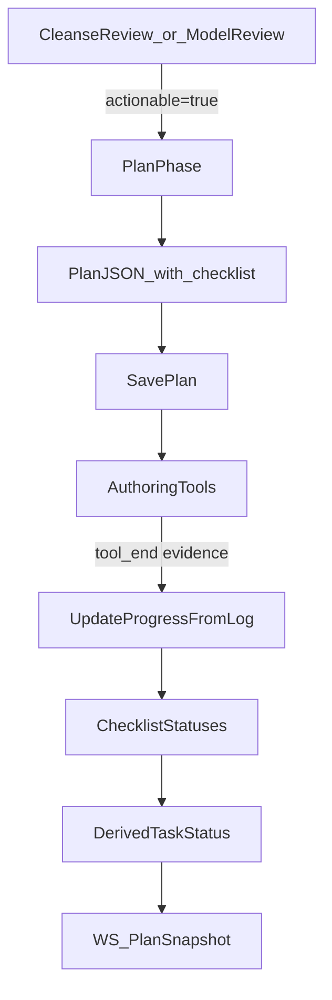

# Goal

Make plan tracking **itemized and deterministic** so the UI can show:

- the stable “original task” for each dataset/model
- what review feedback introduced (as new checklist items)
- what’s completed vs remaining, without a task appearing `done` while still carrying actionable work

# Current state (what’s causing confusion)

- Plan tasks (`CleanseTask`, `ModelTask`) only have a single coarse `status` plus free-form `notes`.
- Progress derivation marks a task `Done` as soon as `staging_model`/`gold_model` succeeds, even if the notes contain additional required work (e.g. YAML contract work).
- The WebSocket `PlanSnapshot` API mirrors this coarse model: tasks expose `status`, `invariants`, `notes`.

Relevant code:

- Plan model: [`crates/react-suites/src/data_engineer/plan.rs`](/Users/huders2000/Documents/sites/skippr/skipprd/crates/react-suites/src/data_engineer/plan.rs)
- Progress derivation: `update_cleanse_progress_from_log`, `update_model_progress_from_log` in the same file
- Batch tools that currently mark tasks done: [`crates/react-suites/src/data_engineer/tools/apply_next_batch.rs`](/Users/huders2000/Documents/sites/skippr/skipprd/crates/react-suites/src/data_engineer/tools/apply_next_batch.rs)
- Plan API mapping: [`react/src/ws/server.rs`](/Users/huders2000/Documents/sites/skippr/skipprd/react/src/ws/server.rs)
- API models: [`react/src/ws/api_gen/src/models/cleanse_task_snapshot.rs`](/Users/huders2000/Documents/sites/skippr/skipprd/react/src/ws/api_gen/src/models/cleanse_task_snapshot.rs), [`react/src/ws/api_gen/src/models/model_task_snapshot.rs`](/Users/huders2000/Documents/sites/skippr/skipprd/react/src/ws/api_gen/src/models/model_task_snapshot.rs)

# Proposed data model (hard cutover)

## 1) Replace `notes` with `checklist`

Introduce a structured checklist item type in the plan layer.

- Add to `plan.rs`:
  - `ChecklistItemStatus`: `pending | in_progress | done | blocked | needs_update`
  - `ChecklistOrigin`: `initial | review_actionable`
  - `PlanChecklistItem`:
    - `id: String` (stable within a task; e.g. `sql_model`, `schema_contract`, `validate`)
    - `label: String` (short UI label)
    - `details: Option<String>` (longer instruction text; optional)
    - `status: ChecklistItemStatus`
    - `origin: ChecklistOrigin`
    - `origin_step_idx: Option<usize>` (thread step index that introduced this requirement; `None` for initial)
    - `evidence: Vec<ChecklistEvidence>` (deterministic references to tool/thread events that completed it)
  - `ChecklistEvidence`:
    - `kind: String` (e.g. `tool_end`, `phase_end`)
    - `tool_name: Option<String>`
    - `tool_id: Option<String>`
    - `step_idx: usize`
    - `ts: Option<String>`

Update `CleanseTask` / `ModelTask`:

- Remove `notes: Vec<String>`
- Add `checklist: Vec<PlanChecklistItem>`
- Keep `invariants` as-is
- Keep `status` (for API simplicity) but treat it as **derived** from checklist (see below)

## 2) Derive task status from checklist

Define a single function `recompute_task_status_from_checklist(task)`:

- If any checklist item is `needs_update` → task `NeedsUpdate`
- Else if any item `blocked` → task `Blocked`
- Else if all items `done` → task `Done`
- Else if any item `in_progress` → task `InProgress`
- Else → `Pending`

This prevents “task is done but still has work”.

# Deterministic progress rules (evidence-backed)

Update progress derivation so it updates **checklist items** rather than immediately setting task done.

## Cleanse (silver)

Checklist defaults per dataset task:

- `sql_model`: staging SQL exists/updated (completed by successful `staging_model` for that dataset)
- `schema_contract`: contract YAML exists/updated (completed by successful `dbt_files op=patch` that touches `models/schema.yml` or `models/staging/*.yml` for the expected model)
- `validate`: dbt validation has passed since the last mutation affecting that model (completed when validation phase completes successfully; evidence from `dbt_validate` tool end ok)

## Model (gold)

Checklist defaults per model task:

- `sql_model`: mart/core SQL exists/updated (completed by successful `gold_model` for that item)
- `schema_contract`: YAML exists/updated (completed by `dbt_files op=patch` touching schema yml paths for that model)
- `validate`: `dbt_validate` ok

## Mapping tool/thread events → checklist updates

Implement deterministic mapping inside `update_cleanse_progress_from_log` / `update_model_progress_from_log`:

- On `staging_model` success: mark `sql_model` done for `succeeded_dataset_ids`, attach evidence
- On `gold_model` success: mark `sql_model` done for `succeeded_item_names`, attach evidence
- On `dbt_files` patch success:
  - Extract patched paths (already implemented in `extract_dbt_files_patch_paths`)
  - If any path looks like schema YAML, mark `schema_contract` **in_progress** for matching tasks; if the patch was non-preview and succeeded, mark **done** and attach evidence
  - Matching heuristic:
    - If path is `models/staging/<name>.yml`, match the task whose `expected_model_path` stem equals `<name>`
    - If path is `models/schema.yml`, match tasks whose `expected_model_path` stem is present in the file-stems touched by the patch args (best-effort)
- On `dbt_validate` tool end:
  - If ok: mark `validate` done for all tasks that have `sql_model` done (or for all tasks in the active plan; whichever is simpler/clearer)
  - If failed: mark `validate` needs_update for tasks implicated by failing model stems (existing logic already extracts stems; reuse it)

After every checklist update, call `recompute_task_status_from_checklist` so `status` reflects remaining work.

# Review feedback tracking (“old vs new feedback”)

When entering a plan phase from `reason_code=review_actionable_true` (already detected in `DataEngineerSuite::entered_from_actionable_review` in [`crates/react-suites/src/data_engineer/mod.rs`](/Users/huders2000/Documents/sites/skippr/skipprd/crates/react-suites/src/data_engineer/mod.rs)):

- Capture the triggering step index (the `Phase` step) and store it in the plan’s `project_snapshot` (e.g. `{"entry_reason_code":"review_actionable_true","entry_step_idx":123,...}`)
- Require the LLM plan JSON to emit any new checklist items derived from review feedback with:
  - `origin = review_actionable`
  - `origin_step_idx = <that step idx>`

This gives the UI a clean way to group items:

- `origin=initial` = original task requirements
- `origin=review_actionable` grouped by `origin_step_idx` = each review cycle’s new requirements

# API spec changes (WebSocket models)

Hard cutover the plan snapshot API to expose checklist items.

Update generated API models under:

- [`react/src/ws/api_gen/src/models/cleanse_task_snapshot.rs`](/Users/huders2000/Documents/sites/skippr/skipprd/react/src/ws/api_gen/src/models/cleanse_task_snapshot.rs)
- [`react/src/ws/api_gen/src/models/model_task_snapshot.rs`](/Users/huders2000/Documents/sites/skippr/skipprd/react/src/ws/api_gen/src/models/model_task_snapshot.rs)

Changes:

- Remove `notes` from `CleanseTaskSnapshot`/`ModelTaskSnapshot`
- Add `checklist: Option<Vec<PlanChecklistItemSnapshot>>`
- Add new API model(s):
  - `PlanChecklistItemSnapshot` (mirrors the plan layer fields but can omit heavy evidence if desired)
  - `PlanChecklistItemStatus`
  - `PlanChecklistItemOrigin`

Update plan mapping in [`react/src/ws/server.rs`](/Users/huders2000/Documents/sites/skippr/skipprd/react/src/ws/server.rs) `load_latest_plans()`:

- Map suite plan tasks → API checklist items
- Ensure `status` is derived (it will be if suite recomputes it before saving)

# LLM plan JSON contract update

Update plan prompts so the LLM outputs structured checklist items instead of free-form notes.

Target prompt files:

- [`crates/react-suites/src/data_engineer/prompts/mod.rs`](/Users/huders2000/Documents/sites/skippr/skipprd/crates/react-suites/src/data_engineer/prompts/mod.rs)
- Any plan-specific prompt module (e.g. `prompts/plan.rs` if present)

Prompt requirements:

- For each task, output `checklist` with stable IDs (`sql_model`, `schema_contract`, `validate`) and any additional review-derived items.
- Enforce that `origin` and `origin_step_idx` are set for review-derived checklist items.

# Tests

Add/adjust unit tests to lock in the behavior:

- Plan progress:
  - `staging_model` success only completes `sql_model`, task remains not-done if `schema_contract`/`validate` pending
  - `dbt_files` patch completing schema marks `schema_contract` done
  - `dbt_validate` ok completes `validate`
- API mapping:
  - `PlanSnapshot` includes `checklist` items and no longer includes `notes`
- Review grouping:
  - When actionable review triggers a new plan, checklist items with `origin=review_actionable` retain `origin_step_idx` and can be grouped

# Rollout and cutover

- This is a hard cutover: existing stored plan JSON blobs may fail to deserialize. That’s acceptable per current non-prod constraints.
- Add a clear error in `load_latest_plans` if a plan file cannot be parsed (so UI doesn’t silently mislead).
