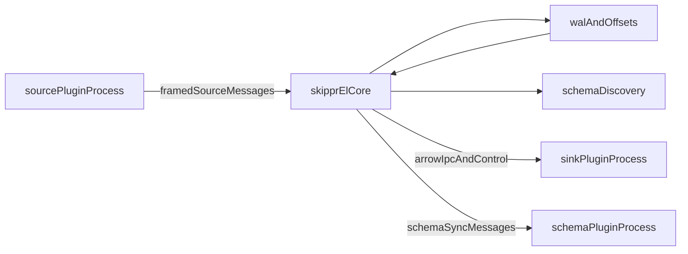

# Runtime Plugin Architecture Plan

## Goal

Move all connectors out of the `skippr-el` binary into separately distributed plugin executables, while keeping the current ingestion guarantees and batching behavior in core.

Also clean up the docs information architecture so connector documentation is not duplicated under CLI-oriented sections: every connector should have its own dedicated page under the connector taxonomy only.

## Core decisions

- Default runtime model: separate plugin child processes, launched and supervised by core.
- Default transport: framed `stdin`/`stdout` IPC.
- Future transport compatibility: design the protocol so the same message model can later ride over TCP or gRPC without changing plugin semantics.
- Core remains the system of record for WAL, offsets, compaction, retries, and schema evolution.

## Recommended architecture

## New boundaries

### Source plugins

- Replace in-process `DataSource::sync(offsets, output)` with an out-of-process source protocol that emits batches equivalent to `IngestBatch`.
- Source plugins should send:
  - `offset_key`
  - raw payload string or bytes
  - optional namespace override
  - source URI / byte metadata
- Core should continue parsing, discovery, WAL writes, and offset advancement.

### Sink plugins

- Replace in-process `DataSink::sync(stream, filename)` with an out-of-process sink protocol that receives:
  - Arrow IPC stream frames
  - logical output key / filename
  - sink routing metadata
- Sink plugins should ack only after durable destination write.
- Core should keep retry semantics and assume sink-side idempotency may be required.

### Schema plugins

- Keep schema sync as a distinct control-plane protocol, not mixed with the data path.
- Schema plugins should receive namespace plus `OutputMetadata`-equivalent schema information.

## Main code areas to reshape

- [src/plugins/traits.rs](/Users/huders2000/Documents/sites/skippr/skipprd/src/plugins/traits.rs)
  - Split current in-process traits into two layers:
    - internal host-side orchestration traits
    - wire-protocol-facing plugin SDK contracts
- [src/helpers/configuration.rs](/Users/huders2000/Documents/sites/skippr/skipprd/src/helpers/configuration.rs)
  - Replace closed enum-only connector registration with runtime plugin manifests and open-ended plugin config payloads.
  - Keep pipeline references stable, but resolve them via plugin manifest metadata instead of compile-time enum variants.
- [src/main.rs](/Users/huders2000/Documents/sites/skippr/skipprd/src/main.rs)
  - Remove large source/sink construction matches and replace them with a host-side plugin manager / launcher.
- [src/ingest_work.rs](/Users/huders2000/Documents/sites/skippr/skipprd/src/ingest_work.rs)
  - Reuse current `IngestBatch` semantics as the basis for the source IPC contract.
- [src/buffer/ingest_buffer.rs](/Users/huders2000/Documents/sites/skippr/skipprd/src/buffer/ingest_buffer.rs)
  - Keep this in core; adapt compactor output to stream Arrow IPC over the sink transport.
- [src/helpers/offsets.rs](/Users/huders2000/Documents/sites/skippr/skipprd/src/helpers/offsets.rs)
  - Keep offset ownership in core, not in plugins.

## Distribution model

- Introduce plugin manifests describing:
  - plugin kind: `data_source`, `data_sink`, `schema_sink`, later `schema_source`
  - plugin name and version
  - supported config schema version
  - executable artifact per target platform
  - checksum / signature metadata
- Core downloads plugins into a managed local plugin directory and verifies checksum before launch.
- Version pinning should live in config or a lockfile so production runs are reproducible.

## IPC design for v1

- Use a framed binary stream over `stdin`/`stdout`.
- Use small control envelopes for:
  - handshake
  - capabilities
  - config load
  - health / heartbeat
  - ack / nack
  - schema sync requests
- Use bulk payload frames for:
  - source-to-core record batches
  - core-to-sink Arrow IPC streams
- Keep message model transport-neutral so TCP/gRPC adapters can be added later.

## Rollout strategy

### Phase 1

- Extract a host-side plugin manager and protocol types inside the existing repo.
- Implement one source and one sink through the external-process path as a vertical slice.
- Keep legacy in-process plugin execution available behind a compatibility path while proving correctness.
- Remove connector duplication in docs navigation and content layout so the new external-plugin model has one canonical place per connector.

### Phase 2

- Create a Rust plugin SDK crate for source, sink, and schema plugins.
- Move connector implementations into separate plugin crates/binaries in this repo or a sibling workspace.
- Add plugin manifest generation and local download/install logic.

### Phase 3

- Migrate remaining connectors from compile-time enum wiring to runtime manifests.
- Remove the big factory matches from core once parity is reached.
- Add optional secondary transports only after the stdio protocol is stable.
- Finalize docs IA:
  - no connector listings under CLI reference / connect-style command docs
  - one dedicated page per connector
  - connector pages grouped only under source/destination taxonomy

## Documentation IA changes

- Current state:
  - dedicated connector pages already exist under `[docs/docs/connectors/inputs](file:///Users/huders2000/Documents/sites/skippr/skipprd/docs/docs/connectors/inputs)` and `[docs/docs/connectors/outputs](file:///Users/huders2000/Documents/sites/skippr/skipprd/docs/docs/connectors/outputs)`
  - navigation is controlled by `[docs/mkdocs.yml](file:///Users/huders2000/Documents/sites/skippr/skipprd/docs/mkdocs.yml)`
- Target state:
  - connector-specific documentation appears only in the connector section
  - no connector catalog or connector-specific duplication under CLI reference
  - no long aggregate connector pages; each connector keeps its own dedicated page
- Planned doc changes:
  - simplify nav in `[docs/mkdocs.yml](file:///Users/huders2000/Documents/sites/skippr/skipprd/docs/mkdocs.yml)` so connectors are only listed in the connector taxonomy
  - keep CLI docs focused on command behavior, flags, and examples, linking out to connector pages instead of re-listing connectors
  - preserve cross-links from configuration pages like `[docs/docs/configuration/input.md](file:///Users/huders2000/Documents/sites/skippr/skipprd/docs/docs/configuration/input.md)` and `[docs/docs/configuration/output.md](file:///Users/huders2000/Documents/sites/skippr/skipprd/docs/docs/configuration/output.md)` to the per-connector pages

## Key design constraints

- Do not move WAL ownership out of core.
- Do not let plugins own source offsets independently of core.
- Preserve schema sync as a separate plane from data sync.
- Prefer transport-neutral protocol messages over transport-specific semantics.
- Keep cross-platform startup and supervision simple; avoid making Unix-specific sockets the default abstraction.
- Keep documentation canonical: one connector, one page, one place in nav.

