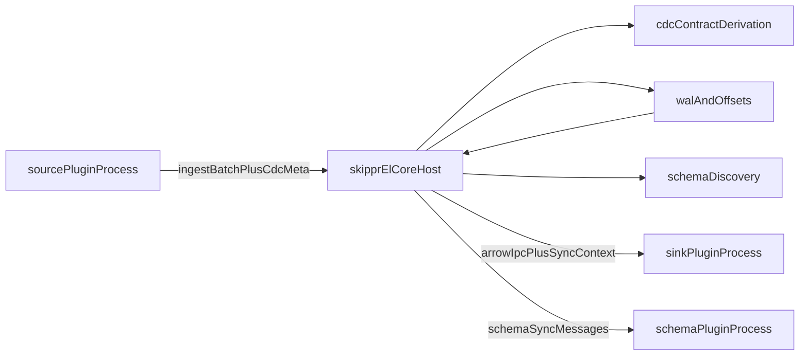

# Runtime Plugin Architecture Plan

## Goal

Move all connectors out of the `skippr-el` binary into separately distributed plugin executables while preserving the CDC-aware source and sink semantics that now exist in the in-process plugin traits.

## Non-goals

- Do not mix documentation cleanup or connector IA work into this plan.
- Do not add alternate transports until the stdio-based runtime protocol is stable.

## Core decisions

- Default runtime model: separate plugin child processes, launched and supervised by core.
- Default transport: framed `stdin`/`stdout` IPC.
- Future transport compatibility: design the protocol so the same message model can later ride over TCP or gRPC without changing plugin semantics.
- Core remains the system of record for WAL, committed offsets, checkpoint authority, compaction, retries, and schema evolution.
- Core derives the enforced CDC guarantee from source and sink capabilities plus pipeline config; plugins declare capabilities but do not decide the contract at runtime.
- Source plugins own source-specific checkpoint payload encoding and bootstrap anchor capture; core stores opaque envelopes and only promotes WAL-owned progress after durable commit.
- Sink plugins must preserve both current CDC paths:
  - exact-once final-state apply with business keys, order tokens, and tombstones
  - CDC-encoded landing for sinks that can accept CDC payloads but do not reconcile final state themselves

## Recommended architecture

## CDC-aware plugin boundaries

### Host responsibilities

- Load plugin manifests, launch child processes, and negotiate protocol version plus plugin kind.
- Collect source and sink capability descriptors and run compatibility validation equivalent to today's `derive_and_validate`.
- Build and retain the `NamespaceContract` used by compaction and sink apply.
- Persist `CheckpointEnvelope` values and `WalPartMeta` blobs in core-owned storage.
- Advance WAL-owned checkpoints only after the corresponding WAL segment is durably committed.

### Source plugins

- Replace in-process `DataSource::sync(offsets, output)` with an explicit source protocol that receives:
  - plugin config
  - previously committed checkpoint envelopes and advisory progress
  - any pipeline CDC configuration relevant to namespace/business-key planning
- Source plugins should emit batches equivalent to today's `IngestBatch`, including:
  - `offset_key`
  - raw payload string or bytes
  - optional namespace override
  - source URI / byte metadata
  - optional per-row `WalRowMeta` aligned to the produced records
- Source control messages should support:
  - capability declaration
  - bootstrap anchor capture
  - checkpoint/progress updates using `CheckpointEnvelope`
  - health / heartbeat / graceful shutdown
- Source-specific checkpoint payload schemas stay owned by the plugin SDK; the host only validates envelope metadata and persists opaque bytes.

### Sink plugins

- Replace in-process `DataSink::sync(stream, filename, cdc_ctx)` with an out-of-process sink protocol that receives:
  - Arrow IPC stream frames
  - logical output key / filename
  - optional `SyncContext` equivalent carrying `WalPartMeta` and `NamespaceContract`
- Sink plugins must preserve both current execution modes:
  - exact-once final-state sinks that compare order tokens, manage Skippr metadata columns, and maintain tombstone tables
  - CDC-encoded sinks that land mutations by augmenting batches with `_skippr_mutation` and `_skippr_order_token`
- Sink plugins should declare `SinkCapability` during handshake so the host can validate the source/sink pair before data starts flowing.
- Sink plugins should ack only after the durable write or transaction commit required by their declared guarantee tier.

### Schema plugins

- Keep schema sync as a distinct control-plane protocol, not mixed with the data path.
- Schema plugins should receive namespace plus `OutputMetadata`-equivalent schema information.
- The runtime split should not force schema plugins to understand CDC row metadata; that stays on the data path only.

## Main code areas to reshape

- `src/plugins/traits.rs`
  - Split current in-process traits into two layers:
    - internal host-side orchestration traits
    - wire-protocol-facing plugin SDK contracts
  - Preserve the existing CDC-aware trait surface: source `capability`, source `capture_bootstrap_anchor`, and sink `sync(..., cdc_ctx)`.
- `src/plugins/cdc.rs`
  - Promote the CDC and checkpoint types into a shared host/SDK contract crate or module boundary.
  - Treat `SourceCapability`, `SinkCapability`, `CheckpointEnvelope`, `NamespaceContract`, `WalRowMeta`, `WalPartMeta`, and `SyncContext` as protocol-stable types.
- `src/main.rs`
  - Replace compile-time source/sink construction matches and startup capability lookup with a host-side plugin manager and handshake flow.
  - Move CDC contract derivation and validation behind the runtime plugin registry instead of hard-coded plugin-name lookups.
- `src/helpers/configuration.rs`
  - Replace closed enum-only connector registration with runtime plugin manifests and open-ended plugin config payloads.
  - Keep pipeline references stable, but resolve them via plugin manifest metadata instead of compile-time enum variants.
- `src/ingest_work.rs`
  - Reuse current `IngestBatch` semantics as the basis for the source IPC contract, including optional `cdc_rows`.
- `src/buffer/ingest_buffer.rs`
  - Keep compaction and `SyncContext` reconstruction in core.
  - Continue reading `WalPartMeta` from WAL-owned metadata blobs before dispatching to sink plugins.
- `src/buffer/segment_file.rs`
  - Keep WAL partition metadata storage in core, including serialized `WalPartMeta` sidecars.
- `src/plugins/data_sink/cdc_encode.rs`
  - Decide whether CDC column augmentation lives in core or in the sink SDK, but preserve the helper path for CDC-encoded sinks.
- `src/plugins/data_sink/cdc_apply.rs`
  - Keep exact-once apply planning logic available to sink plugins through shared SDK helpers rather than duplicating SQL-generation behavior per plugin.

## Distribution model

- Introduce plugin manifests describing:
  - plugin kind: `data_source`, `data_sink`, `schema_sink`, later `schema_source`
  - plugin name and version
  - protocol version
  - supported config schema version
  - declared capability descriptor
  - executable artifact per target platform
  - checksum / signature metadata
- Core downloads plugins into a managed local plugin directory and verifies checksums before launch.
- Version pinning should live in config or a lockfile so production runs are reproducible.
- Capability information must be present in the manifest and re-confirmed during runtime handshake so the host can reject stale or mismatched binaries early.

## IPC design for v1

- Use a framed binary stream over `stdin`/`stdout`.
- Use control envelopes for:
  - handshake
  - plugin metadata / capabilities
  - config load
  - checkpoint restore
  - bootstrap anchor capture
  - health / heartbeat
  - ack / nack
  - schema sync requests
- Use bulk payload frames for:
  - source-to-core ingest batches
  - source-to-core checkpoint/progress updates
  - core-to-sink Arrow IPC streams
  - core-to-sink CDC sync context
- Keep the wire model transport-neutral so TCP/gRPC adapters can be added later.

## Rollout strategy

### Phase 1

- Extract shared protocol and CDC contract types inside the existing repo.
- Implement `Postgres -> Postgres` through the external-process path as the first vertical slice because it exercises:
  - anchored snapshot/bootstrap semantics
  - source-native checkpoint payloads
  - per-row CDC metadata
  - business keys and order tokens
  - tombstone-backed exact-once sink apply
- Keep legacy in-process plugin execution available behind a compatibility path while proving correctness.

### Phase 2

- Create a Rust plugin SDK crate for source, sink, and schema plugins.
- Move connector implementations into separate plugin crates/binaries in this repo or a sibling workspace.
- Add plugin manifest generation and local download/install logic.
- Add one CDC-encoded sink slice after the first exact-once slice to prove the lighter-weight CDC landing path as well.

### Phase 3

- Migrate remaining connectors from compile-time enum wiring to runtime manifests.
- Remove the big factory matches from core once parity is reached.
- Verify that non-CDC append-only connectors still work through the same runtime host model.
- Add optional secondary transports only after the stdio protocol is stable.

## Key design constraints

- Do not move WAL ownership out of core.
- Do not let plugins advance committed source progress independently of core.
- Preserve checkpoint authority distinctions between WAL-owned state and advisory hints.
- Preserve schema sync as a separate plane from data sync.
- Preserve the current CDC capability model and effective-guarantee derivation semantics.
- Preserve the current `WalRowMeta` / `WalPartMeta` fidelity across the plugin boundary.
- Prefer transport-neutral protocol messages over transport-specific semantics.
- Keep cross-platform startup and supervision simple; avoid making Unix-specific sockets the default abstraction.
