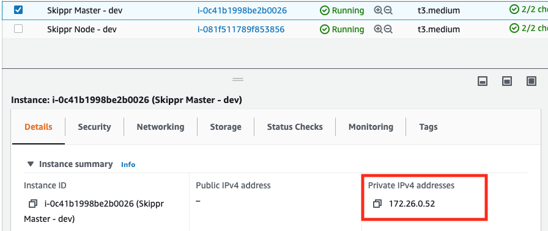

# Deploying to AWS

### Deployment Method

Skippr provisions with just one `cloudformation command` and is designed to easily drop into your existing deployment and CICD tooling.

The deployment contains a single machine image with best practice infrastructure as code, including:

* Skippr Amazon Machine Image
* EC2 Instance Profile
* Autoscaling Group (for worker nodes)
* RDS MySQL instance (for job configurations)
* KMS (to encrypt connection secrets)


## Deployment Steps

#### Contact Skippr support to enable your license

Your AWS Account ID needs to be licensed and authenticated to deploy the Skippr AMI machine image.

Reach out via web chat at [skippr.io](https://skippr.io) or via your support email.

#### Export bash environment variables with your configuration values

```console
export SKIPPR_ENV=""
export AWS_REGION=""
export SKIPPR_CF_URL=""
export EC2_KEY_PAIR=""
export EC2_INSTANCE_TYPE=""
export VPC_ID=""
export VPC_CIDR=""
export SUBNET_AZ1_ID=""
export SUBNET_AZ2_ID=""
export RDS_USER=""
export RDS_PASS=""
```

#### Run the Cloud Formation command to create the Skippr stack

```console
aws cloudformation create-stack \
    --stack-name ${SKIPPR_ENV} \
    --region ${AWS_REGION} \
    --template-url ${SKIPPR_CF_URL} \
    --capabilities CAPABILITY_IAM \
    --parameters \
        ParameterKey=KeyName,ParameterValue=${EC2_KEY_PAIR} \
        ParameterKey=NodeInstanceType,ParameterValue=${EC2_INSTANCE_TYPE} \
        ParameterKey=VpcId,ParameterValue=${VPC_ID} \
        ParameterKey=VpcCidr,ParameterValue=${VPC_CIDR} \
        ParameterKey=VpcAz1SubnetId,ParameterValue=${SUBNET_AZ1_ID} \
        ParameterKey=VpcAz2SubnetId,ParameterValue=${SUBNET_AZ2_ID} \
        ParameterKey=DBUsername,ParameterValue=${RDS_USER} \
        ParameterKey=DBPassword,ParameterValue=${RDS_PASS}

```

You can view all AWS Resources Skippr has created and any events and errors while creating those resources in the AWS CloudFormation console.

Vists:

**AWS Web Console** -> **CloudFormation** -> **Stacks** -> **[YOUR STACK NAME]**

Once all resources have been created and the EC2 machines are ready, Skippr will start and initialise in about 5 mins.

#### Login to the Skippr console

Access the Skippr web console by visiting the private IP address of the `Skippr Master` EC2 Instance on port 30002 (or 30001 for HTTP) in your web browser.



e.g:

* https://172.26.0.52:30002/
* http://172.26.0.52:30001/


You're done!


## Deleting the Skippr Stack

If you're just testing and wish to delete the Skippr stack, it's as simple as running:

```console
aws cloudformation delete-stack --stack-name ${SKIPPR_ENV}
```

Or, visit:

**AWS Web Console** -> **CloudFormation** -> **Stacks** -> **[YOUR STACK NAME]**

And then click Delete.

**IMPORTANT**

This will permanently and irrevocably delete all your Skippr infrastructure and data, including configurations, input and output connection details, encrypted secrets, and the AWS KMS encryption key.

Any data in your destinations that Skippr has synced to will remain, as will any destination schemas and configurations (such as Hive schemas and Athena databases and tables).

