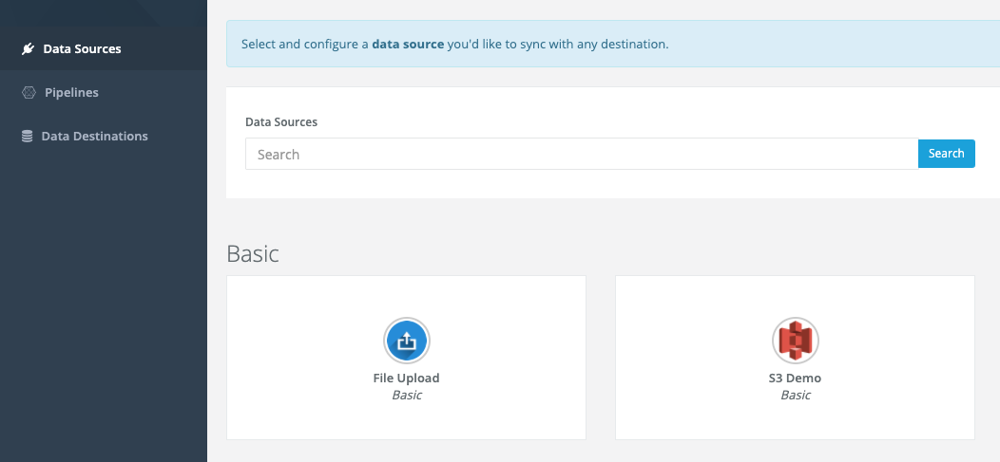
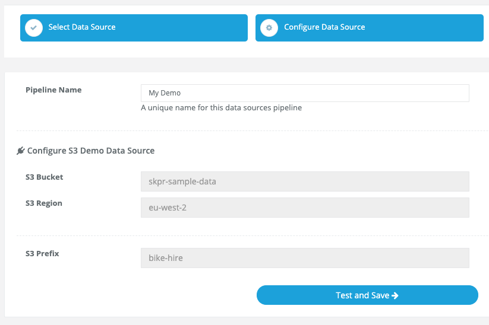
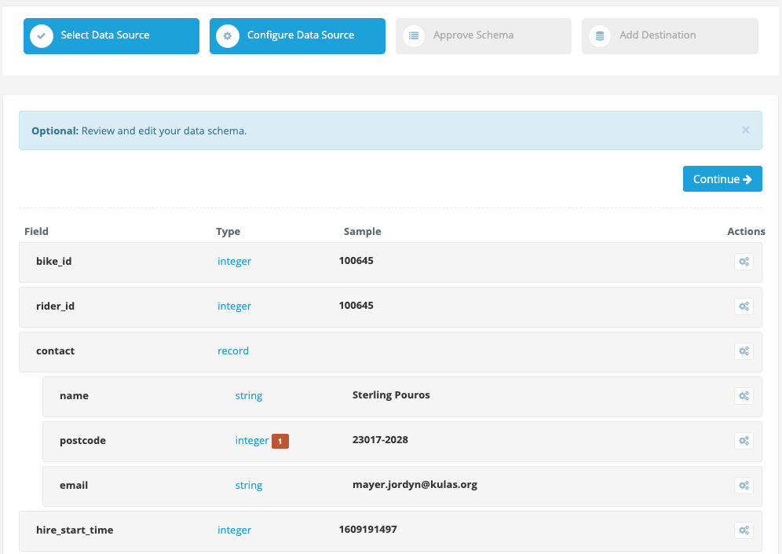
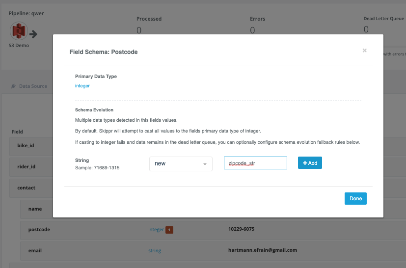
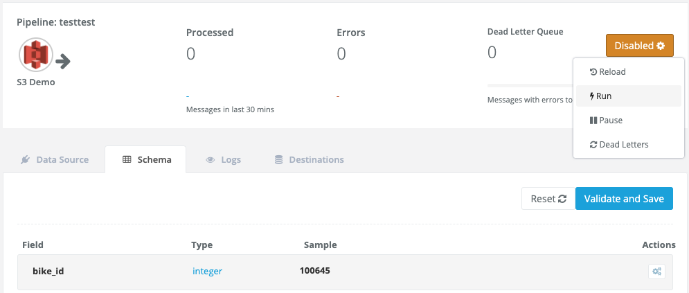

# Online Demo Quick Start

### Important

It's highly recommened to use the Skippr demo data input with this online demo account.

The Skippr online demo is for testing only. While the platform is secure, you probably shouldn't submit your credentials or process your data as it's likely you have data processing controls in place.

Skippr is designed to deploy to your private cloud environment and drop into your existing CICD, git workflow and build tooling such as Terraform. [Please contact us](https://hello.skippr.io/request-free-trial) to deploy a free trial to your private cloud.


## Let's Get to the Demo!

During this demo, you will:

- Ingest 1 million raw json messages from a city bike hire company
- Auto-discover the raw json's nested schema
- Solve schema evolution for a nested field


### 1. Create a Demo User Account

Visit [https://console.skippr.io/register](https://console.skippr.io/register) and create a user account.


### 2. Add the Demo Data Source

The `S3 Demo` Data Source is the easiest way to get started with the Skippr demo. The S3 Demo bucket contains gzip'd files of json, representing IoT events from a fictitious Bike Hire company.




The demo data is a fairly typical example of event data, containing some ID's, location and timestamps and nested data.

The nested data in the `metadata` field is particularly complex but as you'll see in the next step, Skippr will discover the **complete nested schema automatically** for us. Allowing us to output fully nested data in formats like Avro or Parquet to our destinations.

Here's an example of the demo json data:

```
{
  "bike_id": "100974",
  "rider_id": "100308",
  "contact": {
    "name": "Lue Goyette",
    "postcode": "39719-6864",
    "email": "abc.xyz@gomail.com"
  },
  "hire_start_time": 1609949532,
  "hire_end_time": 1609950403,
  "metadata": {
    "rcvd_time": 1609949579,
    "sent_time": 1609949570,
    "prcd_micro_time": 1609949527.87177,
    "tags": [
      {
        "name": "type",
        "value": "trip"
      }
    ]
  },
  "location": {
    "start_geo": {
      "lat": 70.869025,
      "lon": 22.627009
    },
    "end_geo": {
      "lat": -87.983513,
      "lon": -83.791549
    }
  }
}
```


### 3. Configure the Input

Now just enter a name for your Demo pipeline and click `Test and Save`.

The `S3 Demo` job will now start and in 1min or so, the discovered schema will appear (you can view the logs while you wait).



**Note:** In this `S3 Demo` example Data Source you'll see that all the configuration fields have been completed already. For normal input plugins you would enter your credentials here.

### 4. Review the Discovered Schema


When the page reloads, you will see the auto-discovered schema fully supports the nested data in the json example we looked at above.



**Schema Evolution**

The eagle-eyed may have noticed that we've deliberately included an issue in the demo data. The `postcode` field has been discovered as an `integer` field type, however later in the demo data it contains some `string` types.

This is typical of schema evolution issues that would normally break data pipelines. However, Skippr has highlighted the issue and will `deadletter` any affected events into the error queue until we set a schema evolution rule. This ensures our pipeline continues to process valid events while not loosing any error events or breaking upstream schemas in our datalakes, etc.

**Solving Schema Evolution**

Let's solve the schema evolution for the postcode field. We'll do this by creating a new field to support any records with `string` values in the postcode field.

(NOTE: it's also possible to simply change the postcode field type but for the purpose of demonstration, we'll create a new field)

- Click the `postcode` field type
- Select `new` in the drop down
- Enter the new field name (e.g. zipcode_str)
- Click `+Add` and `Done` buttons
- Finally, click `Validate and Save`



That's it, all `integers` in the postcode field will continue to process. Any `strings` will now be output to the new `zipcode_str` field.

Skippr will only allow non-breaking changes in your schema evolution by default and will manage the schemas in your destinations (Snowflake, Avro Schema registry, etc).

### Ok, Let's start the pipeline

Having reviewed the schema (and if you fancy it, resolving the `postcode` field schema evolution), we can now start the pipeline.

Select `Run` from the top actions dropdown button.

The pipeline will start and in 1 min or so you'll see metrics for the successfully ingested messages as well as any that have been dead-lettered and sent to the error queue.



## What next?

So far we've demonstrated connecting to a data source and discovering a schema via the Skippr Console UI.

From here you might like to try:

- solving the schema evolution for the `postcode` field and re-processing the deadletters
- adding destination outputs (such as S3, Athena, Snowflake, etc)

While we've used the **Skippr UI** here, it's best practice to use the **Skippr CLI** or **Skippr Terraform** provider, following configuration as code and IaaC principles.

Much in the same way as your would define your Transformation data models in code with tools like getDBT.com. Remember, **Skippr is the EL in ELT** - so a perfect fit for your Transformation tooling.


## Get Free Trial

To deploy Skippr to your private cloud environment and start ingesting your data to your datalakes and streaming platforms, [request a free trial](https://hello.skippr.io/request-free-trial)
