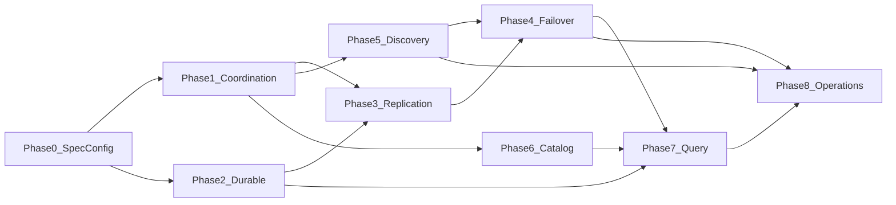

# Implementation WBS: Multi-Node Skippr HLA

**Architecture:** [`hla-distributed-query-iceberg-catalog.md`](./hla-distributed-query-iceberg-catalog.md)  
**Flight SQL / Ballista:** [`hla-flight-sql-ballista.md`](./hla-flight-sql-ballista.md)  
**Style:** [`AGENTS.md`](../../../AGENTS.md)  
**Boundary:** [`repository-map.md`](./repository-map.md)

This WBS is the implementation contract for clustered disk WAL, failover, the Iceberg DynamoDB catalog, Flight SQL, and Ballista. It supersedes the earlier draft choices for sled leases, custom Flight tickets, configurable quorum, extra cluster knobs, and an Iceberg listing fallback. Shipped vs deferred is recorded in the architecture spec **Implementation status** section: Arrow Flight SQL 58.3, Ballista 53, and authenticated Chitchat (WU-5.1) are in tree. Flight SQL / Ballista requirements and design: [`hla-flight-sql-ballista.md`](./hla-flight-sql-ballista.md).

## Completion rules for every work unit

- Compile-time invariants first: newtypes, enums, exhaustive matches, typed errors.
- No `if cluster` branches through ingest orchestration. Cluster behavior enters through typed factories, lease guard, durable store, offset publisher, and lifecycle.
- No one-implementor trait hierarchy. Traits are justified only by real production backends or deterministic test doubles.
- No process-global pipeline/config lookup from replica/query/catch-up code.
- Default host builds do not pull DynamoDB connector dependencies.
- Feature-gated code compiles in CI.
- No work unit is complete without its named deterministic tests.

## Locked configuration

```rust
pub enum WalStorage {
    Disk,
    S3,
    Clustered,
}
```

- Existing `WAL_STORAGE` / `--wal-storage` only.
- `clustered` reuses existing `SKIPPR_OFFSET_DYNAMODB_TABLE` for offsets, leases, and membership.
- Iceberg `catalog.type: skippr` uses a separate customer-created `catalog.table`. It MUST NOT be the offset table.
- No lease/quorum/TTL/node/bind/peer-list knobs.
- Quorum and replication factor are both two total copies.
- `clustered` forces DynamoDB offsets/checkpoints.
- `clustered sync --once` and clustered discover fail validation.
- `clustered query` never takes an ingest lease. After WU-7.5 it opens Flight SQL on any ready node; that node plans Iceberg∪WAL. WAL is best-effort latest advertised head ([`hla-flight-sql-ballista.md`](./hla-flight-sql-ballista.md)).
- `disk` and `s3` start no cluster services.

## Dependency graph



## Planned layout

```text
crates/skippr-lease/
crates/skippr-lease-store-dynamodb/
crates/skippr-iceberg-catalog/
crates/skippr-iceberg-catalog-dynamodb/
crates/skippr-query-ballista/
proto/cluster.proto
src/cluster/
  identity.rs
  membership.rs
  peer.rs
  placement.rs
  promote.rs
  scheduler.rs
  lifecycle.rs
src/buffer/durable/
  mutation.rs
  log.rs
  snapshot.rs
  apply.rs
  store.rs
  replicate.rs
src/query_flight/          # Arrow Flight SQL 58.3 on flight_addr; in-process Ballista
  service.rs
  live_wal.rs
src/sqlrt/
  iceberg_table.rs
  flight_sql_table.rs      # FlightSqlExec leaf, not StreamingBatchesExec
  wal_table.rs
```

# Phase 0 — Spec, config, and compatibility gates

## WU-0.1 Typed `WalStorage`

**Touch:**

- [src/helpers/configuration.rs](../../../src/helpers/configuration.rs)
- [src/cli/mod.rs](../../../src/cli/mod.rs)
- [src/buffer/wal_store.rs](../../../src/buffer/wal_store.rs)
- [src/buffer/ingest_buffer.rs](../../../src/buffer/ingest_buffer.rs)
- [src/helpers/offsets.rs](../../../src/helpers/offsets.rs)
- [src/engine.rs](../../../src/engine.rs)
- [src/ingest_work.rs](../../../src/ingest_work.rs)

**Deliverables:**

- Parse `disk|s3|clustered` into an enum.
- Unknown values fail startup.
- Exhaustively replace all string `s3` comparisons.
- Do not add a YAML `wal_storage` field.
- Add a guard test preventing new string comparisons.

**Tests:** enum parsing, CLI precedence, unknown value, every factory branch.

## WU-0.2 Clustered mode validation

**Deliverables:**

- Require existing `offset-store-dynamodb` feature and table.
- Select DynamoDB offsets when unset; reject explicit sled.
- Reject clustered `--once`, discover, AtLeastOnce sink, NonRetryable sink, and duplicate `DATA_DIR` process.
- Add `PipelineConfigView::for_name` for immutable per-pipeline resolution without process-global pipeline identity.

**Tests:** all valid/invalid mode and connector combinations.

## WU-0.3 Documentation synchronization

Update operator/config/concept/README docs with:

- third `WAL_STORAGE` value;
- expanded DDB row families and IAM;
- S3 mode remains non-clustered;
- no extra cluster knobs;
- trusted-private-network requirement;
- two-node durability versus three-node failover write availability.

# Phase 1 — Coordination

## WU-1.1 Identity, clock, and typed errors

**Create:** `crates/skippr-lease`.

```rust
pub struct LeaseEpoch(u64);
pub struct CommitIndex(u64);
pub struct NodeId(uuid::Uuid);
pub struct HostId(String);
pub struct PipelineKey {
    tenant: String,
    workspace: String,
    pipeline: String,
}
```

**Deliverables:**

- UUID process generation.
- Host ID derived from platform metadata/machine ID/hostname.
- `Clock` and `AsyncSleeper` production/test implementations.
- Typed lease/fence/quorum/divergence/store/protocol errors.

**Tests:** deterministic monotonic advance and host-ID fallback.

## WU-1.2 `LeaseGuard` and lifecycle

```rust
pub enum WriteAuthority {
    SingleNode,
    Leased(LeaseSession),
}

pub enum PipelineRole {
    Idle,
    OwnerElect(LeaseSession),
    ActivePrimary(WriteAuthority),
    Replica { epoch_seen: LeaseEpoch },
}
```

**Deliverables:**

- Local monotonic expiry.
- Higher epoch demotes Active/Elect and updates replicas.
- `PipelineLifecycle` watch channel.
- Ingest, compactor, durable store, runtime source, and offsets observe fence.
- Single-node epoch zero path.

**Tests:** role checks, expiry, fence rumor, renew loss, source still producing after fence.

## WU-1.3 Clock-free DDB lease

**Create:** `crates/skippr-lease-store-dynamodb`, included by existing `offset-store-dynamodb` feature.

**Row:**

```text
PK={tenant}#{workspace}#{pipeline}
SK=lease
owner_node, epoch, heartbeat, released, initialized
```

**Protocol:**

- conditional create for missing item;
- conditional renew increments heartbeat;
- contention strongly observes an unchanged owner/epoch/heartbeat for 30 monotonic seconds;
- conditional exact-tuple steal increments epoch;
- release only after successful drain;
- never delete lease row;
- local deadline starts when DDB request starts; late response cannot extend it.

Use a dedicated async DDB client so offset publication cannot starve renew.

**Tests:** 100 concurrent acquires, renew/steal race, late/lost response, throttle, release/reacquire epoch, initialized crash windows.

## WU-1.4 DDB membership

**Row:**

```text
PK={tenant}#{workspace}#cluster
SK=node#{node_uuid}
host_id, addresses, heartbeat, protocol range, capabilities
```

**Deliverables:**

- wildcard/ephemeral listeners;
- advertised private IP derived from route to DDB endpoint;
- exact-PK Query for cold discovery;
- conditional stale-row cleanup after unchanged observation plus failed dial;
- no DDB Scan;
- membership remains hint-only.

**Tests:** stale rows, bad address, generation mismatch, protocol mismatch, same-host exclusion.

## WU-1.5 Conditional clustered offsets/checkpoints

**Touch:**

- [crates/skippr-offset-store-dynamodb/src/lib.rs](../../../crates/skippr-offset-store-dynamodb/src/lib.rs)
- [src/helpers/offsets.rs](../../../src/helpers/offsets.rs)
- [src/buffer/ingest_buffer.rs](../../../src/buffer/ingest_buffer.rs)
- runtime-plugin offset-hint path

**Item metadata:** `wal_epoch`, `wal_commit_index`, `payload_sha256`.

**Deliverables:**

- Strong read, merge sticky Closed/max Position, conditional exact-prior write, retry.
- Checkpoint last-writer ordering by WAL tuple.
- Same tuple/same hash idempotent; same tuple/different hash corruption.
- Older tuple cannot overwrite newer.
- Async/bounded publication on offset worker.
- Strong-consistent reconciliation barrier before source construction.
- Direct clustered offset writes without a committed tuple are rejected.

**Tests:** conditional races, partial multi-key success, failed quorum leaves DDB untouched, crash after quorum before DDB, S3 object skipped after promotion, CDC checkpoint recovery.

# Phase 2 — Durable mutation state

## WU-2.1 Protobuf domain and hash chain

**Create:** `proto/cluster.proto`, `src/buffer/durable/mutation.rs`.

Envelope fields:

- protocol version;
- pipeline key;
- epoch;
- commit index;
- previous hash;
- typed body.

Hash canonical protobuf plus previous hash and payload hash. Sort every repeated identity collection.

Mutations:

```text
CommitSegment
PutCompaction
CompleteSlices
ReclaimSegment
```

`CommitSegment` contains segment descriptor, sorted offsets, and checkpoint envelopes. Segment bytes are an out-of-band payload belonging to the same mutation.

`PutCompaction` contains the whole portable transaction for every state transition.

**Tests:** codec/current-previous version, canonical ordering, chain mismatch, unknown field/version, all variants.

## WU-2.2 Portable refs and `PipelinePaths`

**Touch:**

- [src/buffer/compaction_transaction.rs](../../../src/buffer/compaction_transaction.rs)
- [src/sink_apply_identity.rs](../../../src/sink_apply_identity.rs)
- runtime WAL ref protocol

**Deliverables:**

- Explicit tenant-scoped paths: `{DATA_DIR}/clustered/{encoded_tenant}/{encoded_workspace}/{encoded_pipeline}`.
- Clustered source identity `wal://tenant/workspace/pipeline/segment`.
- No absolute path in clustered manifests, RPCs, hashes, or sink receipts.
- Legacy disk identity/layout remains unchanged in disk mode; migration installs the clustered baseline under the new root.
- Replica paths never call process-global config.

**Tests:** identical compaction ID/fingerprint across different local roots; path-isolation property.

## WU-2.3 Mutation log state machine

**Create:** `log.rs`.

Records:

```text
Prepared(envelope)
Committed(index, hash)
STATE(base, committed, applied, head_hash)
OFFSET_PUBLISHED(index)
```

**Primary order:**

1. epoch check;
2. payload temp write/hash/fsync/rename/dir fsync;
3. Prepared append/fsync;
4. remote replication;
5. local Committed append/fsync;
6. apply;
7. DDB offsets/checkpoints;
8. ingest Ack.

**Recovery:**

- replay committed-not-applied;
- reconcile prepared unknown outcome with peer Status;
- matching remote commit finalizes locally;
- no peer proof: preserve Prepared, return `QuorumLost`, do not `abort_pending_prepared`, do not activate ingest;
- never commit orphan payload by existence;
- fail closed on chain/hash divergence;
- missing suffix-log envelope at `base < index < committed` is `Diverged`.

**Tests:** subprocess crash at every boundary, truncated records, STATE mismatch, ENOSPC, duplicate request, unknown outcome.

## WU-2.4 Durable applicator

**Create:** `apply.rs` as one production struct.

**Deliverables:**

- Commit marker via existing fsync helper.
- Whole-manifest write/fsync/rename/dir fsync.
- Completion through existing ledger.
- Reclaim through existing cleanup/cache/index helpers.
- Idempotent `(index, hash)` apply.
- Apply error marks node ineligible but remains replayable.

**Tests:** every mutation, duplicate apply, partial failure, corrupt segment/ledger/manifest.

## WU-2.5 `PipelineDurableStore`

**Create:** `store.rs`.

**Deliverables:**

- Disk: `PipelineDurableStore` with `PipelinePaths::legacy_disk`, sled offsets, no network. `ensure_disk_durable_store` installs it before ingest.
- Clustered: leased `PipelineDurableStore`, synchronous replica, DDB offsets, tenant `PipelinePaths`.
- S3: existing store.
- `WalStoreFactory` / `WalReaderFactory` Disk and Clustered arms share `ClusteredWalStore` / `ClusteredWalReader`. `DiskWalStore` is deleted.

**Tests:** existing disk behavior parity and factory exhaustiveness.

## WU-2.6 Compaction integration

Replace direct compaction state writes:

1. quorum Pending;
2. quorum Sent;
3. sink call;
4. quorum Acked;
5. quorum CompleteSlices;
6. quorum Tombstoned/Reclaim.

Recovery of Sent calls sink preflight. Clustered connector validation guarantees replay is safe.

**Tests:** sink success/crash before Acked, AlreadyApplied, unsupported sink rejection, completion/reclaim ordering.

## WU-2.7 State snapshots and retention

**Create:** `snapshot.rs`.

Snapshot contains:

- base index/hash;
- live segment descriptors/payload hashes;
- live compaction transactions;
- completion bitmaps plus compaction/ref mapping;
- latest offset/checkpoint payloads with WAL tuple;
- required schema fingerprints.

Build under commit-queue cut, fsync staging, atomic install. Prune logs/payloads only after snapshot durability.

**Tests:** install crash, cold bootstrap, retained-history boundary.

## WU-2.8 Existing disk migration

Only while lease `initialized=false`:

- require drained/no live manifests;
- read committed segments/completion/current offset backend;
- build baseline state snapshot;
- seed DDB offsets/checkpoints;
- write cluster marker;
- bootstrap remote;
- conditionally set initialized.

Existing initialized lease with no hard state fails.

**Tests:** empty/new, old committed WAL, compacted/reclaimed with sled offsets, live manifest refusal, crash before/after initialized.

# Phase 3 — Replica protocol and quorum

## WU-3.1 Bounded TCP transport

**Create:** `src/cluster/peer.rs`.

Use protobuf control frames and raw streamed payload chunks:

- 16 MiB metadata cap;
- 1 MiB payload chunks;
- buffer splits oversized metadata before commit;
- bounded queues and one in-flight mutation per pipeline;
- read/write/idle/whole-RPC deadlines;
- partial frame cleanup;
- current and previous protocol negotiation.

RPCs: Status, AssignReplica, InstallSnapshot, FetchEntries, Replicate, DropReplica.

Handshake `ClientHello` has cluster hash (`ClusterId`), node id, protocol range. No tenant/workspace (`reserved 5, 6, 7`). `CURRENT_PROTOCOL` is 2. Client verifies `HelloOk.cluster_hash` and protocol range. mTLS is required.

Assign: `ready` starts false; unknown pipeline and unparseable `primary_endpoint` Nack. Assign calls `observe_epoch` and records `assigned_primary`. Unassigned or wrong-epoch Replicate Nacks.

**Tests:** split/truncated/oversized frames, slow reader, reconnect, timeout, protocol mismatch, no unbounded allocation.

## WU-3.2 Replica reopening and placement

**Create:** `placement.rs`.

- Reopen local pipeline directories only with valid cluster marker/state.
- Verify/replay before advertising.
- Target one remote replica.
- Rendezvous-rank candidates.
- Exclude same process, same HostId, bad protocol, disk pressure (including unmeasurable free space), corruption.
- Assign/bootstrap before ready ad.
- In-flight peer set is immutable.

**Tests:** deterministic ranking, membership churn, same-host exclusion, restart generation, replacement.

## WU-3.3 Quorum replicator

**Create:** `replicate.rs`.

- Local fsynced Prepared is vote one.
- One caught-up remote Ack is vote two.
- Replica Acks after durable commit/apply.
- Lagging/stale/corrupt/disk-full/timeout does not count.
- Timeout/unknown live replicate error: keep Prepared, fence ingest.
- Definite Nack (stale, not caught up, disk full, pinned, diverged): abort Prepared.
- No commit marker/offset/Ack without quorum.

**Tests:** quorum success/loss, stale epoch, gap, hash mismatch, timeout, offset unchanged.

## WU-3.4 Unknown outcome

- Reconcile remote Ack lost before local commit.
- Finalize matching peer hash.
- Preserve potentially committed Prepared record until proof; without proof, `QuorumLost` and no ingest activate.
- Reconcile offsets through head before source starts.

**Tests:** response loss, primary SIGKILL, promoted replica, idempotent offset repair.

# Phase 4 — Catch-up and promotion

## WU-4.1 Snapshot plus incremental catch-up

- Status returns epoch, base/committed/applied indexes, head hash, health. Empty hash is genesis; non-32-byte is `ProtocolMismatch`.
- Local committed ahead of donor is `Diverged`.
- Install snapshot when requester predates base.
- Fetch committed entries in order.
- Re-poll and verify index/hash.
- No S3 archive or DDB head hint.

**Tests:** empty fetch, 1..N, snapshot boundary, donor failure/retry, corrupt snapshot.

## WU-4.2 Promotion

Sequence:

1. lease acquisition and OwnerElect;
2. higher-epoch rumor;
3. highest hash-consistent catch-up (always hash-check vs donor endpoint; local ahead is `Diverged`);
4. offset/checkpoint reconciliation (OwnerElect; before activate);
5. schema load/install from object-store `metadata.json` (steal already waited one `LEASE_TIMEOUT`; do not wait again before GET; install plugin schema state; live WAL namespaces must be in the document; initialized pipelines fail closed without it);
6. new remote replica bootstrap;
7. ActivePrimary;
8. source/compactor start.

No implicit majority on hash disagreement. Initialized head loss is fatal.

**Tests:** missed rumor, old renew, hash conflict, no head, new head zero, missing metadata.json / live namespace, steal observation is the previous-writer TTL (no second wait), no replacement.

## WU-4.3 Lag/replacement/purge

- Behind node never Acks.
- Catch up in background.
- Healthy replica leaves only after replacement.
- Corrupt replica stops ads and purges only its pipeline.
- Primary loses quorum until replacement.
- Reclaim is not delayed for scans; missing files are skipped.

**Tests:** lag recovery, forced corruption, purge isolation, active scan.

## WU-4.4 Old-primary fencing

- Local deadline and higher epoch stop commits.
- Old quorum commit is either recovered or remains uncommitted.
- Old offset tuple cannot overwrite new.
- Source may keep producing temporarily but every durable path rejects.

**Tests:** partitioned old primary, in-flight flush/sink, late DDB call.

# Phase 5 — Discovery and gossip

## WU-5.1 Live membership (authenticated Chitchat)

**Create:** `src/cluster/gossip.rs` (Chitchat 0.9), `membership.rs` (DDB / Cloud tables cold seeds).

- DDB / Cloud tables Query supplies cold seeds (`add_seeds` / `ChitchatHandle::gossip`).
- Live transport is authenticated Chitchat: HMAC-SHA256 on `ad` / `fence` / `suspect` payloads. `SKIPPR_CLUSTER_GOSSIP_KEY` is required (no tenant-string fallback). Chitchat `cluster_id` is `SKIPPR_CLUSTER_ID`.
- Advertise endpoints, protocol, replica head hint, capacity/readiness. No `ClientHello.role`.
- No partition-level ads.

**Tests:** three-node convergence, stale DDB row, restart generation, bounded payload.

## WU-5.2 Fence/suspicion wiring

- Fence rumor updates guard only.
- Suspicion triggers lease observation only.
- Status is head truth.
- Gossip cannot call lease mutation apply or offsets.

**Tests:** partition, delayed rumor, stale commit hint, DDB CAS still decisive.

## WU-5.3 Trust boundary

- Replica/Flight/Ballista TCP is always mTLS. Gossip UDP is HMAC with a required cluster key.
- Handshake verifies **cluster id** (`cluster_hash`) and protocol, not tenant/workspace.
- Tenant is `PipelineKey` on every replica frame and Flight `Authorization: Basic {tenant}/{workspace}` on every SQL RPC. Cloud JWT stays on the gateway (D31).
- Flight tables are filtered to the session `TenantScope`.

**Tests:** cross-cluster (wrong `cluster_hash`) and incompatible-version rejection; foreign Flight tenant rejected.

# Phase 6 — Iceberg DynamoDB catalog

## WU-6.1 Shared catalog config

**Create:** `crates/skippr-iceberg-catalog`.

- Move `IcebergCatalogConfig` out of plugin.
- Add Skippr `table`/`warehouse`/`region` variant (`catalog.type: skippr`). `table` is a customer-created catalog table, distinct from `SKIPPR_OFFSET_DYNAMODB_TABLE`.
- Plugin and host share one serde contract.
- `glue_catalog` becomes `Arc<dyn Catalog>` factory/cache.
- Refactor Glue-concrete commit helpers.

**Tests:** all config variants and Glue regression.

## WU-6.2 Full DynamoDB `Catalog`

**Create:** `crates/skippr-iceberg-catalog-dynamodb`.

Implement every `Catalog` method.

Key layout:

```text
PK=catalog#{warehouse_sha256}
SK=namespace#{encoded}
properties, table_count

PK=catalog#{warehouse_sha256}#namespace#{encoded}
SK=table#{name}
uuid, metadata_location, previous_location, generation
```

- Reversible length-prefixed identifiers.
- Transactional create/drop/rename with namespace count.
- Full TableRequirement validation/TableUpdate application.
- Metadata object before pointer CAS.
- Bounded conflict retry.

**Tests:** MemoryCatalog parity, all methods, races, rename, non-empty namespace, stale requirements, orphan metadata.

## WU-6.3 Iceberg sink wiring and query identity

- Build DynamoDB catalog in plugin.
- Preserve Glue.
- Preserve snapshot compaction/idempotency/schema/WAL fingerprint properties.
- Keep REST out of v1.

**Tests:** grouped append/CDC/replace policies with DDB catalog, AlreadyApplied, concurrent commit.

# Phase 7 — Query

## WU-7.1 Iceberg DataFusion provider

**Create:** `src/sqlrt/iceberg_table.rs`.

Implement read-only provider over vendored `TableScan::to_arrow`:

- pinned latest snapshot;
- projection/filter/limit pushdown;
- Iceberg schema/field ID authority;
- R2 object-store setup.

Do not use published `iceberg-datafusion` due MSRV/API mismatch.

Iceberg config/catalog errors fail registration. Non-Iceberg/deadletter listing remains.

**Tests:** no ListingTable for Iceberg, missing catalog error, snapshot pin, pushdown.

## WU-7.2 Unpinned live WAL selector

**Replace:** [src/sqlrt/wal_table.rs](../../../src/sqlrt/wal_table.rs) and `src/query_flight/live_wal.rs` (selector lives with Flight SQL).

`select_live_ordinals(log, exclude_segment_ids)` is the only selector.

- Live ids = `StateSnapshot.segments` ∪ suffix `CommitSegment`.
- Skip ledger-complete ordinals; skip unreadable ledgers and missing files.
- `ReclaimSegment` and Iceberg `skippr.wal-segment-ids` exclude the whole segment.
- No pins, no client head cut, no compaction-id maps.
- Stream batches; no MemTable.
- Project/cast/null-fill to Iceberg schema.

**Tests:** missing file skips, complete ordinal not in UNION, Iceberg-named segment not in WAL.

## WU-7.3 Flight SQL

**Implemented** in `src/query_flight`. Contract: [`hla-flight-sql-ballista.md`](./hla-flight-sql-ballista.md) (WU-7.3). Framed `src/query_socket` is deleted.

Hard-replace `src/query_socket` with `src/query_flight` in the same change. No framed compatibility mode.

Dependencies: Arrow Flight **58.3** `flight-sql`, tonic/prost as required by that crate. Workspace Arrow is already 58.3.

Implement read-only Flight SQL metadata, statements, prepared statements, bounded execution (`CONTROL_FRAME_MAX_BYTES`), and:

```sql
live_wal_scan(tenant, workspace, pipeline, namespace, exclude_segment_ids)
```

- TVF, not a public custom ticket. Mutation-log / replica `CURRENT_PROTOCOL` is 2 (cluster hello). Flight SQL is not a second protocol family.
- GetFlightInfo returns a ticket/prepared handle that does **not** freeze ordinals. DoGet calls `select_live_ordinals` now.
- Foreign tenant/workspace and unknown pipeline fail closed. DDL/update rejected.
- Membership `flight_addr` becomes the gRPC bind. Same ephemeral wildcard, no new knobs.
- `IcebergWalUnionProvider` WAL child is `FlightSqlExec`, not eager `StreamingBatchesExec`. Until WU-7.5, `execute` MAY DoGet in-process on the query client.
- Catalog listing stays prefix-filtered (`catalog_table_to_namespace`).

**Tests:** metadata prefix filter, SELECT unique ids, unknown pipeline, read-only rejection, reclaim between GetFlightInfo and DoGet skips the file, oversized SQL, Iceberg-only with no ready member, harness `query_each_replica_socket` over Flight SQL. `cargo test -p skipprd --lib query_flight::` replaces `query_socket::`.

## WU-7.4 Unpinned UNION

**Shipped in-process:** `IcebergWalUnionProvider` `UnionExec` + `GlobalLimitExec` on the union.

1. load Iceberg current snapshot (fail closed if none);
2. exclude Iceberg `skippr.wal-segment-ids` from WAL;
3. scan live WAL from one ready membership `flight_addr`, or a local durable store;
4. if no WAL replica is reachable, return Iceberg only;
5. UNION is a dumb concat — no DISTINCT, pin, or wait.

Distributed Flight/Ballista UNION remains WU-7.3 / WU-7.5 ([`hla-flight-sql-ballista.md`](./hla-flight-sql-ballista.md)).

**Tests:** missing file skips, complete ordinal not in WAL, Iceberg-named segment not in WAL, Iceberg-only with no replica.

## WU-7.5 Ballista 53 extension

**Implemented** in `run_clustered` (gossip-elected in-process Ballista cluster). Contract: [`hla-flight-sql-ballista.md`](./hla-flight-sql-ballista.md) (WU-7.5).

- Compile Ballista 53 + Iceberg Rust + Flight SQL into `skipprd`. Delete wrapper bins.
- Every clustered node starts a Ballista scheduler + executor + query frontend in `run_clustered`. Executors poll the gossip-elected scheduler (min `NodeId`).
- WAL picker: max advertised `committed_index` (gossip hint, Status fallback); local on tie returns this node's advertised `flight_addr` as `FlightSqlExec`; Iceberg-only if none reachable.
- Iceberg: in-process Catalog first; parquet on any cluster executor; peer Flight SQL scan if load fails; never listing.
- `FlightSqlExec::execute` DoGets; prost schema-in-payload codec; delete `FLSQ`. `WalScanExec` must not enter a Ballista plan.
- `clustered query` uses any ready `flight_addr`. `query-scheduler#` is not used.

**Tests:** codec; UNION shape; local vs remote WAL head as `FlightSqlExec`; election; Iceberg peer fallback; `ballista_cluster_query` HLA scenario.

# Phase 8 — Lifecycle and operations

## WU-8.1 Single-primary scheduler

- Start cluster services before pipeline loop.
- Maintain replicas independently of primary pipeline.
- Run at most one primary (`if ran { break }` after `HeldUntilFence`).
- File sources keep mtime wait and retain the lease.
- Other finite sources: `begin_drain`, `release_after_drain`, return `ReleasedAfterFinite` so the loop can try the next pipeline.
- Indefinite source retains lease.
- Ingest store is the ActivePrimary `PipelineDurableStore`, not scheduler-written `PIPELINE_NAME`.
- Renew is `renew_until_lost`.

**Tests:** two pipelines, lease held elsewhere, finite switch, no concurrent primary.

## WU-8.2 Fence/SIGTERM lifecycle

1. stop acquisition;
2. stop source intake;
3. reject new WAL/sink;
4. resolve/time out commits;
5. drain compactor/runtime source/outbox;
6. release only after quiescence (`release_after_drain` errors leave the lease held; do not retry-release);
7. stop network services after in-flight requests.

**Tests:** signal at idle/ingest/quorum/sink/catch-up; failed drain leaves lease.

## WU-8.3 Readiness and metrics

Readiness requires payload, committed/applied index, head hash, and healthy state.

Metrics (no partition or compaction-ID labels):

- lease/membership;
- quorum/nacks/timeouts;
- committed/applied/published indexes;
- lag/catch-up/snapshot;
- divergence/purge;
- promotion;
- query request/fail (`cluster_flight_*`; Arrow Flight SQL 58.3);
- Iceberg CAS.

Dynamo CAS errors use SDK `ProvideErrorMetadata::code() == Some("ConditionalCheckFailedException")`.

## WU-8.4 Preserve S3 mode

- No lease/replica in S3 mode.
- Preserve Lambda DDB offset repair.
- Document unsupported multi-writer S3.

**Tests:** existing S3 suites unchanged.

## WU-8.5 IAM/build/release

- Expand offset-table IAM/docs.
- Keep DDB absent from default host.
- Existing feature includes lease store.
- Add feature compile/test to CI.
- Package Ballista wrappers after WU-7.5 integration tests.

## WU-8.6 Soak

Maintainer-only:

- three-process churn;
- asymmetric partitions;
- DDB throttle;
- disk pressure;
- long query/reclaim;
- primary SIGKILL during sink/commit.

Random chaos is soak only, never correctness proof.

# Deterministic test contract

## Harness

```text
MemoryLeaseStore
MemoryMembershipStore
MemoryOffsetPublisher
ManualClock and ManualSleeper
ModelPipelineState
FakeNode
ScriptedPeer
Failpoint
Subprocess crash helper
```

Model state includes role, epoch, prepared/committed/applied/published indexes, hash chain, live segments, compaction transactions, completion bits, and DDB values.

## Required failure groups

### Lease/config

- concurrent acquire;
- renew/steal;
- unchanged-heartbeat timeout;
- late response;
- renew starvation;
- release/drain;
- initialized crash;
- all WAL storage values and invalid mode/config combinations.

### Filesystem/log

- crash at every durable boundary;
- unknown outcome;
- truncation/corruption/hash-chain failure;
- ENOSPC;
- snapshot install/prune;
- old disk migration;
- pipeline path isolation.

### Network/replication

- quorum loss;
- lag/stale epoch;
- slow/corrupt/disk-full replica;
- oversized/partial frames;
- reconnect/backpressure;
- membership change mid-commit;
- snapshot/catch-up;
- same-index hash divergence;
- two-node versus three-node availability.

### Offset/source

- no DDB write before quorum;
- partial publication/reconcile;
- tuple/hash idempotence/corruption;
- stale writer;
- S3 duplicate prevention;
- CDC checkpoint failover;
- existing early-Closed behavior.

### Compaction/sink

- all transaction states;
- ambiguous Sent/preflight;
- sink capability rejection;
- completion/reclaim order;
- portable identity.

### Catalog/query

- complete Catalog parity/OCC;
- pointer ordering;
- no Iceberg listing;
- completion-aware WAL;
- no double-count;
- schema evolution;
- Flight SQL GetFlightInfo/DoGet (WU-7.3);
- Ballista UNION-before-aggregate, executor retry, scheduler discovery (WU-7.5).

### Lifecycle/version

- fence/SIGTERM at every phase;
- graceful/failed drain;
- current/previous protocol;
- rolling replica replacement.

## CI commands

```bash
cargo test -p skippr-lease
cargo test -p skipprd cluster::
cargo test -p skipprd buffer::durable::
cargo test -p skipprd query_flight::
# after WU-7.3: cargo test -p skipprd query_flight::
cargo test -p skippr-query-ballista
cargo test -p skipprd sqlrt::wal_table::
cargo test -p skipprd --test hla_cluster
cargo check -p skipprd --features offset-store-dynamodb
cargo check --all-features
cargo clippy -p skipprd --features offset-store-dynamodb
cargo fmt --all -- --check
python3 tests/hla_e2e/test_run.py
python3 tests/hla_e2e/ddb_cas.py
python3 .github/scripts/check_host_dependency_boundaries.py
python3 .github/scripts/test_runtime_e2e_harness.py
```

`python3 tests/hla_e2e/run.py` is the process harness (do not treat as proof until its hard assertions are run). Workflow `.github/workflows/hla-e2e.yml` runs `ddb_cas.py` then `run.py`; the first GitHub Actions HLA run is still deferred.

Add a deterministic DynamoDB Local job for lease, membership, offset CAS, and catalog (`tests/hla_e2e/ddb_cas.py`). Offset/lease/membership CAS uses `skippr-hla-e2e-offsets`; catalog OCC uses `skippr-hla-e2e-catalog`. Existing S3 chaos does not count as clustered testing.

# Definition of done

- Typed clustered mode cannot fall through to disk.
- Clock-free lease prevents two active durable writers.
- Every acknowledged segment has two durable copies.
- Every acknowledged segment has cluster-visible offset/checkpoint state.
- No lease DDB request occurs per flush.
- Hash-consistent WAL/compaction state survives failover.
- Promotion has object-store `metadata.json` schema state (steal observation is the previous-epoch TTL; no second wait), offsets, and a new synchronous replica.
- Portable identities are node-independent.
- Clustered sinks are replay-safe by declared capability.
- Full Iceberg Catalog OCC passes.
- Iceberg query has no listing fallback and no cold/live duplicate (in-process UNION).
- Fence and shutdown stop side effects; failed drain leaves the lease held.
- Deterministic failure suites and feature builds pass CI.
- Arrow Flight SQL 58.3 and in-process Ballista UNION are implemented. Contract: [`hla-flight-sql-ballista.md`](./hla-flight-sql-ballista.md). HLA e2e over Flight SQL is the remaining live gate.

# Non-goals

- Sled leases.
- Multiple ActivePrimary pipelines in one process.
- Cluster tuning knobs in v1.
- Clustered S3 WAL.
- DDB commit head hint.
- S3 catch-up archive.
- Schema JSON mutation.
- Glue outbox replication.
- AtLeastOnce/NonRetryable clustered sinks.
- Custom public WAL Flight ticket.
- Partial query.
- Iceberg listing fallback.
- Iceberg REST v1.
- Historical lake/WAL time travel.
- TLS/token auth v1.
