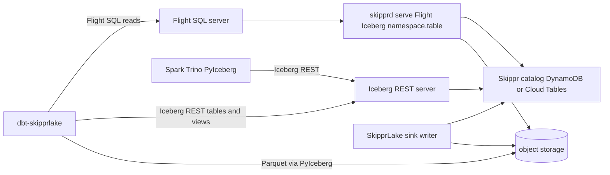

# Spec 2: SkipprLake dbt adapter, REST catalog and views

Status: draft for implementation. Prerequisite: [Spec 1: Exclusive warehouse sinks](./warehouse-sinks-cutover.md) fully landed (SkipprLake plugin, `SkipprLakeConfig`, `QueryBackend`, SDE `SkipprLake` mapping).
Repos touched: `skipprd` (server side), **`dbt-skipprlake` (new repo, fully standalone)**, `sde` (profile generation and sidecar), `cloud` and `skippr-web` (docs).

## 1. Goals and non-goals

### Goals

1. `dbt run` works against a SkipprLake with `materialized` = `table`, `view`, `incremental` (append and merge) and `seed`.
2. The adapter package **`dbt-skipprlake`** is completely encapsulated. Its code, config, profile and tests reference **no** `skippr.yml` and **no** skipprd code. It speaks only open protocols:
   - Iceberg REST Catalog API (tables and views).
   - Arrow Flight SQL (reads).
   - Iceberg view spec (view metadata).
3. skipprd serves those protocols for any Iceberg lake skipprd wrote (SkipprLake first; AthenaIceberg Glue and Duckdb filesystem use the same server), so any Iceberg client can use the same endpoint later: Spark, Trino, Snowflake, PyIceberg, DuckDB (read).
4. No translation layer between the adapter and skipprd (no "lake commit" CLI, no custom RPC). Writes and metadata go through the REST catalog.
5. SDE runs dbt against SkipprLake like any other warehouse. The "Skippr is not a dbt adapter" special cases are deleted.

### Non-goals

- Server-side CTAS or DML through Flight SQL (Flight SQL stays read-only; see D6).
- Credential vending (STS or pre-signed URLs). v1 uses storage properties supplied to the client.
- `dbt snapshot`, `materialized_view`, multi-table transactions (`/v1/{prefix}/transactions/commit`).
- Making Spark/Trino see live WAL rows. They read compacted Iceberg only (section 3).
- DuckDB as a warehouse. `Duckdb` remains a skipprd output only (Spec 1).

## 2. Locked decisions

Confirmed 2026-09-30: **S4** (ingest namespace is read-only over REST; dbt writes only to other namespaces).

| # | Decision | Why |
|---|---|---|
| S1 | `dbt-skipprlake` is a separate Apache-2.0 Python package in its own repo. It depends on `dbt-core`, `dbt-adapters`, `pyiceberg`, `adbc-driver-flightsql`, `pyarrow`. It has no dependency on, or reference to, skipprd. | Encapsulation requirement. |
| S2 | skipprd gains `skipprd serve`, which exposes Iceberg REST and read-only Flight SQL for the **one physical Iceberg catalog** in the config (`IcebergCatalogSpec` equality). Iceberg sinks are SkipprLake, AthenaIceberg, and Duckdb. | Kernel service (with query and Ballista), not a SkipprLake plugin. |
| S3 | **Reads** (dbt tests, previews, table materialization source SQL) go through Flight SQL as Iceberg `namespace.table` (committed snapshot). **Metadata and writes** from Iceberg clients go through REST. `pipeline.namespace` is the local Iceberg ∪ WAL ingest view only. `skipprd query` SQL DDL mutates the same `iceberg::Catalog`. | Lake contract is Iceberg identity. WAL freshness is the local ingest alias, not Flight/dbt. |
| S4 | Sink-managed ingest namespaces (SkipprLake `table_namespace`, AthenaIceberg Glue database, Duckdb namespace) are **read-only over REST**. Create, commit, drop and rename against those namespaces return **403 `ForbiddenException`**. Load and list stay allowed. | The ingest writer owns idempotency manifests and CDC state in those tables. |
| S5 | Views use the Iceberg view spec v1 (SQL representation, dialect **`skipprd`**). View metadata JSON lives in object storage next to tables. The pointer lives in the catalog store. `skipprd query` registers them as DataFusion views. | Makes `materialized='view'` work and stays standard for future engines. |
| S6 | Flight SQL stays read-only (`reject_ddl` remains). Iceberg clients mutate via REST. `skipprd query` SQL DDL (`DROP TABLE` / `DROP DATABASE`) uses `Catalog::drop_*` on the same catalog. | Flight is not a second write protocol. REST and skipprd SQL DDL share `iceberg::Catalog`. |
| S7 | Table materialization data path in v1 is client-side: Flight SQL → Arrow stream → PyIceberg → object store → REST commit. | Standard Iceberg client behaviour; no server-side write path to invent. |
| S8 | Auth in v1 is a static bearer token plus optional TLS. Skippr Cloud fronts the endpoints with its gateway (JWT, D31). | Simple, explicit product config. |
| S9 | Namespace rule: an Iceberg namespace other than the sink's ingest namespace becomes a DataFusion schema of the same name. It must not equal any pipeline name. | Pipelines already own `datafusion.<pipeline>` (Iceberg ∪ WAL). |

## 3. Naming and WAL visibility

The **lake contract** is the Iceberg `namespace.table` (`bronze.shop`, `shop_gold.fct_shop`). SDE, dbt-skipprlake, Flight SQL `GetTables`, and REST clients use that name. `pipeline.table` (`shop.shop`) is a **local** Iceberg ∪ WAL view on the sync host. It is not the lake identity and SDE never quotes it.

| Client | Table name for ingest table `shop` from pipeline `shop`, `table_namespace: bronze` | Sees live WAL |
|---|---|---|
| `skipprd query` ingest alias | `shop.shop` (`datafusion.<pipeline>.<namespace>`) | Yes (Iceberg ∪ WAL) |
| Flight SQL / `skipprd query` lake ident | Iceberg ident `bronze.shop` | No (committed Iceberg) |
| Spark, Trino, PyIceberg, DuckDB via REST | `bronze.shop` | No |
| dbt-skipprlake source | `source('bronze','shop')` — SchemaOnly: dbt schema = Iceberg namespace | No (committed Iceberg) |
| dbt-skipprlake silver / gold | `shop_silver.stg_bronze_shop`, `shop_gold.fct_shop` | n/a (pure Iceberg) |

Rules:

- dbt sources use the Iceberg ingest namespace (`table_namespace`) as the dbt source schema and the Iceberg table as the identifier. After a one-shot `skipprd sync`, that snapshot is the lake.
- Silver and gold dbt `schema:` values are Iceberg namespaces `{pipeline}_silver` / `{pipeline}_gold`. Flight SQL `GetTables` lists every Iceberg `namespace.table`.
- Creating a namespace whose name equals a configured pipeline name is rejected (REST `createNamespace` → 409, query registration → error).

## 4. Architecture



The REST server and Flight server live in one process (`skipprd serve`) and share the `IcebergCatalogSpec` and the catalog handle.

## 5. Protocol surface

### 5.1 Iceberg REST subset (server)

`{prefix}` is empty in `skipprd serve` (`RestState.prefix` is `""`; there is no `--rest-prefix` CLI flag). When empty the path is `/v1/namespaces`. Tests may nest under a non-empty prefix. Multi-level namespaces use the unit separator `0x1F` percent-encoded as `%1F`.

| Method and path | Purpose | Notes |
|---|---|---|
| `GET /v1/config` | Client config | Returns `{"defaults":{},"overrides":{},"endpoints":[...]}` listing only the endpoints below |
| `GET /v1/{prefix}/namespaces` | List | |
| `POST /v1/{prefix}/namespaces` | Create | 409 when name equals a pipeline name |
| `GET/HEAD/DELETE /v1/{prefix}/namespaces/{ns}` | Get, exists, drop | Drop of the ingest namespace → 403 |
| `POST /v1/{prefix}/namespaces/{ns}/properties` | Update | |
| `GET /v1/{prefix}/namespaces/{ns}/tables` | List | |
| `POST /v1/{prefix}/namespaces/{ns}/tables` | Create | 403 in the ingest namespace |
| `GET/HEAD /v1/{prefix}/namespaces/{ns}/tables/{t}` | Load, exists | Allowed everywhere |
| `POST /v1/{prefix}/namespaces/{ns}/tables/{t}` | Commit | 403 in the ingest namespace; 409 on requirement failure |
| `DELETE /v1/{prefix}/namespaces/{ns}/tables/{t}` | Drop | 403 in the ingest namespace |
| `POST /v1/{prefix}/tables/rename` | Rename | 403 if source or destination is in the ingest namespace |
| `GET /v1/{prefix}/namespaces/{ns}/views` | List views | Ships with dbt-skipprlake (P7) |
| `POST /v1/{prefix}/namespaces/{ns}/views` | Create view | |
| `GET/HEAD /v1/{prefix}/namespaces/{ns}/views/{v}` | Load, exists | |
| `POST /v1/{prefix}/namespaces/{ns}/views/{v}` | Commit view | Requirement `assert-view-uuid` |
| `DELETE /v1/{prefix}/namespaces/{ns}/views/{v}` | Drop view | |
| `POST /v1/{prefix}/views/rename` | Rename view | |

Not implemented (omitted from `endpoints`): `register`, `metrics`, `transactions/commit`, scan planning, `oauth/tokens`.

Error body (all routes):

```json
{"error": {"message": "...", "type": "NoSuchTableException", "code": 404}}
```

| Situation | Status | `type` |
|---|---|---|
| Missing table, namespace or view | 404 | `NoSuchTableException`, `NoSuchNamespaceException`, `NoSuchViewException` |
| Already exists | 409 | `AlreadyExistsException` |
| Commit requirement failed (OCC) | 409 | `CommitFailedException` |
| Write to the ingest namespace | 403 | `ForbiddenException` |
| Bad request | 400 | `BadRequestException` |
| Missing or wrong token | 401 | `NotAuthorizedException` |
| Commit outcome unknown (timeout after send) | 500/502/503/504 | `CommitStateUnknownException` |

### 5.2 Flight SQL subset (server)

Read-only. Same command set the cluster Flight server already handles (`CommandStatementQuery`, prepared statements, `GetCatalogs`, `GetDbSchemas`, `GetTables`, `GetTableTypes`, `GetSqlInfo`). `FlightSqlServerReadOnly = true` stays. `reject_ddl` stays.

Auth: metadata header `authorization: Bearer <token>`.

### 5.3 Iceberg view metadata (stored in object storage)

Path: `<warehouse>/<namespace>/<view>/metadata/<version>-<uuid>.metadata.json`.

```json
{
  "view-uuid": "fa6506c3-7681-40c8-86dc-e36561f83385",
  "format-version": 1,
  "location": "s3://lake/analytics/v_orders",
  "current-version-id": 1,
  "versions": [
    {
      "version-id": 1,
      "timestamp-ms": 1727690000000,
      "schema-id": 0,
      "summary": {"engine-name": "dbt-skipprlake", "engine-version": "0.1.0"},
      "default-namespace": ["analytics"],
      "representations": [
        {"type": "sql", "sql": "select id, total from bronze.shop", "dialect": "skipprd"}
      ]
    }
  ],
  "schemas": [
    {"schema-id": 0, "type": "struct", "fields": [
      {"id": 1, "name": "id", "required": false, "type": "long"},
      {"id": 2, "name": "total", "required": false, "type": "double"}
    ]}
  ],
  "version-log": [{"timestamp-ms": 1727690000000, "version-id": 1}],
  "properties": {}
}
```

Dialect string `skipprd` means "DataFusion SQL as executed by the skipprd query engine". Engines that find no representation for their dialect must not guess. skipprd does the same: a view without a `skipprd` representation is skipped with a warning and does not appear in queries.

## 6. Server implementation (skipprd)

### 6.1 Vendored iceberg: expose a constructor for `TableCommit`

`third_party/iceberg/src/catalog/mod.rs` builds `TableCommit` with `#[builder(build_method(vis = "pub(crate)"))]`, so an external crate cannot construct one. The crate is vendored, so add a public constructor (do not fork the trait):

```rust
impl TableCommit {
    /// Build a commit from a REST `CommitTableRequest`.
    pub fn from_rest(
        ident: TableIdent,
        requirements: Vec<TableRequirement>,
        updates: Vec<TableUpdate>,
    ) -> Self {
        Self { ident, requirements, updates }
    }
}
```

`TableRequirement` (`#[serde(tag = "type")]`) and `TableUpdate` (`#[serde(tag = "action")]`) already derive `Serialize` and `Deserialize` with the spec names (`assert-table-uuid`, `add-snapshot`, ...), so the REST body deserializes directly. The Skippr catalogs' `update_table` already call `TableCommit::apply` and enforce OCC (DynamoDB conditional writes). The REST commit endpoint is therefore an HTTP shim over `Catalog::update_table`.

### 6.2 New crate `skippr-iceberg-rest`

```text
crates/skippr-iceberg-rest/
  Cargo.toml
  src/lib.rs         router(state) -> axum::Router
  src/tables.rs      table and namespace handlers
  src/error.rs       RestError -> Response
  src/auth.rs        bearer middleware
```

View handlers (`src/views.rs`) ship with dbt-skipprlake (P7). Table and namespace REST plus `skipprd serve` ship in this crate now.

`Cargo.toml` dependencies: `axum`, `serde`, `serde_json`, `iceberg = "0.9.1"`. Dev: MemoryCatalog.

State:

```rust
#[derive(Clone)]
pub struct RestState {
    pub catalog: Arc<dyn iceberg::Catalog>,
    pub ingest_namespaces: BTreeSet<String>,
    pub pipeline_names: BTreeSet<String>,
    pub token: Arc<str>,
    pub prefix: String,
}

impl RestState {
    fn is_ingest_namespace(&self, ns: &NamespaceIdent) -> bool {
        self.ingest_namespaces.contains(&ns.to_string())
    }
}
```

Router:

```rust
pub fn router(state: RestState) -> Router {
    Router::new()
        .route("/v1/config", get(config))
        .route("/v1/namespaces", get(list_namespaces).post(create_namespace))
        .route("/v1/namespaces/:ns", get(get_namespace).head(namespace_exists).delete(drop_namespace))
        .route("/v1/namespaces/:ns/properties", post(update_namespace))
        .route("/v1/namespaces/:ns/tables", get(list_tables).post(create_table))
        .route("/v1/namespaces/:ns/tables/:t",
               get(load_table).head(table_exists).post(commit_table).delete(drop_table))
        .route("/v1/tables/rename", post(rename_table))
        .layer(middleware::from_fn_with_state(state.clone(), auth::require_bearer))
        .with_state(state)
}
```

`RestState.prefix` is empty in `skipprd serve`. Tests may nest the catalog routes under `/v1/{prefix}` and have `config` return `overrides: {"prefix": "<prefix>"}`. There is no `--rest-prefix` CLI flag.

### 6.3 Error mapping

One place, one type:

```rust
pub enum RestError {
    NoSuchTable(String),
    NoSuchNamespace(String),
    NoSuchView(String),
    AlreadyExists(String),
    CommitFailed(String),
    CommitStateUnknown(String),
    Forbidden(String),
    BadRequest(String),
    Unauthorized,
    Internal(String),
}

impl From<iceberg::Error> for RestError {
    fn from(err: iceberg::Error) -> Self {
        use iceberg::ErrorKind::*;
        match err.kind() {
            TableNotFound => Self::NoSuchTable(err.to_string()),
            NamespaceNotFound => Self::NoSuchNamespace(err.to_string()),
            TableAlreadyExists | NamespaceAlreadyExists => Self::AlreadyExists(err.to_string()),
            CatalogCommitConflicts => Self::CommitFailed(err.to_string()),
            DataInvalid | PreconditionFailed => Self::BadRequest(err.to_string()),
            _ => Self::Internal(err.to_string()),
        }
    }
}

impl IntoResponse for RestError {
    fn into_response(self) -> Response {
        let (code, kind, message) = match &self { /* table in 5.1 */ };
        (StatusCode::from_u16(code).unwrap(), Json(json!({"error": {"message": message, "type": kind, "code": code}}))).into_response()
    }
}
```

Verify the exact `iceberg::ErrorKind` variant names against `third_party/iceberg/src/error.rs` and the Skippr catalogs' `is_conditional_check_failed` mapping. The DynamoDB catalog must return the commit-conflict kind on a failed conditional write (test it).

### 6.4 Commit handler and ingest protection

```rust
async fn commit_table(
    State(st): State<RestState>,
    Path((ns, t)): Path<(String, String)>,
    Json(req): Json<CommitTableRequest>,
) -> Result<Json<LoadTableResult>, RestError> {
    let ns = decode_namespace(&ns)?;
    if st.is_ingest_namespace(&ns) {
        return Err(RestError::Forbidden(format!(
            "namespace '{}' is managed by the SkipprLake sink and is read-only over REST", ns.join(".")
        )));
    }
    let ident = TableIdent::new(ns, t);
    let commit = TableCommit::from_rest(ident, req.requirements, req.updates);
    let table = st.catalog.update_table(commit).await?;
    Ok(Json(load_result(&table)))
}

fn load_result(table: &Table) -> LoadTableResult {
    LoadTableResult {
        metadata_location: table.metadata_location().map(str::to_string),
        metadata: table.metadata().clone(),   // serializes to spec TableMetadata JSON
        config: BTreeMap::new(),              // no credential vending in v1
    }
}
```

`createNamespace`:

```rust
async fn create_namespace(State(st): State<RestState>, Json(req): Json<CreateNamespaceRequest>) -> Result<Json<CreateNamespaceResponse>, RestError> {
    let ns = NamespaceIdent::from_vec(req.namespace)?;
    if ns.len() == 1 && st.pipeline_names.contains(&ns[0]) {
        return Err(RestError::AlreadyExists(format!(
            "'{}' is a pipeline name; it cannot be an Iceberg namespace", ns[0]
        )));
    }
    let created = st.catalog.create_namespace(&ns, req.properties).await?;
    Ok(Json(CreateNamespaceResponse::from(created)))
}
```

Every mutating handler starts with the same `guard_writable(&st, &ns)?` helper (DRY).

### 6.5 View catalog

The vendored `iceberg::Catalog` has no view methods. Add a trait beside the Skippr catalogs in `crates/skippr-iceberg-catalog`:

```rust
#[async_trait]
pub trait ViewCatalog: Send + Sync + Debug {
    async fn list_views(&self, ns: &NamespaceIdent) -> Result<Vec<TableIdent>>;
    async fn load_view(&self, view: &TableIdent) -> Result<ViewPointer>;          // metadata_location + parsed metadata
    async fn create_view(&self, view: &TableIdent, metadata_location: &str) -> Result<()>;   // fails if exists
    /// Compare-and-swap the pointer from `expected` to `next`. Err(CommitConflict) on mismatch.
    async fn swap_view(&self, view: &TableIdent, expected: &str, next: &str) -> Result<()>;
    async fn drop_view(&self, view: &TableIdent) -> Result<()>;
    async fn rename_view(&self, src: &TableIdent, dest: &TableIdent) -> Result<()>;
}
```

Implementations:

- `DynamoDbCatalog`: same table and partition key as tables (`catalog#<warehouse_hash>`), sort key `view#<ns>#<name>` with attribute `metadata_location`. Create uses `attribute_not_exists(PK)`; swap uses `#loc = :expected`; the pattern already exists in `create_table` and `update_table`.
- `CloudTablesCatalog`: the same shape on Cloud Tables items.

Tables and views share one identifier space: creating a table with the name of an existing view (and vice versa) is `AlreadyExists`. Enforce in both `create_table` (check `ViewCatalog::load_view`) and `create_view` (check `Catalog::table_exists`).

View metadata JSON read and write reuse `FileIO` from the catalog's `iceberg_file_io_for_warehouse`. Add serde structs for the view metadata in a new `crates/skippr-iceberg-rest/src/view_metadata.rs` (or in `skippr-iceberg-catalog` so the query side can read it without depending on axum). Prefer `skippr-iceberg-catalog` and export `ViewMetadata`, `ViewVersion`, `ViewRepresentation`.

View commit:

```rust
async fn commit_view(State(st): State<RestState>, Path((ns, v)): Path<(String, String)>, Json(req): Json<CommitViewRequest>) -> Result<Json<LoadViewResult>, RestError> {
    guard_writable(&st, &decode_namespace(&ns)?)?;
    let ident = TableIdent::new(decode_namespace(&ns)?, v);
    let current = st.views.load_view(&ident).await?;
    for r in &req.requirements {
        match r {
            ViewRequirement::AssertViewUuid { uuid } if *uuid != current.metadata.view_uuid =>
                return Err(RestError::CommitFailed("view uuid mismatch".into())),
            _ => {}
        }
    }
    let mut meta = current.metadata.clone();
    for update in req.updates { meta.apply(update)?; }          // add-view-version, set-current-view-version, add-schema, set-properties, upgrade-format-version
    let next_location = write_view_metadata(&st, &ident, &meta).await?;
    st.views.swap_view(&ident, &current.metadata_location, &next_location).await?;
    Ok(Json(LoadViewResult { metadata_location: next_location, metadata: meta, config: Default::default() }))
}
```

`ViewMetadata::apply` implements exactly these spec actions: `assign-uuid`, `upgrade-format-version`, `add-schema`, `set-current-schema` (not used by views; reject), `add-view-version`, `set-current-view-version` (with `-1` = last added), `set-properties`, `remove-properties`, `set-location`. Reject unknown actions with 400.

### 6.6 `skipprd serve`

New subcommand in `src/cli`:

```rust
#[derive(Parser, Debug, Clone, PartialEq)]
pub struct ServeArgs {
    /// Iceberg REST bind address.
    #[arg(long, default_value = "127.0.0.1:8181")]
    pub rest_bind: SocketAddr,
    /// Flight SQL bind address.
    #[arg(long, default_value = "127.0.0.1:8815")]
    pub flight_bind: SocketAddr,
    /// Name of the env var that holds the bearer token. Required.
    #[arg(long, default_value = "SKIPPRLAKE_TOKEN")]
    pub token_env: String,
    /// TLS cert and key (PEM). When omitted, binds plaintext (loopback only).
    #[arg(long, requires = "tls_key")]
    pub tls_cert: Option<PathBuf>,
    #[arg(long, requires = "tls_cert")]
    pub tls_key: Option<PathBuf>,
    /// Write `{"rest":"...","flight":"..."}` here once both listeners are up.
    #[arg(long)]
    pub ready_file: Option<PathBuf>,
}
```

Startup validation (fail closed, in this order):

1. Token env var set and non-empty.
2. Non-loopback bind requires TLS.
3. Config contains at least one pipeline with an Iceberg sink (`QueryBackend::Iceberg`).
4. All Iceberg sinks describe the same physical catalog (`IcebergCatalogSpec::physical_key`). Otherwise error `"serve exposes one Iceberg catalog; found SkipprLake and AthenaIceberg"`.
5. No ingest namespace equals a pipeline name.

Then: open the catalog once (`open_iceberg_catalog` on `plan.spec`), build `RestState`, start both servers, write the ready file.

Port `0` is valid and the actual bound addresses are written to the ready file. SDE relies on this.

### 6.7 Flight SQL: local mode and bearer auth

Today `QueryFlightServer::start_with_registry` requires cluster mTLS (`cluster::tls::tonic_server_tls()`), Basic `tenant/workspace` auth, and the elected Ballista scheduler (`ensure_elected_live`). Refactor with two enums, not booleans:

```rust
pub enum FlightAuth {
    /// Existing cluster behaviour: Basic tenant/workspace over mTLS.
    ClusterBasic,
    /// `skipprd serve`: static bearer token, scope taken from config.
    Bearer { token: Arc<str>, scope: TenantScope },
}

pub enum FlightEngine {
    /// Existing: Ballista over the elected scheduler.
    Clustered { registry: Option<Arc<ReplicaRegistry>> },
    /// `skipprd serve`: in-process DataFusion; no gossip, no Ballista election.
    Local,
}

impl QueryFlightServer {
    pub async fn start(bind: SocketAddr, auth: FlightAuth, engine: FlightEngine, app_config: Config, tls: Option<ServerTlsConfig>) -> Result<Self, DurableError>;
}
```

`session_scope` becomes `match &self.auth`. `execute_sql_stream_inner` becomes a `match &self.engine`:

```rust
match &self.engine {
    FlightEngine::Clustered { .. } => { /* existing: ensure_elected_live + plan_clustered_select */ }
    FlightEngine::Local => {
        let ctx = crate::sqlrt::query::new_context_iceberg_namespaces(&self.app_config).await?;
        let df = ctx.sql(sql).await?;
        (df.schema().inner().clone(), Box::pin(df.execute_stream().await?...))
    }
}
```

Local serve Flight registers Iceberg `namespace.table` only (`register_user_namespaces`). It does not call `new_context_all_namespaces` (that is `skipprd query` Iceberg ∪ WAL). Clustered HLA Flight still classifies `LiveWal` / `Iceberg`.

Tests first:

- `flight_bearer_rejects_missing_and_wrong_token`.
- `flight_local_serves_select_1`.
- `flight_local_rejects_ddl` (`reject_ddl`).
- Cluster path unchanged: existing tests stay green.

### 6.8 Query side: user namespaces and views

In `src/sqlrt/tables.rs` (sqlrt still must not name Athena/Glue/Duckdb; the isolation test from Spec 1 must stay green):

```rust
/// Register every Iceberg catalog namespace as a DataFusion schema (`namespace.table`).
/// skipprd query still aliases ingest as `pipeline.table` via register_namespace_view.
async fn register_user_namespaces(
    ctx: &SessionContext,
    config: &Config,
) -> Result<(), DataFusionError> {
    // Open each distinct IcebergCatalogSpec via open_iceberg_catalog.
    // extra_namespace_names includes ingest Iceberg idents (bronze.shop for dbt)
    // and rejects pipeline-name collisions. skipprd query still aliases ingest as pipeline.table.
    // IcebergScanTableProvider::new_with_catalog serializes IcebergCatalogSpec JSON.
}
```
```

Views (after all tables are registered, so views may reference tables and other views):

```rust
async fn register_views(ctx: &SessionContext, views: &dyn ViewCatalog, namespaces: &[NamespaceIdent]) -> Result<(), DataFusionError> {
    let mut pending: Vec<(String, String, String)> = collect_skipprlake_view_sql(views, namespaces).await?; // (schema, name, sql)
    // Fixpoint: a view registers once the tables it references exist. Bounded by the view count.
    for _ in 0..=pending.len() {
        let mut next = Vec::new();
        for (schema, name, sql) in pending {
            match ctx.sql(&sql).await {
                Ok(df) => ctx.register_table(TableReference::partial(schema.as_str(), name.as_str()), df.into_view())
                    .map(|_| ())?,
                Err(_) => next.push((schema, name, sql)),
            }
        }
        if next.is_empty() { return Ok(()); }
        pending = next;
    }
    Err(DataFusionError::Plan(format!(
        "unresolved views (missing dependency or cycle): {}",
        pending.iter().map(|(s, n, _)| format!("{s}.{n}")).collect::<Vec<_>>().join(", ")
    )))
}
```

`collect_skipprlake_view_sql` picks the representation with `type == "sql"` and `dialect == "skipprlake"` from `current-version-id`. Views with no such representation are skipped with a `tracing::warn!`.

`skipprd query` uses `new_context_all_namespaces` (`register_namespace_view` Iceberg ∪ WAL ingest alias plus `register_user_namespaces`). `skipprd serve` Flight uses `new_context_iceberg_namespaces` (`register_user_namespaces` only) so lake clients see Iceberg `namespace.table`, not `pipeline.namespace`.

```text
skipprd query:
  for each pipeline: register_namespace_view (Iceberg ∪ WAL, or WAL only)
  if any pipeline is Iceberg: register_user_namespaces
skipprd serve Flight:
  register_user_namespaces only  # Iceberg namespace.table
```

Clustered Ballista (`plan_clustered_select`) gets the same two calls. `IcebergScanTableProvider` already serializes the catalog JSON for executors; it now serializes `IcebergCatalogSpec` (`SkipprLakeOpen` includes backend and object store).

Tests first: user namespace tables queryable as `shop_gold.fct_x`; ingest namespace not exposed twice; collision errors; view over table; view over view; cycle detected; non-`skipprlake` dialect view skipped.

### 6.9 Docs and CLI help

- `docs/docs/cli/serve.md`, `docs/docs/connectors/outputs/skipprlake.md` (REST and Flight sections, token, TLS).
- `docs/docs/guides/query-skipprlake-from-spark.md` (and Trino, PyIceberg, DuckDB read) showing catalog URI, token and the "no live WAL" note:

```python
# PyIceberg
from pyiceberg.catalog.rest import RestCatalog
cat = RestCatalog("lake", uri="http://127.0.0.1:8181", token="...")
cat.load_table("bronze.orders").scan().to_arrow()
```

```sql
-- DuckDB (read only)
ATTACH 'lake' AS lake (TYPE iceberg, ENDPOINT 'http://127.0.0.1:8181', TOKEN '...');
SELECT count(*) FROM lake.bronze.orders;
```

Verify each engine snippet before publishing.

---

## 7. `dbt-skipprlake` (new repository)

### 7.1 Layout

```text
dbt-skipprlake/
  pyproject.toml
  README.md
  src/dbt/adapters/skipprlake/
    __init__.py            Plugin + registration
    connections.py         credentials, connection manager (Flight SQL)
    impl.py                SkipprLakeAdapter
    relation.py            SkipprLakeRelation
    column.py              SkipprLakeColumn
    rest.py                REST catalog and view client (tables via PyIceberg, views via httpx)
    types.py               Arrow <-> dbt type mapping
  src/dbt/include/skipprlake/
    dbt_project.yml
    macros/
      adapters.sql
      catalog.sql
      utils/*.sql
      materializations/{table,view,incremental,seed}.sql
  tests/
    unit/
    functional/            dbt-tests-adapter suites
```

`pyproject.toml`:

```toml
[project]
name = "dbt-skipprlake"
version = "0.1.0"
requires-python = ">=3.10"
dependencies = [
  "dbt-core>=1.9,<2",
  "dbt-adapters>=1.7,<2",
  "pyiceberg[pyarrow]>=0.9",     # verify: table.upsert and REST client behaviour
  "adbc-driver-flightsql>=1.0",
  "pyarrow>=15",
  "httpx>=0.27",
]
[project.optional-dependencies]
s3 = ["pyiceberg[s3fs]"]
test = ["dbt-tests-adapter>=1.9", "pytest"]
[tool.hatch.build.targets.wheel]
packages = ["src/dbt"]
```

Encapsulation checks (enforced in CI of this repo):

```bash
! rg -n 'skippr\.yml|skipprd|SKIPPR_' src tests README.md
```

Tests obtain the server from environment variables only (`SKIPPRLAKE_TEST_CATALOG_URI`, `SKIPPRLAKE_TEST_QUERY_URI`, `SKIPPRLAKE_TEST_TOKEN`, `SKIPPRLAKE_TEST_STORAGE_*`). Whoever runs the tests starts a compatible server.

### 7.2 Profile

```yaml
my_lake:
  target: dev
  outputs:
    dev:
      type: skipprlake
      catalog_uri: http://127.0.0.1:8181         # Iceberg REST
      query_uri: grpc://127.0.0.1:8815           # Arrow Flight SQL (grpc+tls:// for TLS)
      token: "{{ env_var('SKIPPRLAKE_TOKEN') }}"
      schema: shop_gold                          # Iceberg namespace (SchemaOnly; no database)
      threads: 4
      storage:                                   # optional; PyIceberg FileIO properties
        s3.endpoint: https://<account>.r2.cloudflarestorage.com
        s3.access-key-id: "{{ env_var('LAKE_KEY') }}"
        s3.secret-access-key: "{{ env_var('LAKE_SECRET') }}"
        s3.region: auto
      tls_root_certs: /path/ca.pem               # optional
```

### 7.3 Credentials and connection manager

```python
# connections.py
from dataclasses import dataclass, field
from typing import Any, Dict, Optional
from dbt.adapters.contracts.connection import Credentials, AdapterResponse
from dbt.adapters.sql import SQLConnectionManager

@dataclass
class SkipprLakeCredentials(Credentials):
    catalog_uri: str = ""
    query_uri: str = ""
    token: str = ""
    schema: str = ""
    storage: Dict[str, str] = field(default_factory=dict)
    tls_root_certs: Optional[str] = None
    database: str = "lake"                    # dbt requires it; fixed logical name

    @property
    def type(self) -> str:
        return "skipprlake"

    def _connection_keys(self):
        return ("catalog_uri", "query_uri", "schema")

    def __post_init__(self):
        for k in ("catalog_uri", "query_uri", "token", "schema"):
            if not getattr(self, k):
                raise ValueError(f"skipprlake profile requires `{k}`")


class SkipprLakeConnectionManager(SQLConnectionManager):
    TYPE = "skipprlake"

    @classmethod
    def open(cls, connection):
        if connection.state == "open":
            return connection
        creds = connection.credentials
        import adbc_driver_flightsql.dbapi as flight
        db_kwargs = {"adbc.flight.sql.authorization_header": f"Bearer {creds.token}"}
        if creds.tls_root_certs:
            db_kwargs["adbc.flight.sql.client_option.tls_root_certs"] = open(creds.tls_root_certs).read()
        connection.handle = flight.connect(creds.query_uri, db_kwargs=db_kwargs)
        connection.state = "open"
        return connection

    @classmethod
    def get_response(cls, cursor) -> AdapterResponse:
        return AdapterResponse(_message="OK", rows_affected=max(cursor.rowcount, 0))

    def cancel(self, connection):
        connection.handle.close()

    @contextmanager
    def exception_handler(self, sql: str):
        try:
            yield
        except Exception as exc:
            raise DbtDatabaseError(str(exc)) from exc
```

Note: verify the ADBC option names against the pinned `adbc-driver-flightsql` version.

### 7.4 REST client

Tables use PyIceberg's REST catalog. Views use a small `httpx` client (PyIceberg's view support varies by version; the view endpoints are tiny and defined by the spec).

```python
# rest.py
from pyiceberg.catalog.rest import RestCatalog
import httpx

class LakeClient:
    def __init__(self, creds):
        self._catalog = RestCatalog(
            "lake", uri=creds.catalog_uri, token=creds.token, **creds.storage,
        )
        self._http = httpx.Client(
            base_url=creds.catalog_uri, headers={"Authorization": f"Bearer {creds.token}"}, timeout=60,
        )

    # -- namespaces
    def create_schema(self, name: str):
        self._catalog.create_namespace_if_not_exists(name)
    def drop_schema(self, name: str):
        self._catalog.drop_namespace(name)
    def list_schemas(self) -> list[str]:
        return [".".join(ns) for ns in self._catalog.list_namespaces()]

    # -- tables
    def list_tables(self, schema: str): return [t[-1] for t in self._catalog.list_tables(schema)]
    def load_table(self, schema: str, name: str): return self._catalog.load_table((schema, name))
    def drop_table(self, schema: str, name: str): self._catalog.drop_table((schema, name))
    def rename_table(self, s, n, ds, dn): self._catalog.rename_table((s, n), (ds, dn))

    # -- views
    def list_views(self, schema: str) -> list[str]:
        r = self._http.get(f"/v1/namespaces/{schema}/views"); r.raise_for_status()
        return [i["name"] for i in r.json()["identifiers"]]

    def create_or_replace_view(self, schema: str, name: str, sql: str, arrow_schema) -> None:
        version = {
            "version-id": 1, "timestamp-ms": _now_ms(), "schema-id": 0,
            "summary": {"engine-name": "dbt-skipprlake", "engine-version": __version__},
            "default-namespace": [schema],
            "representations": [{"type": "sql", "sql": sql, "dialect": "skipprlake"}],
        }
        if self._view_exists(schema, name):
            self._commit_view_version(schema, name, sql, arrow_schema)
        else:
            body = {"name": name, "schema": _iceberg_schema_json(arrow_schema),
                    "view-version": version, "properties": {}}
            r = self._http.post(f"/v1/namespaces/{schema}/views", json=body)
            _raise_for_status(r)
```

`_commit_view_version` posts `updates: [{"action": "add-schema", ...}, {"action": "add-view-version", ...}, {"action": "set-current-view-version", "view-version-id": -1}]` with `requirements: [{"type": "assert-view-uuid", "uuid": <loaded>}]`.

Concurrency: on HTTP 409 `CommitFailedException`, reload and retry up to 3 times (fixed ceiling in code, not a setting).

### 7.5 Adapter class

```python
# impl.py
from dbt.adapters.sql import SQLAdapter

class SkipprLakeAdapter(SQLAdapter):
    ConnectionManager = SkipprLakeConnectionManager
    Relation = SkipprLakeRelation
    Column = SkipprLakeColumn

    @classmethod
    def date_function(cls): return "now()"

    def _lake(self) -> LakeClient:
        return self.connections.get_thread_connection().credentials and LakeClient(self.config.credentials)

    # -- schemas
    def create_schema(self, relation): self._lake().create_schema(relation.schema)
    def drop_schema(self, relation):   self._lake().drop_schema(relation.schema)
    def list_schemas(self, database):  return self._lake().list_schemas()

    # -- relations (REST, not SQL)
    def list_relations_without_caching(self, schema_relation):
        lake = self._lake()
        rels = [self.Relation.create(schema=schema_relation.schema, identifier=n, type=RelationType.Table)
                for n in lake.list_tables(schema_relation.schema)]
        rels += [self.Relation.create(schema=schema_relation.schema, identifier=n, type=RelationType.View)
                 for n in lake.list_views(schema_relation.schema)]
        return rels

    def get_columns_in_relation(self, relation):
        t = self._lake().load_table(relation.schema, relation.identifier)
        return [self.Column(f.name, str(f.field_type), None, None, None) for f in t.schema().fields]

    def drop_relation(self, relation):
        lake = self._lake()
        (lake.drop_view if relation.type == RelationType.View else lake.drop_table)(relation.schema, relation.identifier)

    def rename_relation(self, from_relation, to_relation):
        self._lake().rename_table(from_relation.schema, from_relation.identifier, to_relation.schema, to_relation.identifier)

    # -- materialization entry points called from Jinja
    @available
    def skipprlake_replace_table(self, relation, select_sql: str) -> None:
        self._lake().replace_table(self.connections, relation, select_sql)

    @available
    def skipprlake_append(self, relation, select_sql: str) -> None: ...
    @available
    def skipprlake_merge(self, relation, select_sql: str, unique_key: list[str]) -> None: ...
    @available
    def skipprlake_create_view(self, relation, select_sql: str) -> None: ...
```

`SkipprLakeRelation`:

```python
@dataclass(frozen=True, eq=False, repr=False)
class SkipprLakeRelation(BaseRelation):
    quote_policy: Policy = field(default_factory=lambda: SkipprLakePolicy(database=False, schema=True, identifier=True))
    include_policy: Policy = field(default_factory=lambda: SkipprLakePolicy(database=False, schema=True, identifier=True))
```

Two-part names (`"schema"."identifier"`) match Iceberg `namespace.table` on `skipprd serve` Flight and REST. They are not `pipeline.namespace` ingest aliases.

### 7.6 Data path: table, append, merge

```python
# rest.py (continued)
import pyarrow as pa

def _read_arrow(self, connections, select_sql: str) -> pa.RecordBatchReader:
    conn = connections.get_thread_connection().handle
    cur = conn.cursor()
    cur.execute(select_sql)
    return cur.fetch_record_batch()         # streaming Arrow, no full materialization

def replace_table(self, connections, relation, select_sql: str) -> None:
    reader = self._read_arrow(connections, select_sql)
    schema = reader.schema
    ident = (relation.schema, relation.identifier)
    if self._catalog.table_exists(ident):
        tbl = self._catalog.load_table(ident)
        with tbl.transaction() as tx:                       # one REST commit: schema change + overwrite
            with tx.update_schema() as u:
                u.union_by_name(schema)                     # additive; incompatible changes raise
            tx.overwrite(reader.read_all())                 # TODO: stream by batches for large outputs
    else:
        self._catalog.create_namespace_if_not_exists(relation.schema)
        tbl = self._catalog.create_table(ident, schema=schema)
        tbl.append(reader.read_all())
```

Rules:

- `table` = one snapshot commit (overwrite in the same transaction). Readers never see an empty table.
- Incompatible type changes: drop and recreate is **not** automatic. Fail with a message telling the user to run `dbt run --full-refresh` (`--full-refresh` executes `drop_table` then create).
- Streaming: `read_all()` holds the result in memory. Keep as v1, and add a ceiling in code (`MAX_MATERIALIZE_ROWS`, fixed, documented) that fails closed with a clear message. Per-batch appends in a single transaction are the follow-up.
- `merge`: `tbl.upsert(df, join_cols=unique_key)` (PyIceberg `upsert` performs copy-on-write, so no delete files that other readers may not support). Verify PyIceberg version support.
- Commit conflicts (`CommitFailedException`): reload and retry up to 3 times; then fail.

### 7.7 Materialization macros

```sql
{# macros/materializations/table.sql #}

  
  {{ run_hooks(pre_hooks) }}
  
  
  
  {{ run_hooks(post_hooks) }}
  {{ return({'relations': [target_relation]}) }}

```

```sql
{# macros/materializations/view.sql #}

  
  {{ run_hooks(pre_hooks) }}
  
  
  {{ run_hooks(post_hooks) }}
  {{ return({'relations': [target_relation]}) }}

```

`skipprlake_create_view` executes `select * from (<sql>) limit 0` over Flight to obtain the result schema (no data), then calls `create_or_replace_view`.

```sql
{# macros/materializations/incremental.sql #}

  
  
  
  
  {{ run_hooks(pre_hooks) }}
  
    
  
    
  
    
    
  
    
  
  {{ run_hooks(post_hooks) }}
  {{ return({'relations': [target_relation]}) }}

```

`seed`: convert the agate table to Arrow in Python (`skipprlake_load_seed`) and call `replace_table` with a schema derived from `column_types` overrides.

`snapshot`: raises `not supported by dbt-skipprlake v1`.

### 7.8 Types and utils macros

```sql
{# macros/adapters.sql #}


{{ return(adapter.list_schemas(database)) }}
 now() 
 cast('{{ timestamp }}' as timestamp) 

{# types; Arrow names accepted by DataFusion #}
varchar
timestamp
double
decimal(38, 9)
bigint
bigint
boolean
```

Cross-database `dbt-utils`/`dbt.*` macros dispatch to `default__` unless overridden. Add overrides only when a functional test fails: DataFusion SQL differs from Postgres for `date_trunc`, `dateadd`, `datediff` and `split_part`. Each override needs a test.

### 7.9 Catalog for `dbt docs`

`skipprlake__get_catalog(information_schema, schemas)` builds an agate table from REST: for each schema in `schemas`, each table and view, one row per column with `table_database='lake'`, `table_schema`, `table_name`, `table_type`, `column_name`, `column_index`, `column_type`. Implement in Python (`SkipprLakeAdapter._get_one_catalog`) to avoid SQL.

### 7.10 Test plan for the adapter

Unit (no server):

- `SkipprLakeCredentials` validation for each missing key.
- Relation rendering: `shop_gold.fct_shop` (SchemaOnly: identifier is `schema.table`, no database).
- `_iceberg_schema_json(arrow_schema)` field ids and types.
- View commit request bodies (assert exact JSON).
- Retry loop: 409 twice then success; 409 four times then fail.

Functional (`dbt-tests-adapter`), gated by env `SKIPPRLAKE_TEST_CATALOG_URI` (skipped, with a printed reason, when unset):

```python
import pytest
from dbt.tests.adapter.basic.test_base import BaseSimpleMaterializations
from dbt.tests.adapter.basic.test_empty import BaseEmpty
from dbt.tests.adapter.basic.test_incremental import BaseIncremental
from dbt.tests.adapter.basic.test_ephemeral import BaseEphemeral
from dbt.tests.adapter.basic.test_generic_tests import BaseGenericTests
from dbt.tests.adapter.basic.test_singular_tests import BaseSingularTests

@pytest.fixture(scope="class")
def dbt_profile_target():
    return {
        "type": "skipprlake",
        "catalog_uri": os.environ["SKIPPRLAKE_TEST_CATALOG_URI"],
        "query_uri": os.environ["SKIPPRLAKE_TEST_QUERY_URI"],
        "token": os.environ["SKIPPRLAKE_TEST_TOKEN"],
        "schema": "dbt_test",
        "threads": 1,
        "storage": json.loads(os.environ.get("SKIPPRLAKE_TEST_STORAGE", "{}")),
    }

class TestSimpleMaterializations(BaseSimpleMaterializations): pass
class TestEmpty(BaseEmpty): pass
class TestIncremental(BaseIncremental): pass
class TestEphemeral(BaseEphemeral): pass
class TestGenericTests(BaseGenericTests): pass
class TestSingularTests(BaseSingularTests): pass
```

Additional functional tests written for this adapter:

- `view` then `table` over the same name (replace type).
- Incremental `merge` with `unique_key` (upsert), then a second run with changed rows.
- Model writes to an ingest namespace → clear error mentioning 403 and the namespace.
- `dbt seed` then a model reading the seed.
- `dbt docs generate` produces a catalog with the created relations.

### 7.11 Packaging and release

- CI: unit tests always; functional tests in a job that provisions a server (see 8.3).
- Publish to PyPI as `dbt-skipprlake`. Version independent of skipprd.
- README documents the profile, the protocols required from a server, and the WAL note.

---

## 8. skipprd end-to-end and CI

### 8.1 Rust contract tests for the REST server

`crates/skippr-iceberg-rest/tests/rest_contract.rs`, using `reqwest` against an ephemeral `axum` server over an in-memory catalog:

- `config_lists_only_implemented_endpoints`.
- `create_namespace_rejects_pipeline_name`.
- `ingest_namespace_is_read_only` (create table, commit, drop, rename each → 403 with `ForbiddenException`).
- `commit_requires_current_snapshot` (stale `assert-ref-snapshot-id` → 409 `CommitFailedException`).
- `two_concurrent_commits_one_winner`.
- `view_create_commit_drop_roundtrip` and `view_and_table_share_identifier_space`.
- `missing_or_wrong_bearer_is_401`.

### 8.2 Cross-client tests

`tests/rest_catalog/test_pyiceberg.py` (Python, in the skipprd repo):

1. Start `skipprd serve` against a temp `file://` lake and DynamoDB-local.
2. With PyIceberg: create namespace, create table, append, load, overwrite, drop.
3. Assert the same table is queryable through `skipprd query` as `datafusion.<ns>.<table>`.
4. Assert PyIceberg cannot commit to the ingest namespace.

### 8.3 dbt e2e in skipprd CI

New workflow `.github/workflows/dbt-skipprlake.yml`:

1. Build skipprd (`--features offset-store-dynamodb`).
2. Start DynamoDB-local, create the catalog table.
3. Start `skipprd serve --rest-bind 127.0.0.1:0 --flight-bind 127.0.0.1:0 --ready-file ready.json` with a File-source pipeline that lands rows in a `SkipprLake` sink.
4. `pip install dbt-skipprlake[test]` (from the sibling repo at a pinned ref).
5. Export `SKIPPRLAKE_TEST_*` from `ready.json` and run the functional suite.
6. Run a real project: source `bronze.shop`, model `shop_gold.fct_shop` as table, an incremental merge model. Assert:
   - `fct_shop` matches the committed Iceberg bronze row count (Flight `namespace.table`).
   - PyIceberg reads `shop_gold.fct_shop`.
   - `materialized='view'` is rejected until REST views exist.

### 8.4 Observability of the server

- `tracing` span per REST request with route, status, namespace, table (no token, no SQL text).
- Counters: `skipprlake_rest_requests_total{route,status}`, `skipprlake_rest_commit_conflicts_total`. Follow the existing metrics module pattern.

---

## 9. SDE integration

Repo: `sde`. Prerequisites: `skipprd serve` released, `dbt-skipprlake` on PyPI or a pinned path.

### 9.1 Tests first

In `crates/skipprd-react-suite-data-engineer/src/dbt/profile.rs`:

```rust
#[test]
fn skippr_profile_generates_skipprlake_target() {
    let cfg = resolved_config_with_skippr_warehouse();
    let endpoint = SkipprLakeEndpoint {
        catalog_uri: "http://127.0.0.1:8181".into(),
        query_uri: "grpc://127.0.0.1:8815".into(),
        token_env: "SKIPPRLAKE_TOKEN".into(),
    };
    let p = generate_profiles_yml_with(&cfg, Some(1), Some(&endpoint)).unwrap();
    assert!(p.profiles_yml.contains("type: skipprlake"));
    assert!(p.profiles_yml.contains("catalog_uri: http://127.0.0.1:8181"));
    assert!(p.profiles_yml.contains("env_var('SKIPPRLAKE_TOKEN')"));
    assert!(!p.profiles_yml.contains("secret"));          // no secrets written
}

#[test]
fn skippr_dbt_models_are_warehouse_relations() {
    assert!(WarehouseKind::Skippr.dbt_models_are_warehouse_relations());
}
```

Replace the tests that encoded the discarded path: `skippr_profile_rejects_dbt_*`, `Skippr` assertions at `de_config.rs` ~736/786/797, and the "dbt materialize is not a Skippr operation" tests.

### 9.2 Endpoint resolution (typed, no impl knobs)

```rust
/// Where dbt-skipprlake connects. Product config, explicit.
pub enum SkipprLakeEndpoint {
    /// Remote or Cloud: URIs from SDE config; token from an env var name.
    Remote { catalog_uri: String, query_uri: String, token_env: String },
    /// Local: SDE starts `skipprd serve` for the duration of the dbt invocation.
    LocalSidecar,
}
```

`SkipprLakeEndpoint::LocalSidecar` is the default for a `SkipprLake` sink with a `file://` or local warehouse. `Remote` is selected when SDE config provides `skipprlake.catalog_uri`. YAML (SDE resolved config, next to `warehouse:`):

```yaml
warehouse:
  kind: skippr
  warehouse: s3://my-lake/
  skipprlake:
    catalog_uri: https://lake.example.com/iceberg
    query_uri: grpc+tls://lake.example.com:8815
    token_env: SKIPPRLAKE_TOKEN
```

### 9.3 Local sidecar

New module `crates/skipprd-react-suite-data-engineer/src/skipprlake_sidecar.rs`:

```rust
pub struct SkipprLakeSidecar {
    child: tokio::process::Child,
    pub endpoint: ResolvedEndpoint,      // actual ports from the ready file
    token: String,                       // random per run, never logged
}

impl SkipprLakeSidecar {
    pub async fn start(skipprd: &Path, config_file: &Path, data_dir: &Path) -> Result<Self, SidecarError> {
        let token = random_token();                      // getrandom; not a journal identity
        let ready = tempfile::NamedTempFile::new()?;
        let child = Command::new(skipprd)
            .arg("serve")
            .args(["--rest-bind", "127.0.0.1:0", "--flight-bind", "127.0.0.1:0"])
            .args(["--token-env", "SKIPPRLAKE_TOKEN"])
            .arg("--ready-file").arg(ready.path())
            .env("SKIPPRLAKE_TOKEN", &token)
            .env("SKIPPR_CONFIG_FILE", config_file)
            .kill_on_drop(true)
            .spawn()?;
        let endpoint = wait_for_ready_file(ready.path(), READY_TIMEOUT).await?;  // fixed ceiling in code
        Ok(Self { child, endpoint, token })
    }
}
```

The dbt subprocess receives `SKIPPRLAKE_TOKEN` in its environment. `profiles.yml` contains only `{{ env_var('SKIPPRLAKE_TOKEN') }}`, never the token.

The sidecar is created by the dbt provider (`provider-dbt`) before the first dbt invocation of a phase and dropped after the phase (`kill_on_drop`). Fail closed when the ready file does not appear within the ceiling; surface the child's stderr tail.

`skipprd` path uses the single resolver from Spec 1 (`SKIPPRD_BIN`).

### 9.4 Deleted "no adapter" special cases

Hard-cutover complete. These names MUST NOT return in `sde`:

- `SKIPPR_NOT_DBT_ADAPTER`
- `skippr_dbt_adapter_observation`
- `skippr_publish_observation`

SkipprLake dbt uses `dbt-skipprlake` (`type: skipprlake`) and the local sidecar. Gold warehouse validation uses SkipprLake relation FQNs (`schema.identifier`).

### 9.5 Profile and routing

`dbt/profile.rs`:

```rust
ActiveWarehouse::Skippr => {
    let ep = endpoint.ok_or_else(|| "SkipprLake dbt requires a resolved endpoint".to_string())?;
    let target = "skipprlake";
    let yml = format!(
r#"{profile}:
  target: {target}
  outputs:
    {target}:
      type: skipprlake
      catalog_uri: {catalog}
      query_uri: {query}
      token: "{{{{ env_var('{token_env}') }}}}"
      schema: {schema}
      threads: {threads}
"#,
        profile = profile_name, catalog = ep.catalog_uri, query = ep.query_uri,
        token_env = ep.token_env, schema = default_schema, threads = threads.unwrap_or(1));
    Ok(GeneratedProfiles { target: target.into(), profiles_yml: yml, tier_routing: tier_routing(cfg, &providers) })
}
```

`tier_routing` for Skippr: `DbtNamespaceShape::SchemaOnly` (dbt `schema:` = Iceberg namespace; no database).

Sources for authored staging models use the Iceberg ingest namespace (`DbtNamespaceShape::SchemaOnly`):

```yaml
sources:
  - name: bronze
    schema: bronze        # Iceberg ingest namespace (table_namespace)
    tables:
      - name: shop
```

### 9.6 Runtime prerequisites

`runtime_prereqs.rs`: for Skippr, run the same adapter presence check used for other dbt adapters (`dbt --version` lists `skipprlake`), and create target namespaces through `dbt`'s `create_schema` (REST), like other warehouses. Missing adapter → typed error `DbtAdapterMissing { adapter: "dbt-skipprlake" }` with the install command.

### 9.7 Query provider

SDE warehouse I/O is `SkipprLakeFlightProvider` against one `skipprd serve` (Flight SQL, Iceberg `namespace.table`). `SkipprCliProvider` is EL-only (`discover` / `sync` / `SHOW PIPELINE` / `LOAD SCHEMA`).

### 9.8 SDE verification

```bash
cargo test -p react-suite-data-engineer -p sde
```

Smoke (progressive, local `file://` lake, DynamoDB-local):

1. `skipprd sync` File source → SkipprLake (12 rows).
2. `sde model`: staging (view or table) → gold (`shop_gold.fct_*`) → tests → publish, all through `dbt-skipprlake` via the local sidecar.
3. Flight SQL `select count(*) from shop_gold.fct_shop` returns the modelled rows.
4. Same project with `Remote` endpoint pointing at a manually started `skipprd serve`.
5. Regression: Athena and Snowflake projects unchanged.

---

## 10. Landing units

```text
P0 spec lock, PyIceberg and DuckDB read checks
  → P1 catalog: ViewCatalog + view metadata + TableCommit::from_rest
    → P2 skippr-iceberg-rest (tables, namespaces, views) + contract tests
      → P3 query: user namespaces on serve Flight; ∪WAL stays on skipprd query
        → P4 Flight: bearer auth + local engine
          → P5 skipprd serve + ready file + e2e with PyIceberg
            → P6 dbt-skipprlake repo (M1..M5 below)
              → P7 SDE integration + delete special cases
                → P8 docs, CI workflow, releases
```

`dbt-skipprlake` milestones inside P6:

| M | Deliverable | Exit |
|---|---|---|
| M1 | Credentials, connection manager, relation, `dbt debug` passes | `dbt debug` green against a test server |
| M2 | Sources and `table` materialization | `BaseSimpleMaterializations` green |
| M3 | `view` materialization | view tests green |
| M4 | `incremental` (append, merge), `seed` | `BaseIncremental` green plus merge test |
| M5 | Catalog for docs, ephemeral, generic/singular tests | `BaseEphemeral`, `BaseGenericTests`, `BaseSingularTests` green |

Each P step: failing test first, then code, then docs, then remove any code it made obsolete.

## 11. Verification gates

### skipprd

```bash
cargo test -p skippr-iceberg-rest
cargo test -p skippr-iceberg-catalog -p skippr-iceberg-catalog-dynamodb -p skippr-iceberg-catalog-cloud-tables
cargo test -p skipprd --lib
cargo test -p skipprd --test query_isolation
cargo check --all-features
cargo run -p skippr-connect-gen -- --check
pytest tests/rest_catalog
```

### dbt-skipprlake

```bash
pytest tests/unit
SKIPPRLAKE_TEST_CATALOG_URI=... SKIPPRLAKE_TEST_QUERY_URI=... SKIPPRLAKE_TEST_TOKEN=... pytest tests/functional
! rg -n 'skippr\.yml|skipprd|SKIPPR_' src tests README.md
```

### sde

```bash
cargo test -p react-suite-data-engineer -p sde
rg -n 'SKIPPR_NOT_DBT_ADAPTER|skippr_publish_observation|skippr_dbt_adapter_observation' sde   # must return nothing
```

## 12. Risks

| Risk | Detail | Mitigation |
|---|---|---|
| PyIceberg feature level | `upsert`, transaction `update_schema` plus `overwrite`, and REST behaviour vary by version | Pin a minimum version; test each in `tests/unit` against a fake REST; fail closed with the version in the message |
| DataFusion SQL vs dbt macros | Many `dbt-utils` macros assume Postgres semantics | Override only failing macros, each with a test; document unsupported macros |
| Views across engines | A `skipprlake`-dialect view is invisible to Spark/Trino | Documented. Optional follow-up: write a second SQL representation when the SQL is portable |
| Large table materialization | `read_all()` holds results in memory | Fixed row ceiling that fails closed; per-batch transactional append as a follow-up |
| REST commit ambiguity | A timeout after the commit request leaves the outcome unknown | Return `CommitStateUnknownException`; the client re-loads the table and checks the snapshot before retrying |
| Two writers on one lake | Ingest writer and REST commits share the catalog | Ingest namespace is read-only over REST (S4); everything else is OCC through the catalog |
| Cloud multi-tenant | `skipprd serve` is single-lake, static-token | Cloud fronts with its gateway (JWT) and runs one `serve` per tenant lake; tenant scoping design lives in the `cloud` repo |
| Credential distribution | v1 needs storage credentials in the dbt profile for S3/R2 | Vended credentials are a follow-up (STS or pre-signed URLs from the REST `config`) |
| Sidecar lifecycle in SDE | Orphaned `skipprd serve` if SDE is killed hard | `kill_on_drop`, loopback bind, per-run random token; add a parent-death check (`--parent-pid`) if orphans are observed in smokes |

## 13. What this makes possible next (not in scope)

- Spark, Trino, Snowflake catalog integration docs against `skipprd serve` (REST already speaks the protocol).
- Credential vending and per-namespace authorization.
- Server-side CTAS through the REST commit path plus a write-capable Flight endpoint.
- `dbt snapshot` and `materialized_view`.
- Multi-table transactions (`/transactions/commit`) for consistent multi-model publishes.
