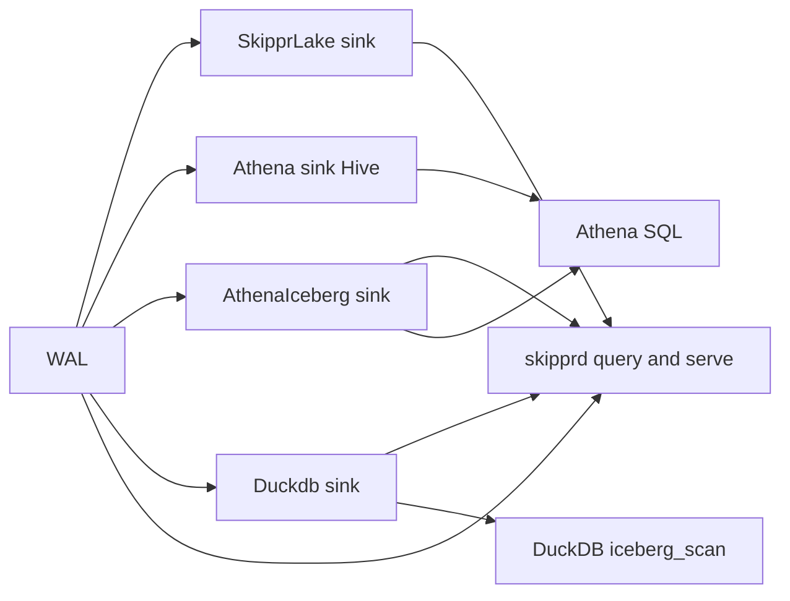

# Spec 1: Exclusive warehouse sinks (hard cutover)

Status: draft for implementation. Companion: [Spec 2: SkipprLake dbt + REST](./skipprlake-dbt-rest.md).
Repos touched: `skipprd` (primary), `sde`, `cloud` (docs and decisions only), `skippr-web` (docs only).

This spec fixes the existing DuckDB, Athena, Iceberg and `skipprd query` wiring. Spec 2 (`dbt-skipprlake`, REST, Flight, LocalSidecar) has landed on this shape.

## 1. Goals and non-goals

### Goals

1. Three mutually exclusive warehouse families. The **data sink plugin key** decides everything downstream; there is no runtime "engine" switch.

   | Plugin key | Writes | Read by |
   |---|---|---|
   | `SkipprLake` | Iceberg on object storage, Skippr catalog (DynamoDB or Cloud Tables) | `skipprd query` (Iceberg ∪ WAL ingest alias); `skipprd serve` Flight/REST (Iceberg `namespace.table`); Spark/Trino via REST |
   | `Athena` | Hive Parquet plus Glue (unchanged) | Athena only (SDE `AthenaProvider`, dbt-athena). `skipprd query` is WAL-only. |
   | `AthenaIceberg` | Iceberg on S3, Glue catalog | `skipprd query` (Iceberg ∪ WAL ingest alias); `skipprd serve` Flight (Iceberg `namespace.table`); Athena SQL |
   | `Duckdb` | Iceberg on `file://`, metadata colocated with data | `skipprd query` (Iceberg ∪ WAL ingest alias); `skipprd serve` Flight (Iceberg `namespace.table`); DuckDB `iceberg_scan`. SDE does not model DuckDB. |

2. `skipprd query` resolves `QueryBackend { Iceberg(IcebergLake), WalOnly }` once at the edge. Iceberg sinks are SkipprLake, AthenaIceberg, and Duckdb. Hive Athena, Snowflake, and other non-Iceberg sinks serve live WAL only. sqlrt never names those sinks.
3. Delete `query_engine`, the Glue/REST/Unity/Polaris catalog variants, and every "Iceberg" plugin-name string.
4. One Iceberg writer implementation shared by three thin plugins.
5. SDE drops `Duckdb` as a warehouse entirely. SDE maps `SkipprLake` and `AthenaIceberg` correctly and never sees `query_engine`.

### Non-goals (Spec 2)

- Iceberg views and public credential vending. SkipprLake dbt is `dbt-skipprlake` (`type: skipprlake`).
- Any DuckDB write path from SDE.
- `sde query` / `sde model` warehouse I/O is Flight against one `skipprd serve` (Iceberg `namespace.table`). `SkipprCliProvider` stays EL-only. The `pipeline.namespace` ∪WAL alias remains `skipprd query` only.
- `skipprd serve` is a kernel service (Iceberg REST + Flight SQL), not a SkipprLake plugin.

## 2. Locked decisions

Confirmed 2026-09-30: **D3** (`AthenaIceberg` is a separate plugin key; `Athena` stays Hive), **D11**, **D12**.

| # | Decision | Why |
|---|---|---|
| D1 | Plugin key selects warehouse family. No `query_engine` anywhere. | One authority per job. |
| D2 | `Iceberg` becomes **`SkipprLake`**, for both the data sink and the schema sink. Flat config, Skippr catalog only. | The plugin is only ever used for the Skippr warehouse. The nested `catalog: {type: ...}` block runs against the flat encapsulated shape used by `Athena`. |
| D3 | Athena on Iceberg is a **separate plugin key `AthenaIceberg`**. `Athena` stays Hive only. No `table_format` switch on `Athena`. | Sink capability is static per plugin name (`[package.metadata.skippr-plugin.sink_capability]` in the plugin `Cargo.toml` plus `sink_capabilities::by_name` in `src/plugins/cdc.rs`). Hive is `CdcEncodedOnly / DeterministicOverwrite`; Iceberg is `ExactOnceCdcEligible / TransactionalIdempotent`. A `table_format` switch on one key would force config-aware capabilities and lose the compile-time guarantee. |
| D4 | `skipprd query` resolves a typed `QueryBackend { Iceberg(IcebergLake), WalOnly }` once, at the edge. `IcebergLake` holds serializable `IcebergCatalogSpec` (Skippr / Glue / filesystem) plus ingest namespace. | Compile-time exhaustiveness. No string compares in sqlrt. Catalogs open asynchronously. |
| D6 | `Duckdb` writes Hadoop-style filesystem Iceberg. `skipprd query` serves Iceberg ∪ WAL; `skipprd serve` Flight serves Iceberg `namespace.table`. SDE does not model DuckDB. | Same Iceberg catalog opener as SkipprLake and AthenaIceberg. |
| D7 | The filesystem catalog crate is the Duckdb catalog backend. Host query opens it through `IcebergCatalogSpec::Filesystem`. | One opener. Not a second Skippr catalog. |
| D12 | Clustered query serves **Iceberg** pipelines. A `WalOnly` pipeline is **not registered** and yields an explicit typed notice (`ClusteredSelectPlan.wal_only`), never a silent skip. Local `skipprd query` serves WAL for WalOnly and Iceberg ∪ WAL for Iceberg. | Ballista scans persisted Iceberg; Hive/Snowflake have none that skipprd may know about. |
| D5 | Manifest-prefix S3 Parquet listing in `skipprd query` is deleted. | It encodes the Athena Hive lake layout inside the query engine. |
| D8 | One shared writer crate `skippr-iceberg-writer`. Plugins are config plus catalog constructor plus `main`. | DRY. `iceberg_sink.rs` is 4.8k LOC with 36 tests. Three copies would diverge. |
| D9 | SDE models SkipprLake through `dbt-skipprlake` (`type: skipprlake`). Local `file://` uses LocalSidecar `skipprd serve`. | Spec 2 landed; `SKIPPR_NOT_DBT_ADAPTER` is deleted. |
| D11 | `table_prefix` is removed. Each `SkipprLake` sink owns a unique `(catalog_table, table_namespace)`, validated at config load (`Config::get_config_dependency_violations`). The Iceberg namespace is the isolation unit. | With no prefix, two sinks sharing a namespace would share table names. A load-time check makes that unrepresentable at run time. |
| D13 | Table location is derived: `{warehouse}/{table_namespace}/{table_name}`. `table_location_prefix`, `properties`, `format`, `query_engine` and `catalog` are removed from the `SkipprLake` config. | Removes six "requires table_location_prefix" runtime error sites and a config input that could disagree with the catalog. |
| D10 | No compatibility shims. Configs using `Iceberg:` fail with the normal unknown-plugin error. Rename is documented in the changelog. | Hard cutover. |

## 3. Pre-cutover audit (historical)

W1–W8 replaced this world. Do not treat this section as current code. `skipprd query` is `QueryBackend::{Iceberg, WalOnly}`. Statement copy is `sqlrt::docs::get_sql_docs()`; checked-in `sql-docs.md` is generated from it (W9). Hive Glue remains the Athena Hive schema sink, not the engine query catalog.

### 3.1 skipprd query knew other sinks

- `src/cluster/pipeline_view.rs` used `iceberg = sink_plugin.eq_ignore_ascii_case("Iceberg")`. The view carried `sink_plugin` and `schema_plugin` strings into query code.
- `src/sqlrt/tables.rs::register_namespace_view` read the pipeline manifest (`registry::manifest_key_for` → `Manifest::s3_key_for`), took `tables.<ns>.prefixes[]`, built `build_s3_df` (a `ListingTable`), and UNIONed WAL. Only the Athena plugin wrote those prefixes. Query encoded the Athena Hive layout.
- `src/sqlrt/tables.rs::iceberg_sink_catalog` parsed the full `IcebergCatalogConfig` (Glue, Skippr, Rest, Unity, Polaris) and errored with adapter names.
- `plan_clustered_select` pre-registered only `view.iceberg` pipelines. Other pipelines were silently absent from clustered queries.
- `src/sqlrt/query.rs` imported `helpers::athena_admin::{delete_glue_database, glue_delete_table, output_athena_admin_config}` and issued Glue calls from the REPL (`DROP DATABASE`, `DROP TABLE`).
- `src/sqlrt/operators/dump_schema.rs` used `SkipprHive` (Hive types).
- `src/sqlrt/operators/drop_table.rs` deleted S3 data via `Manifest::read` prefixes.
- Markdown copies of SQL docs (`sql-docs.md`, `docs/docs/sql/reference.md`) still taught Athena/Glue as the query catalog after `docs.rs` already named SkipprLake.

### 3.2 Iceberg plugin (deleted in W3/W4)

- `plugins/data_sink/iceberg/src/iceberg_sink.rs`: 4,798 LOC. `DataSinkIcebergPluginConfig { catalog, table_namespace, table_prefix, table_location_prefix, properties, query_engine, format }`.
- `IcebergQueryEngineConfig { Athena{workgroup}, Skippr }`: parsed, stored, **never read** at query time.
- `IcebergCatalogConfig` (then in `crates/skippr-iceberg-catalog`): Glue, Skippr, Rest, Unity, Polaris. Rest, Unity and Polaris failed at runtime ("configured but not implemented yet").
- Glue worked via `iceberg-catalog-glue` (`GlueCatalogBuilder`), used by 8 CI e2e scenarios.
- Schema sink `plugins/schema_sink/iceberg/src/main.rs` was a 56-line wrapper around `DataSinkIcebergPlugin`.
- Equality deletes were emitted (`PendingFileContent::EqualityDeletes`, `equality_ids_for_columns`, `plan_contract_equality_ids`) for CDC and at least `merge_by_key` and `replace_partition`.

### 3.3 Host hardcodes of `"Iceberg"`

`src/engine.rs`, `src/plugins/cdc.rs` (`ICEBERG`, `by_name`), `src/runtime_plugins/protocol.rs`, `src/helpers/configuration.rs` schema pairing, `src/helpers/plugin_config.rs`, `src/cluster/validation.rs`, `src/cluster/pipeline_view.rs`, `src/connect.rs` / `src/connect_generated.rs`. Cut in W3.

### 3.4 SDE (W6 cut)

YAML plugin key is parsed once into `SkipprdYamlPlugin`; `Iceberg` is not a variant. `Duckdb` is a skipprd output only (Err, not a warehouse). `SkipprLake` → `WarehouseConfig::Skippr` with `warehouse` URI required at parse, translate, resolve, emit, and connect. `AthenaIceberg` → `WarehouseConfig::Athena { table_format: Iceberg, warehouse required }`. Schema sink `Iceberg` is rejected. `gold_model` hard-errors without warehouse kind. One binary env: `SKIPPRD_BIN`. See W6.

## 4. Target architecture



Notes:

- `skipprd query` sees Iceberg ∪ WAL for SkipprLake, AthenaIceberg, and Duckdb. `skipprd serve` Flight sees Iceberg `namespace.table` only. Hive Athena, Snowflake, and other non-Iceberg pipelines are WAL-only on `skipprd query`.
- Host query opens catalogs through `IcebergCatalogSpec` (Skippr / Glue / filesystem). Plugin YAML may carry extra Athena SQL keys; `GlueCatalogConfig` / `FsCatalogConfig` are the query/serve subset and do not link sink binaries.
- Athena SQL and DuckDB `iceberg_scan` remain available for those warehouses' own clients.

### 4.1 Crate layout after the cutover

```text
crates/
  skippr-iceberg-writer/          shared writer (extracted from iceberg_sink.rs)
  skippr-iceberg-catalog/         WarehouseObjectStore + SkipprLakeConfig + SkipprCatalogBackend
  skippr-iceberg-catalog-dynamodb/        KEEP (typed config in)
  skippr-iceberg-catalog-cloud-tables/    KEEP (typed config in)
  skippr-iceberg-catalog-glue/    Glue opener for host query/serve (no Athena SQL keys)
  skippr-iceberg-catalog-fs/      filesystem catalog (Duckdb sink and host query)
  skippr-iceberg-rest/            Iceberg REST for skipprd serve
plugins/
  data_sink/skipprlake/           RENAMED from data_sink/iceberg
  schema_sink/skipprlake/         RENAMED from schema_sink/iceberg
  data_sink/athena_iceberg/       NEW
  schema_sink/athena_iceberg/     NEW
  data_sink/duckdb/               NEW
  schema_sink/duckdb/             NEW
  data_sink/athena/               KEEP (Hive), manifest write removed
  schema_sink/glue/               KEEP (Hive)
```

## 5. Landing units

Each unit is a hard cutover: code, tests, docs and callers move together. Order and dependencies:

```text
W0 spikes and spec lock
  → W1 writer extraction (pure refactor, green before anything else)
    → W3 SkipprLake config + plugin rename (D11, D13; defines SkipprLakeConfig)
      → W2 query isolation (`QueryBackend::{Iceberg(IcebergLake), WalOnly}`; `IcebergCatalogSpec::Skippr` wraps `SkipprLakeOpen` from W3 YAML)
        → W4 AthenaIceberg (same merge chain: Glue Iceberg moves off the lake plugin)
          → W5 Duckdb sink
          → W6 SDE cutover
            → W7 CI, docs, release, sibling repos
              → W8 verification gates
```

W3, W2 and W4 are one merge chain, in separate commits. Removing Glue from the lake plugin breaks 8 Glue e2e scenarios; AthenaIceberg replaces them in the same change.

---

## W0. Spikes and design lock

### W0.1 Spike S1: DuckDB reads filesystem-catalog Iceberg

Write a throwaway test (not committed) that:

1. Creates a table with `iceberg-rust` on `file:///tmp/lake/wh` with a filesystem catalog stub: `metadata/v1.metadata.json`, `metadata/version-hint.text`.
2. Appends a Parquet data file.
3. Opens DuckDB (CLI or `duckdb` Python) and runs:

```sql
INSTALL iceberg; LOAD iceberg;
SELECT count(*) FROM iceberg_scan('/tmp/lake/wh/default/orders');
-- If version guessing is required by your DuckDB version:
SET unsafe_enable_version_guessing = true;
```

Repeat on S3 (MinIO) and R2 using `WarehouseObjectStore::duckdb_create_secret_sql()`.

Pass criteria: row counts match after each of three appends; schema evolution (add nullable column) is visible; a rewritten metadata path (`allow_moved_paths`) is not needed.

If this fails, stop W5 and report. Do **not** add a REST catalog to fix it (see D6).

### W0.2 Spike S2: equality-delete behaviour

For each write policy in `iceberg_sink.rs`, record whether it emits equality-delete files:

- Read `iceberg_sink.rs` around lines 1069–1100 (`exact_cdc_contract`, `WritePolicy::MergeByKey`, `WritePolicy::ReplacePartition`), 1647–1700, 1794–1830 (delete paths) and `plan_contract_equality_ids`.
- Produce a table `policy → emits EqualityDeletes (yes/no)`.

Then test what DuckDB `iceberg_scan` and Athena (for AthenaIceberg, on a Glue Iceberg v2 table) do on a table with an equality-delete file. Record results in this spec (section 12).

Outcome drives capability metadata for `Duckdb` and `AthenaIceberg` (W4, W5). Default when unproven: the sink declares **no** policy that emits equality deletes.

### W0.3 Design lock

Add this file's section 2 verbatim to `docs/docs/maintainers/warehouse-sinks.md` as a short "what is the contract" page (no steps) once W3 lands. Amend `cloud` decision D13 and `specs/services/elt.md` in W7.

---

## W1. Extract `skippr-iceberg-writer`

Pure refactor. No behaviour change. All 36 tests in `iceberg_sink.rs` move and stay green before W2.

### W1.1 New crate

`crates/skippr-iceberg-writer/Cargo.toml`:

```toml
[package]
name = "skippr-iceberg-writer"
version = "0.1.0"
edition = "2021"

[dependencies]
skippr-runtime-sdk.workspace = true
skippr-object-writer = { path = "../skippr-object-writer" }
skippr-iceberg-catalog = { path = "../skippr-iceberg-catalog" }
iceberg = "0.9.1"
arrow.workspace = true
parquet.workspace = true
datafusion.workspace = true
tokio.workspace = true
async-trait.workspace = true
futures.workspace = true
serde.workspace = true
serde_json.workspace = true
tracing.workspace = true
aws-config = "1.5.1"
aws-sdk-s3 = "1.32.0"
# NOTE: no iceberg-catalog-glue, no dynamodb, no cloud-tables. The catalog is injected.
```

### W1.2 Public API

The catalog is injected. The capability is a type parameter. Both are enforced by the compiler.

```rust
// crates/skippr-iceberg-writer/src/lib.rs (as landed)
pub struct IcebergWriterConfig {
    /// Non-append policies this sink may execute (existing sdk type; its `match` is exhaustive).
    pub policies: SinkWritePolicySupport,
    pub table_namespace: String,
    pub table_prefix: Option<String>,          // removed in W3 (D11)
    pub table_location_prefix: Option<String>, // replaced by derived location in W3 (D13)
    pub properties: BTreeMap<String, String>,  // removed in W3 (D13)
}

/// `S` supplies NAME and CAPABILITY. `HasSinkSpec for IcebergWriter<S>` is a blanket impl,
/// so plugins declare only `declare_sink_spec!(Spec, CAPABILITY, WriteSupport)`.
pub struct IcebergWriter<S: SinkSpec> { /* moved from DataSinkIcebergPlugin */ }

impl<S: SinkSpec> IcebergWriter<S> {
    pub async fn new(
        context: RuntimeExecutionContext,
        binding: RuntimeBinding,
        buffer_name: String,
        catalog: Arc<dyn Catalog>,
        config: IcebergWriterConfig,
    ) -> io::Result<Self>;
}
// impl DataSink and SchemaSink once, for every S.
```

Plugins hold no wrapper struct: `pub type DataSinkIcebergPlugin = IcebergWriter<IcebergSinkSpec>;`.

### W1.3 Move list

From `plugins/data_sink/iceberg/src/iceberg_sink.rs` into the writer crate (by function, not exhaustive):

- All grouped-commit and CDC machinery: `IcebergGroupedPending`, `PendingIcebergFile`, `PendingFileContent`, `StoredPartitionValue`, `CdcStateSession`, `grouped_pending_key`, `validate_grouped_pending`, `filter_grouped_cdc_batches`, `prepare_grouped_policy_batches`, `grouped_snapshot_properties`, `table_has_grouped_snapshot`.
- Schema mapping: `iceberg_schema_from_output_metadata`, `field_to_nested_field`, `primitive_type_for_skippr`, `apply_iceberg_field_ids*`, `merge_iceberg_schema_missing_fields`.
- Object IO: `S3ObjectWriteBackend`, `ObjectLocation`, `parse_object_location`, `to_iceberg_s3_uri`, `parse_s3_uri`, s3-not-found helpers.
- All 36 tests. `make_v2_minimal_table_for_tests` moves with them.

Stays in the plugin: config struct, catalog construction, `main.rs`.

### W1.4 Catalog resolution moves out

`DataSinkIcebergPlugin::catalog()` (line ~2456) and `table_namespace()` (~2623) contain the `match &self.config.catalog { Glue | Skippr | Rest | Unity | Polaris }`. Delete them from the writer. Each plugin builds its `Arc<dyn Catalog>` before calling `IcebergWriter::new` (W3, W4, W5).

### W1.5 Policies

The writer reuses `SinkWritePolicySupport` and `validate_write_policy_for_sink` (exhaustive `match` on `WritePolicy` in the sdk). No second policy type. Sink name in errors is `S::NAME`.

### W1.6 Tests (first)

- Keep all 36 tests running under `cargo test -p skippr-iceberg-writer`.
- New: `sync_schema_creates_table_in_injected_catalog_namespace` builds an `IcebergWriter<S>` over a `MemoryCatalog` and asserts the table lands in the configured namespace (proves the catalog is injected).
- `to_iceberg_s3_uri` moved to `skippr-iceberg-catalog` (single owner; the plugin's Glue arm and the writer both use it).
- The `include_str!("iceberg_sink.rs")` source-grep guard was deleted; `validate_grouped_pending` already proves the behaviour.
- The existing `plugins/data_sink/iceberg` tests that touched the plugin struct become thin config tests in W3.

Gate to exit W1: `cargo test -p skippr-iceberg-writer -p skippr-plugin-data-sink-iceberg` green, no behaviour diff in `.github/actions/e2e/*iceberg*`.

---

## W2. Query isolation in skipprd

### W2.1 Tests first

Add `tests/query_isolation.rs`. It fails until W2 lands and stays as a permanent gate:

```rust
use std::fs;
use std::path::Path;

/// `skipprd query` must not know Hive Athena, Snowflake, or Athena SQL.
/// Iceberg catalog backends are opened at the cluster edge, not in sqlrt.
/// Banned identifiers are assembled with concat! so this file does not trip itself.
#[test]
fn sqlrt_and_query_flight_know_no_other_sinks() {
    let banned: &[&str] = &[
        concat!("Ath", "ena"),
        concat!("Gl", "ue"),
        concat!("Hi", "ve"),
        concat!("Duck", "db"),
        concat!("Snow", "flake"),
        concat!("athena", "_admin"),
        concat!("build_s3", "_df"),
        concat!("manifest_key", "_for"),
        concat!("Iceberg", "CatalogConfig"),
        "query_engine",
    ];
    let root = Path::new(env!("CARGO_MANIFEST_DIR")).join("src");
    for dir in ["sqlrt", "query_flight"] {
        for entry in walk(&root.join(dir)) {
            let text = fs::read_to_string(&entry).unwrap();
            for word in banned {
                assert!(
                    !text.contains(word),
                    "{} mentions banned identifier `{word}`; skipprd query is Iceberg ∪ WAL, not Hive/Snowflake SQL",
                    entry.display()
                );
            }
        }
    }
}
```

`walk` is a small recursive `read_dir` helper in the test file. Tests inside `sqlrt` that legitimately need a phrase use `concat!` too.

Behavioural tests, in `src/cluster/pipeline_view.rs` (historical W2 named `sqlrt/backend.rs`; query backend lives at the cluster edge):

```rust
#[test]
fn athena_sink_resolves_wal_only() {
    let cfg = config_with_sink("Athena", json!({"s3_bucket": "b", "s3_prefix": "p",
        "athena_workgroup_name": "wg", "athena_results_s3_bucket": "r"}));
    assert!(matches!(QueryBackend::for_pipeline(&cfg, "p").unwrap(), QueryBackend::WalOnly));
}

#[test]
fn skipprlake_sink_resolves_typed_backend() {
    let cfg = config_with_sink("SkipprLake", json!({
        "warehouse": "s3://wh/", "catalog_table": "cat", "region": "us-east-1",
        "table_namespace": "bronze"
    }));
    assert!(matches!(QueryBackend::for_pipeline(&cfg, "p").unwrap(), QueryBackend::Iceberg(_)));
}

#[test]
fn malformed_skipprlake_config_fails_closed_not_wal_only() {
    let cfg = config_with_sink("SkipprLake", json!({"warehouse": "s3://wh/", "catalog": {"type": "glue"}}));
    assert!(QueryBackend::for_pipeline(&cfg, "p").is_err());
}

#[tokio::test]
async fn wal_only_pipeline_never_reads_manifest_or_lists_s3() {
    // Use a storage double that panics on get_json_opt; register_namespace_view must not call it.
}

#[tokio::test]
async fn clustered_select_notices_wal_only_pipelines() {
    // File/Athena sink pipelines are listed on ClusteredSelectPlan.wal_only and
    // are not registered as lake tables. Local register_namespace_view still serves WAL.
}
```

### W2.2 Typed backend

Lives on `PipelineConfigView` (cluster is the edge that already owns sink identity). sqlrt matches `view.backend` only — it does not re-decode JSON.

```rust
/// How `skipprd query` reads one pipeline. Resolved once; never re-derived from strings.
#[derive(Clone, Debug)]
pub enum QueryBackend {
    /// Iceberg data sink: Iceberg catalog ∪ live WAL.
    Iceberg(IcebergLake),
    /// Any other sink, or no sink: live WAL only (local query). Clustered: typed notice, not registered.
    WalOnly,
}
```

Plugin name is matched **once** at `QueryBackend::for_pipeline`. Malformed Iceberg sink config is `ConfigError::IcebergConfigInvalid`, not `WalOnly`.

### W2.3 `PipelineConfigView`

`src/cluster/pipeline_view.rs`:

- Remove `pub iceberg: bool`.
- Add `pub backend: QueryBackend`.
- Keep `sink_plugin` and `sink_capability()` for **ingest and cluster validation only** (clustered idempotency check). Query code must not read `sink_plugin`; the isolation test enforces this for `sqlrt/` and `query_flight/`.
- Update the three test literals (`iceberg: true/false` → `backend: QueryBackend::...`).

### W2.4 `register_namespace_view`

Replace the manifest-prefix branch:

```rust
pub async fn register_namespace_view(
    ctx: &SessionContext,
    config: &Config,
    pipeline: &str,
    namespace: &str,
) -> Result<(), DataFusionError> {
    if already_registered(ctx, pipeline, namespace).await { return Ok(()); }
    config.init().await;
    let view = PipelineConfigView::for_name(config, pipeline)
        .map_err(|e| DataFusionError::Plan(e.to_string()))?;
    match &view.backend {
        QueryBackend::Iceberg(_) => register_iceberg_union_view(
            config, ctx, pipeline, namespace, &view, &namespace_union_opts(config),
        ).await.map_err(|err| DataFusionError::Plan(format!(
            "Iceberg catalog unavailable for '{pipeline}.{namespace}': {err}"
        ))),
        QueryBackend::WalOnly => register_wal_namespace_view(ctx, config, pipeline, namespace).await,
    }
}
```

Delete: `build_s3_df`, `build_timestamp_projection` (if only used here), the manifest fetch, the `Ok(_) => {}` and clustered error arms, and the 12s/45s timeouts.

### W2.5 Catalog config in query

`iceberg_sink_catalog` / `IcebergSinkCatalog` become:

```rust
fn iceberg_lake(view: &PipelineConfigView) -> Result<&IcebergLake, DataFusionError> {
    match &view.backend {
        QueryBackend::Iceberg(lake) => Ok(lake),
        QueryBackend::WalOnly => Err(DataFusionError::Plan(
            "pipeline is not an Iceberg pipeline".into(),
        )),
    }
}
```

`load_iceberg_scan_provider` and `list_iceberg_source_namespaces` drop the `match &sink.catalog_cfg { Skippr => ..., other => Err(adapter_name) }` arms. `open_iceberg_catalog` (in `src/cluster/backend.rs`) takes `&IcebergCatalogSpec`. Skippr identity includes `SkipprCatalogBackend` and `object_store` (`SkipprLakeOpen`); Ballista reload must not guess DynamoDB via `Config::new()`.

Delete `#[allow(dead_code)] struct IcebergSinkCatalog`.

### W2.6 Clustered path (D12)

Clustered query serves **Iceberg** pipelines. `plan_clustered_select` currently skips non-Iceberg pipelines silently (`if !view.iceberg { continue; }`). Replace the skip with `QueryBackend` (do **not** add a second `ClusteredPipelineScope` enum):

```rust
pub struct ClusteredSelectPlan {
    pub df: datafusion::dataframe::DataFrame,
    /// Pipelines whose sink is not Iceberg. Not registered. Never silently omitted.
    pub wal_only: Vec<String>,
}
```

`plan_clustered_select` returns `ClusteredSelectPlan`. Iceberg pipelines register Iceberg ∪ WAL. WalOnly names go on `wal_only` and are not registered. Catalog-list **errors** fail the plan (not warn+continue). An empty namespace list is success (no tables yet). Rename `iceberg_only` / `run_iceberg_only_query` to `lake_only` / `run_lake_only_query`. Local `skipprd query` serves WAL-only pipelines via `register_wal_namespace_view`.

### W2.7 Remove Glue/Athena/Hive from the query REPL

`src/sqlrt/query.rs`:

- Delete the `use crate::helpers::athena_admin::{...}` import and the `Statement::DatabaseDrop` arm that calls `delete_glue_database`.
- Delete the `glue_delete_table` branch (~1036–1048) in table drop.
- `DROP DATABASE` and `DROP TABLE` in the REPL become: Iceberg pipelines drop via the catalog (see W2.8); any other backend returns `"DROP TABLE is only supported for Iceberg pipelines"`.
- Delete `src/helpers/athena_admin.rs` and its `pub mod` if no other caller remains (grep shows only `sqlrt/query.rs`).

`src/sqlrt/operators/dump_schema.rs`: replace Hive with the Arrow schema:

```rust
// before: SkipprHive::convert_skippr_to_hive(&output_metadata)
// after:  render the Arrow schema of the registered table
let schema = ctx.table(fqn).await?.schema().inner().clone();
let rows: Vec<(String, String, bool)> = schema
    .fields()
    .iter()
    .map(|f| (f.name().clone(), f.data_type().to_string(), f.is_nullable()))
    .collect();
```

`src/sqlrt/docs.rs`: statement copy names Iceberg ∪ WAL. Glue/Athena are not the engine query catalog. Markdown is generated (`sql-docs.md` from `get_sql_docs_formatted()`); handwritten `docs/docs/sql/reference.md` is deleted (W9).

### W2.8 `drop_table`

`src/sqlrt/operators/drop_table.rs`: delete the `Manifest::read` prefix deletion. New behaviour:

```rust
match &view.backend {
    QueryBackend::Iceberg(lake) => {
        let catalog = open_iceberg_catalog(&lake.catalog).await?;
        catalog.drop_table(&ident).await?;   // pointer delete; data purge stays a sink concern
        delete_wal_partition(...).await?;
    }
    QueryBackend::WalOnly => return Err(DataFusionError::Plan(
        "DROP TABLE is only supported for Iceberg pipelines".into(),
    )),
}
```

### W2.9 Athena plugin stops writing the manifest

`plugins/data_sink/athena/src/athena.rs` ~1793–1819: delete the `Manifest::ensure_prefix_and_db` call. Delete `Manifest::ensure_prefix_and_db`, `ensure_prefix`, `s3_key_for`, `read`, `epoch` and the `Config::ensure_prefix*` wrappers (`configuration.rs` ~1836–1860) if grep shows no remaining callers; keep only what the schema/registry still uses. Remove `registry::manifest_key_for`.

### W2.10 Done criteria for W2

- `tests/query_isolation.rs` green.
- `cargo test -p skipprd --lib` green with the updated view literals.
- `cargo test --test hla_cluster` (or the current clustered test target) green.
- Python `tests/hla_e2e/run.py` unchanged in behaviour (still SkipprLake ∪ WAL; key rename comes in W3).

---

## W3. SkipprLake plugin cutover

### W3.1 Config

Flat, encapsulated, `deny_unknown_fields`. Lives in `crates/skippr-iceberg-catalog/src/lib.rs` beside `WarehouseObjectStore` so the host can deserialize sink YAML without linking the plugin binary. Query identity is `SkipprLakeOpen { lake, backend }` inside `IcebergCatalogSpec`, not `SkipprLakeConfig` alone.

```rust
/// Data sink and schema sink config for `SkipprLake:`.
#[derive(Debug, Deserialize, Serialize, Clone, PartialEq, SkipprConfig)]
#[serde(deny_unknown_fields)]
pub struct SkipprLakeConfig {
    /// Iceberg warehouse root: `s3://bucket/path`, `file:///abs/path`.
    pub warehouse: String,
    /// DynamoDB table (or Cloud Tables namespace) that holds catalog pointers.
    /// MUST NOT be the offset/lease table (`SKIPPR_OFFSET_DYNAMODB_TABLE`).
    pub catalog_table: String,
    #[serde(default)]
    pub region: Option<String>,
    #[serde(default)]
    pub object_store: WarehouseObjectStore,
    /// Iceberg namespace for sink-managed tables. Default: `default`.
    #[serde(default = "default_lake_namespace")]
    pub table_namespace: String,
}

impl SkipprLakeConfig {
    pub const PLUGIN_NAME: &'static str = "SkipprLake";
}
```

YAML:

```yaml
data_sinks:
  lake:
    SkipprLake:
      warehouse: s3://my-lake/
      catalog_table: my-lake-catalog
      region: us-east-1
      table_namespace: bronze
      object_store:
        type: r2
        endpoint: ${OBJECTS_S3_ENDPOINT}
        access_key_id: ${OBJECTS_ACCESS_KEY_ID}
        secret_access_key: ${OBJECTS_SECRET_ACCESS_KEY}
        path_style: true
schema_sinks:
  lake_schema:
    SkipprLake:
      warehouse: s3://my-lake/
      catalog_table: my-lake-catalog
      region: us-east-1
      table_namespace: bronze
      object_store:
        type: r2
        endpoint: ${OBJECTS_S3_ENDPOINT}
        access_key_id: ${OBJECTS_ACCESS_KEY_ID}
        secret_access_key: ${OBJECTS_SECRET_ACCESS_KEY}
        path_style: true
```

Removed keys: `catalog` block and `catalog.type`, `table_prefix`, `table_location_prefix`, `properties`, `format` (always Parquet), `query_engine`. Table naming is always `namespace` (no prefix); `catalog_table_to_namespace` in `tables.rs` loses its `prefix` parameter.

`IcebergCatalogConfig` (Glue, Skippr, Rest, Unity, Polaris) is deleted. `adapter_name()`, `warehouse()`, `skippr_table()` go with it. `WarehouseObjectStore` and `duckdb_create_secret_sql()` stay (the latter is used by SkipprLake tests).

### W3.2 Dynamodb and cloud-tables catalogs

`DynamoDbCatalog::new(&IcebergCatalogConfig)` and `CloudTablesCatalog::new(&IcebergCatalogConfig)` change to take `&SkipprLakeConfig`. Their "requires catalog type skippr" checks (`dynamodb/src/lib.rs:48`, `cloud-tables/src/lib.rs:50`) are deleted (the type now guarantees it). `iceberg_file_io_for_warehouse` takes `&SkipprLakeConfig`.

### W3.3 Plugin

Rename directories and packages:

```text
plugins/data_sink/iceberg    → plugins/data_sink/skipprlake
plugins/schema_sink/iceberg  → plugins/schema_sink/skipprlake
skippr-plugin-data-sink-iceberg    → skippr-plugin-data-sink-skipprlake
skippr-plugin-schema-sink-iceberg  → skippr-plugin-schema-sink-skipprlake
```

`plugins/data_sink/skipprlake/Cargo.toml` (dependency list, then metadata):

```toml
[dependencies]
skippr-runtime-sdk.workspace = true
skippr-iceberg-writer = { path = "../../../crates/skippr-iceberg-writer" }
skippr-iceberg-catalog = { path = "../../../crates/skippr-iceberg-catalog" }
skippr-iceberg-catalog-dynamodb = { path = "../../../crates/skippr-iceberg-catalog-dynamodb" }
skippr-iceberg-catalog-cloud-tables = { path = "../../../crates/skippr-iceberg-catalog-cloud-tables" }
iceberg = "0.9.1"
# removed: iceberg-catalog-glue

[package.metadata.skippr-plugin]
kind = "DataSink"
plugin_name = "SkipprLake"

[package.metadata.skippr-plugin.sink_capability]
name = "SkipprLake"
max_sessions_per_child = 1
guarantee_tier = "ExactOnceCdcEligible"
can_manage_skippr_columns = true
can_maintain_tombstone_tables = true
can_compare_order_tokens = true
supports_transactions = true
retry_semantics = "TransactionalIdempotent"
grouping_support = "FinalStateBatches"
supports_merge_by_key = true
supports_replace_partition = true
supports_replace_table = true
supports_primary_key_metadata = false
```

`src/lib.rs`:

```rust
use std::io;
use std::sync::Arc;
use iceberg::Catalog;
use skippr_iceberg_catalog::{SkipprCatalogBackend, SkipprLakeConfig};
use skippr_iceberg_writer::{IcebergWriter, IcebergWriterConfig};

pub async fn open_catalog(cfg: &SkipprLakeConfig) -> io::Result<Arc<dyn Catalog>> {
    match SkipprCatalogBackend::from_offset_store(
        &std::env::var("SKIPPR_OFFSET_STORE").unwrap_or_default(),
    ) {
        SkipprCatalogBackend::CloudTables => { /* CloudTablesCatalog::new */ }
        SkipprCatalogBackend::DynamoDb => { /* DynamoDbCatalog::new */ }
    }
}

pub fn writer_config(cfg: &SkipprLakeConfig) -> IcebergWriterConfig {
    IcebergWriterConfig {
        policies: SKIPPRLAKE_WRITE_POLICIES,
        table_namespace: cfg.table_namespace.clone(),
        location_root: cfg.location_root(),
    }
}
```

The host is the one Config authority: `configured_kind` → `offset_store_env_value`. Runtime plugin spawn injects that string as `SKIPPR_OFFSET_STORE`. Query (`catalog_backend`) and the plugin (`open_catalog`) both call `SkipprCatalogBackend::from_offset_store` on that same string. YAML `skippr.offset_store` without a process env var MUST still reach the plugin.

`main.rs` builds the writer inside the install closure:

```rust
|install| async move {
    let cfg: SkipprLakeConfig = install.config.0.decode().map_err(io::Error::other)?;
    let catalog = open_catalog(&cfg).await?;
    IcebergWriter::new(install.context, install.binding, "data".into(), catalog, writer_config(&cfg)).await
}
```

The schema-sink `main.rs` is the same closure with buffer name `"schema"`, using `declare_schema_sink_spec!(SkipprLakeSchemaSinkSpec, IcebergWriter, "SkipprLake")`. Delete the `IcebergSchemaSync` wrapper struct.

### W3.4 Host hardcodes

| File | Change |
|---|---|
| `src/plugins/cdc.rs` | `ICEBERG` → `SKIPPRLAKE` with `name: "SkipprLake"`; `by_name` arm `"SkipprLake"`; test name list (~1302); test uses `sink_capabilities::SKIPPRLAKE` |
| `src/engine.rs` | 1689 `"SkipprLake" => Some(&sink_capabilities::SKIPPRLAKE)`; 1884 |
| `src/runtime_plugins/protocol.rs:155` | write-policy defaults for `"SkipprLake"` |
| `src/helpers/configuration.rs:716` | SkipprLake data+schema names pair; decoded `SkipprLakeConfig` values MUST be equal |
| `src/helpers/plugin_config.rs:157` | remove parquet default; SkipprLake has no `format` |
| `src/cluster/validation.rs:161,474` | use `SkipprLakeConfig::PLUGIN_NAME`; `skippr_catalog_table` returns `cfg.catalog_table` from the typed config |
| `src/connect.rs:862,868` and tests | YAML key `SkipprLake`, flat fields |
| `src/lib.rs` | none (audit: no `query_engine` references exist here) |

### W3.5 Connect codegen

`skippr-connect-gen` reflects `DataSinkIcebergPluginConfig`. Point it at `SkipprLakeConfig` (via the `SkipprConfig` derive) and regenerate:

```bash
cargo run -p skippr-connect-gen
cargo run -p skippr-connect-gen -- --check
```

Expected diffs: `ConnectPlugin::DataSinkSkipprLake`, `SchemaSinkSkipprLake`, CLI `DataSinkSkipprLakeArgs`, Python `DataSinkSkipprLake`. All `query_engine_*` and `catalog_*` fields disappear. Update `python/tests/test_connect.py` and `crates/skippr-connect-gen` tests that assert `plugin_name == "Iceberg"`.

### W3.6 Tests first

- `skipprlake_config_rejects_removed_keys`: `catalog`, `query_engine`, `table_prefix`, `properties`, `format` each produce `unknown field`.
- `skipprlake_config_flat_roundtrip` with an R2 `object_store`.
- `skipprlake_capability_matches_cargo_metadata` (existing pattern that reads plugin `Cargo.toml`).
- `iceberg_plugin_name_is_unknown` checks that `Iceberg` no longer resolves in `sink_capabilities::by_name` and that `plugins/data_sink/iceberg` and `plugins/schema_sink/iceberg` are gone.

### W3.7 Migration of CI Glue scenarios

Land with W4. See W4.6.

---

## W4. AthenaIceberg plugin (lands in the same merge as W3)

### W4.1 What it is

Iceberg on S3 with the Glue catalog, queried by Athena. It reuses `skippr-iceberg-writer` and `iceberg-catalog-glue`; this is the code that used to live in the Iceberg plugin's `Glue` arm (`iceberg_sink.rs` ~2461–2490).

### W4.2 Config

```rust
#[derive(Debug, Deserialize, Serialize, Clone, PartialEq, SkipprConfig)]
#[serde(deny_unknown_fields)]
pub struct AthenaIcebergConfig {
    /// Table storage root: `s3://bucket/prefix/`.
    pub warehouse: String,
    /// Glue database. Also the Iceberg namespace.
    pub glue_database_name: String,
    pub athena_workgroup_name: String,
    /// Bucket name only (not an `s3://` URI), same as `Athena:`.
    pub athena_results_s3_bucket: String,
    #[serde(default)]
    pub region: Option<String>,
    #[serde(default)]
    pub catalog_id: Option<String>,
    #[serde(default)]
    pub object_store: S3CompatibleObjectStore,
}
```

`object_store` is `S3CompatibleObjectStore` (`S3` | `R2`). `File` cannot be named. Missing `glue_database_name`, workgroup or results bucket is a config error (no silent defaults). This also fixes the bug where the old Iceberg→Athena projection dropped `result_s3`.

YAML:

```yaml
data_sinks:
  warehouse:
    AthenaIceberg:
      warehouse: s3://my-bucket/warehouse/
      glue_database_name: analytics
      athena_workgroup_name: primary
      athena_results_s3_bucket: my-athena-results
      region: us-east-1
schema_sinks:
  catalog:
    AthenaIceberg:
      warehouse: s3://my-bucket/warehouse/
      glue_database_name: analytics
      athena_workgroup_name: primary
      athena_results_s3_bucket: my-athena-results
```

### W4.3 Plugin body

```rust
pub async fn open_glue_catalog(cfg: &AthenaIcebergConfig) -> Result<Arc<dyn Catalog>, io::Error> {
    let mut props = HashMap::new();
    props.insert(GLUE_CATALOG_PROP_WAREHOUSE.to_string(), cfg.warehouse.clone());
    if let Some(id) = &cfg.catalog_id { props.insert(GLUE_CATALOG_PROP_CATALOG_ID.into(), id.clone()); }
    if let Some(region) = &cfg.region { props.insert(AWS_REGION_NAME.into(), region.clone()); }
    for (k, v) in skippr_iceberg_catalog::s3_object_store_props(&cfg.object_store).map_err(io::Error::other)? {
        props.insert(k, v);
    }
    let catalog = GlueCatalogBuilder::default().load("glue", props).await
        .map_err(|e| io::Error::other(e.to_string()))?;
    Ok(Arc::new(catalog))
}
```

Writer config: `table_namespace = cfg.glue_database_name`, `location_root` from warehouse + namespace (D13). There is no `table_prefix` on `IcebergWriterConfig`. Table names are unprefixed (`type_matrix_orders`, not `skippr_type_matrix_orders`).

**W4 SoT (superseded by D4 Iceberg):** AthenaIceberg is an Iceberg query lake. `open_glue_catalog` is `skippr-iceberg-catalog-glue` used by the plugin and host `IcebergCatalogSpec::Glue`. Pairing: AthenaIceberg data_sink MUST use AthenaIceberg schema_sink. Workgroup/results keys are Athena SQL / SDE.

### W4.4 Capability

`plugins/data_sink/athena_iceberg/Cargo.toml`:

```toml
[package.metadata.skippr-plugin]
kind = "DataSink"
plugin_name = "AthenaIceberg"

[package.metadata.skippr-plugin.sink_capability]
name = "AthenaIceberg"
max_sessions_per_child = 1
guarantee_tier = "ExactOnceCdcEligible"      # W0.2 proof is the Athena SELECT checks in W4.6 e2e; downgrade only if those fail
can_manage_skippr_columns = true
can_maintain_tombstone_tables = true
can_compare_order_tokens = true
supports_transactions = true
retry_semantics = "TransactionalIdempotent"
grouping_support = "FinalStateBatches"       # CdcEncodedBatches if downgraded
supports_merge_by_key = true                 # false if downgraded
supports_replace_partition = true
supports_replace_table = true
supports_primary_key_metadata = false
```

Add `ATHENA_ICEBERG` to `src/plugins/cdc.rs::sink_capabilities` and `by_name`.

### W4.5 Athena (Hive) plugin cleanups

- Remove the `Manifest::ensure_prefix_and_db` call (W2.9).
- Leave `athena_workgroup_name`, `athena_results_s3_bucket`, `region`, `catalog` docs as query-only keys.
- Keep the Glue Hive schema sink and the catalog outbox untouched.

### W4.6 CI migration

Eight scenarios move from `Iceberg:` + `catalog.type: glue` to `AthenaIceberg:`:

```text
.github/actions/e2e/postgres_iceberg_types_cdc
.github/actions/e2e/postgres_iceberg_cdc_late_delete
.github/actions/e2e/mysql_iceberg_types_cdc
.github/actions/e2e/dynamodb_iceberg_types_cdc
.github/actions/e2e/mssql_iceberg_debug_linux
.github/actions/e2e/mssql_iceberg_debug_windows
.github/actions/e2e/stripe_iceberg_merge_by_key
.github/actions/e2e/stripe_iceberg_replace_partition
```

Edits per scenario `skippr.yml`:

```yaml
# before
data_sinks:
  iceberg_glue:
    Iceberg:
      catalog: {type: glue, warehouse: s3://.../, database: e2e_db, region: us-east-1}
      table_namespace: e2e_db
# after
data_sinks:
  iceberg_glue:
    AthenaIceberg:
      warehouse: s3://.../
      glue_database_name: e2e_db
      athena_workgroup_name: ${E2E_ATHENA_WORKGROUP}
      athena_results_s3_bucket: ${E2E_ATHENA_RESULTS_BUCKET}
      region: us-east-1
```

Also update:

- `.github/scripts/runtime_e2e_harness.py`: recognise `AthenaIceberg:` and `iceberg_glue:` blocks; `iceberg_glue_table_name` is unprefixed (no `skippr_` prefix).
- **Add an Athena read check** to every scenario that uses `merge_by_key`, CDC or replace policy: run `SELECT count(*)` through Athena and compare to the expected final state. This is the only real proof that Athena can read what the writer produced (W0.2). Do not drop it.
- `.github/actions/e2e/iceberg_equality_commit/action.yaml`: build `skippr-plugin-data-sink-athena-iceberg` / `skippr-plugin-schema-sink-athena-iceberg`.
- `.github/scripts/runtime_plugin_catalog.py` and `test_runtime_plugin_catalog.py`: new slugs `skipprlake`, `athena_iceberg`, `duckdb`; remove `iceberg`. Manifest names: `skipprlake-sink.json`, `skipprlake-schema.json`, and so on.
- `local-dfs-keyword-hub.yml`: convert to `AthenaIceberg:` (it used Glue plus `query_engine: athena`).

### W4.7 Tests first

- `athena_iceberg_requires_glue_database_workgroup_and_results_bucket`.
- `athena_iceberg_config_rejects_catalog_type_and_query_engine`.
- Live Athena read-after-merge tests are e2e (above).

---

## W5. Duckdb sink (skipprd output only)

### W5.1 Filesystem catalog crate

`crates/skippr-iceberg-catalog-fs/src/lib.rs`, implementing `iceberg::Catalog`.

**W5 SoT (superseded by D4/D6/D7):** `DuckdbConfig` stays on the plugin. `FsCatalog` is `skippr-iceberg-catalog-fs`. Host query opens it through `IcebergCatalogSpec::Filesystem`. Pairing: Duckdb data_sink MUST equal Duckdb schema_sink. No REST for DuckDB as a product warehouse. Warehouse is `file://` only.

**Metadata layout (S1):** iceberg-rust writes `{table}/metadata/{version:05}-{uuid}.metadata.json`. DuckDB 1.5.5 `iceberg_scan` reads that with `unsafe_enable_version_guessing`. Without guessing it looks up `version-hint.text` as Hadoop `v{N}.metadata.json` (or `{N}.metadata.json`) — a numeric hint does **not** open UUID filenames. FsCatalog therefore writes both:

```text
<warehouse>/<namespace>/<table>/metadata/{version:05}-{uuid}.metadata.json   # iceberg-rust
<warehouse>/<namespace>/<table>/metadata/v{N}.metadata.json                 # DuckDB hint target; OCC
<warehouse>/<namespace>/<table>/metadata/version-hint.text                  # ASCII version N, no extra newline
<warehouse>/<namespace>/<table>/data/...
```

- `load_table`: version = max(hint, listed Hadoop `v{N}`); read Hadoop `v{N}` bytes; open the UUID metadata file whose bytes match (do not take the first `read_dir` UUID glob; do not parse Hadoop names as `MetadataLocation`).
- `create_table`: write UUID metadata from `MetadataLocation`, copy the same bytes to `v0.metadata.json` using create-if-absent, write hint `0`.
- `update_table(commit)`: `commit.apply` yields the next UUID path; write UUID metadata; copy bytes to `v{N+1}.metadata.json` using create-if-absent (**this is the OCC**); then overwrite the hint. Loser gets `ErrorKind::CatalogCommitConflicts`; IcebergWriter `ensure_table` loads the winner.
- Namespaces are directories. `table_exists`, `list_tables`, and `drop_table` are Hadoop `v{N}` presence, not a `metadata/` directory. `create_table` requires an existing namespace; `IcebergWriter::ensure_catalog_namespace` is the one namespace-create path.
- Docs for DuckDB `iceberg_scan` MUST NOT require `unsafe_enable_version_guessing` because the hint + `v{N}` alias exist.

`iceberg_file_io_for(warehouse, object_store)` is the one FileIO builder in `skippr-iceberg-catalog`; `iceberg_file_io_for_warehouse` is the `SkipprLakeConfig` wrapper. Do not add `object_store_for`. OCC create-if-absent for `v{N}` uses `object_store` `PutMode::Create` (FileIO has overwrite `write`, not create-if-absent).

Create-if-absent per backend:

```rust
/// Atomic "create only if absent". Ok(true)=created, Ok(false)=already exists.
async fn put_if_absent(store: &dyn ObjectStore, path: &Path, bytes: Bytes) -> Result<bool> {
    match store.put_opts(path, bytes.into(), PutOptions { mode: PutMode::Create, ..Default::default() }).await {
        Ok(_) => Ok(true),
        Err(object_store::Error::AlreadyExists { .. }) => Ok(false),
        Err(e) => Err(e.into()),
    }
}
```

`object_store` `PutMode::Create` maps to `O_EXCL` on local files. Add a unit test that two concurrent commits to the same version produce exactly one winner. The hint file is advisory; readers that lose the hint race still find `v<N+1>` by listing on the next call.

Rationale for being catalog-agnostic-free: Skippr catalog crates never depend on this crate and this crate is not exported from `skipprd` config (D7).

### W5.2 Config

```rust
#[derive(Debug, Deserialize, Serialize, Clone, SkipprConfig)]
#[serde(deny_unknown_fields)]
pub struct DuckdbConfig {
    /// `file:///abs/path`.
    pub warehouse: String,
    /// Iceberg's namespace for sink-managed tables. Required; unique per warehouse.
    pub table_namespace: String,
}
// PartialEq uses warehouse_key, not raw warehouse strings.
```

YAML:

```yaml
data_sinks:
  local:
    Duckdb:
      warehouse: file:///Users/me/lake
      table_namespace: bronze
```

Reject at deserialize time: `catalog`, `catalog_table`, `query_engine`, REST/Glue keys (they are unknown fields).

### W5.3 Capability

Derived from S2: MergeByKey and ReplacePartition emit equality deletes; ReplaceTable does not. Until DuckDB is proven to apply equality deletes:

```toml
[package.metadata.skippr-plugin.sink_capability]
name = "Duckdb"
max_sessions_per_child = 1
guarantee_tier = "CdcEncodedOnly"
can_manage_skippr_columns = false
can_maintain_tombstone_tables = false
can_compare_order_tokens = false
supports_transactions = true
retry_semantics = "TransactionalIdempotent"
grouping_support = "CdcEncodedBatches"
supports_merge_by_key = false
supports_replace_partition = false
supports_replace_table = true
supports_primary_key_metadata = false
```

`SinkWritePolicySupport { supports_merge_by_key: false, supports_replace_partition: false, supports_replace_table: true }` (append is implicit). Also set `default_write_policy_flags_for_sink` in `src/runtime_plugins/protocol.rs` (AthenaIceberg already has this arm).

Existing source/sink compatibility (`derive_and_validate` in `src/plugins/cdc.rs`) already rejects CDC sources that need exact-once merge into a `CdcEncodedOnly` sink where required. Add `Duckdb` to `sink_capabilities::by_name` and the tests at ~1302.

### W5.4 Plugin

```rust
pub async fn open_fs_catalog(cfg: &DuckdbConfig) -> Result<Arc<dyn Catalog>, io::Error> {
    cfg.validate().map_err(io::Error::other)?;
    let file_io = skippr_iceberg_catalog::iceberg_file_io_for(
        &cfg.warehouse,
        &skippr_iceberg_catalog::WarehouseObjectStore::S3,
    )
    .map_err(io::Error::other)?;
    Ok(Arc::new(FsCatalog::new(cfg.warehouse.clone(), file_io)?))
}
```

`main.rs` follows AthenaIceberg. Schema sink `Duckdb` pairs with data sink `Duckdb` via `is_duckdb` + typed `DuckdbPairing` (not a `"Duckdb"` string arm). Uniqueness and pairing equality: two Duckdb sinks MUST NOT share `(warehouse_key(warehouse), table_namespace)` at config load.

### W5.5 Tests first

- FS catalog: create/load/update; concurrent commit OCC on `v{N}`; hint recovery when the hint is stale; `file://` only.
- Plugin: `duckdb_sink_rejects_merge_by_key`; `duckdb_config_rejects_catalog_and_query_engine`; pairing tests.
- E2E (`.github/actions/e2e/file_duckdb_append`): File source → `Duckdb` sink on `file://`; then a DuckDB step **without** `unsafe_enable_version_guessing`:

```bash
duckdb -c "INSTALL iceberg; LOAD iceberg; SELECT count(*) FROM iceberg_scan('$WAREHOUSE/bronze/source');"
```

- Docs land in W5 (not W7): `outputs/duckdb.md`, `schema_sinks/duckdb.md`, VitePress, `connectors/index.md`. DuckDB `iceberg_scan` sees persisted Iceberg (**no WAL**). `skipprd query` on Duckdb is Iceberg ∪ WAL. No merge/CDC. No S3/R2 warehouse.

---

## W6. SDE cutover

Landed in `sde`. Warehouse identity is `WarehouseKind` / `WarehouseConfig` / `WarehouseFile`. YAML plugin keys parse once into `SkipprdYamlPlugin` (`AthenaIceberg` before `Athena`). `Iceberg` is not a variant. `Duckdb` is skipprd output only. SkipprLake and AthenaIceberg require `warehouse` at parse, translate, resolve, emit, and connect; both always emit the key. `SKIPPRD_BIN` is the only skipprd-binary env and wins even when a configured path exists. Product CLI is `sde`. ReAct tool card is `sde_cli`. `WarehouseKind` / `ProvidersResolved` do not default to Athena. Diagnostics `warehouse_kind` is `SkipprdYamlPlugin::warehouse_kind_str` (`skippr`, not `skipprlake`). EL YAML sink key is `WarehouseResolved::data_sink_plugin_name`, not a remapped `SkipprOutputConfig` string.

Deleted in the same change: `query_engine`, Iceberg plugin/schema_sink warehouse paths, `WarehouseKind::Duckdb`, dual `SKIPPR_ICEBERG_*` / `SKIPPRD_BINARY` / `SKIPPR_BINARY`, `gold_model` Athena unwrap_or, skipprd-binary stem fallback, skippr-as-CLI user-facing strings.

Progressive SkipprLake smoke stays W8.

---

## W7. CI, docs, release, sibling repos

Landed. Customer-facing skipprd docs, the runtime plugin catalog, CHANGELOG/python 0.2.0, Cloud D13, and sibling snippets name `SkipprLake` / `AthenaIceberg` / `Duckdb`. `Iceberg:` and nested `catalog.type: skippr` are illegal. Connector pages are `athenaiceberg.md` (not `athena_iceberg.md`). Cloud fleet-agent `otel_skippr_yml` emits `SkipprLake:`. skippr-ide has no Iceberg plugin YAML.

### W7.1 skipprd docs

- Deleted `outputs/iceberg.md` and `schema_sinks/iceberg.md`.
- Pages: `skipprlake.md`, `athenaiceberg.md`, `duckdb.md` (data + schema).
- `outputs/athena.md`: `skipprd query` is WAL-only for Athena pipelines.
- Contract page: [warehouse-sinks.md](./warehouse-sinks.md).

### W7.2 Release

- Catalog discovers SkipprLake / AthenaIceberg / Duckdb from crate metadata. Iceberg plugin crates are gone.
- Python `pyproject.toml` 0.2.0. `CHANGELOG.md` Unreleased breaking entry.

### W7.3 `cloud` repo

- D13 / services.md / elt.md / traces.md / metrics.md / README / datalake-preview-smoke: `SkipprLake:`.
- `fleet-agent` `otel_skippr_yml` emits flat `SkipprLake`.

### W7.4 `skippr-web` and `skippr-ide`

- No Iceberg plugin YAML. Blog sink lists say SkipprLake. Iceberg as a table format stays.

---

## W8. Verification gates

Mechanical warehouse gates ran this session. Live progressive smokes 1–3 and HLA `run.py` need DynamoDB Local / DuckDB CLI / Athena credentials (true blocker, not a dual path).

### skipprd (ran)

- `cargo test -p skippr-iceberg-writer` 45 ok
- `cargo test -p skippr-iceberg-catalog-fs` 11 ok
- `cargo test -p skipprd --lib` 1097 ok
- `cargo test -p skipprd --test query_isolation` ok
- `cargo test -p skippr-plugin-data-sink-skipprlake -p skippr-plugin-data-sink-athena-iceberg -p skippr-plugin-data-sink-duckdb` ok
- `cargo check --all-features` ok
- `cargo run -p skippr-connect-gen -- --check` ok
- `python3 .github/scripts/test_runtime_e2e_harness.py` 38 ok
- `python3 .github/scripts/test_runtime_plugin_catalog.py` 19 ok

### sde (ran)

- `cargo test -p sde --bin sde warehouse_` 12 ok (AthenaIceberg label, SkipprLake URI, Iceberg/Duckdb not warehouse kinds)
- `cargo test -p react-suite-data-engineer` 612 ok / 1 fail: `review_batched::global_semantic_context_is_not_injected_for_cleanse_review_but_is_for_model_review` (review unify schema fixture; not warehouse)

### Negative grep gates

Production code (not `#[cfg(test)]` / cutover history) MUST NOT mention deleted names. Tests that reject `query_engine` / `"Iceberg"` as unknown are the lock.

```bash
rg -n 'IcebergCatalogConfig' skipprd/src skipprd/plugins skipprd/crates sde/crates --glob '!*test*'
rg -n 'iceberg-catalog-glue' skipprd/plugins/data_sink/skipprlake skipprd/plugins/data_sink/duckdb
rg -n 'WarehouseKind::Duckdb|WarehouseFile::Duckdb' sde
rg -n 'build_s3_df|athena_admin|SkipprHive' skipprd/src/sqlrt skipprd/src/query_flight
```

Those production greps are clean.

### Smokes

1. SkipprLake local `file://` plus DynamoDB-local — **not run** (needs DynamoDB Local).
2. Duckdb sink `file://` → `duckdb` `iceberg_scan` — **not run** (needs DuckDB CLI).
3. AthenaIceberg live CI — **not run** (needs Athena credentials).
4. `skipprd query` on Hive Athena is WAL-only — covered by `query_isolation` + host `QueryBackend::WalOnly`. AthenaIceberg is Iceberg ∪ WAL.

## 9. Risks

| Risk | Mitigation |
|---|---|
| W3+W4 is one large merge because Glue Iceberg moves | W1 lands first as a pure refactor; W3 and W4 each have their own tests; only the merge is combined |
| DuckDB cannot read filesystem-catalog tables | W0.1 gate; stop and report, do not add REST |
| Athena or DuckDB cannot read equality deletes | W0.2; capability metadata restricts policies; e2e Athena read check catches regressions |
| Conditional PUT semantics differ per backend | `PutMode::Create` tested on local files (`O_EXCL`) |
| Published plugin names change | New slugs in the same release; no shim; changelog entry |
| `PipelineConfigView.sink_plugin` still visible to query code | `tests/query_isolation.rs` enforces banned identifiers for `sqlrt/` and `query_flight/` |
| WAL-only namespace discovery relies on registry JSON or pipeline metadata | Test `File` and `Athena` pipelines register namespaces without a manifest |

## 10. Removed and renamed (checklist)

- Removed: `IcebergQueryEngineConfig`, `IcebergCatalogConfig`, `Iceberg` plugin key, `query_engine`, Glue/REST/Unity/Polaris catalog variants in the lake plugin, `build_s3_df`, manifest prefix listing, `athena_admin`, `SkipprHive` in sqlrt, `Manifest::ensure_prefix_and_db`, SDE `Duckdb` warehouse (`WarehouseKind`, `WarehouseFile`, CLI, connector schema, profile arm, provider wiring), `SKIPPRD_BINARY`/`SKIPPR_BINARY`.
- Renamed: `Iceberg` → `SkipprLake` (data and schema sinks, packages, capability, connect symbols).
- Added: `AthenaIceberg`, `Duckdb` (skipprd sinks), `skippr-iceberg-writer`, `skippr-iceberg-catalog-fs`, `QueryBackend`, `AthenaTableFormat`.

## 11. Handoff to Spec 2

After this spec, Spec 2 relies on:

- `IcebergCatalogSpec` (`SkipprLakeOpen` includes backend and object store) as the typed lake identity for REST, Flight, Ballista reload, and query.
- The catalog crates exposing `Arc<dyn iceberg::Catalog>` (REST wraps that trait).
- `QueryBackend::Iceberg` as the only place query builds Iceberg ∪ WAL providers (views register there).
- SDE `WarehouseKind::Skippr` using `dbt-skipprlake` (`DbtNamespaceShape::SchemaOnly`) plus LocalSidecar for `file://`.

## 12. Spike results (fill in during W0)

| Spike | Result | Date |
|---|---|---|
| S1 DuckDB `iceberg_scan` on filesystem catalog (file, S3, R2) | **file:// pass (DuckDB 1.5.5).** iceberg-rust MemoryCatalog + `LocalFsStorageFactory` wrote `{version:05}-{uuid}.metadata.json`. Three appends (2+3+1) → `iceberg_scan` count 6 with `SET unsafe_enable_version_guessing = true`. Without guessing, DuckDB requires `version-hint.text` **and** Hadoop `v{N}.metadata.json` (or `{N}.metadata.json`); a numeric hint does not open UUID filenames. Copying the UUID metadata bytes to `v3.metadata.json` + `printf '3'` hint → count 6 with no unsafe flag. `allow_moved_paths` not needed. Schema evolution: add nullable `bar` + append → DuckDB `SELECT foo, bar WHERE foo = 99` returned `evolved`. **S3/R2 not run.** W5 warehouse is `file://` only. | 2026-10-01 |
| S2 policy → equality deletes | **From `skippr-iceberg-writer`:** `Append` none; `MergeByKey` equality deletes on primary key; `ReplacePartition` equality deletes on partition key; `ReplaceTable` recreates the table, no equality deletes (`equality_ids` None). | 2026-10-01 |
| S2 DuckDB reads equality deletes | **Not run.** Duckdb capability therefore omits merge/replace_partition (`CdcEncodedOnly`, `supports_replace_table = true`). | 2026-10-01 |
| S2 Athena reads equality deletes (Glue Iceberg v2) | **Not run this slice.** AthenaIceberg already ships ExactOnce + merge/replace; W4.6 e2e Athena `SELECT` is the live proof. | 2026-10-01 |
