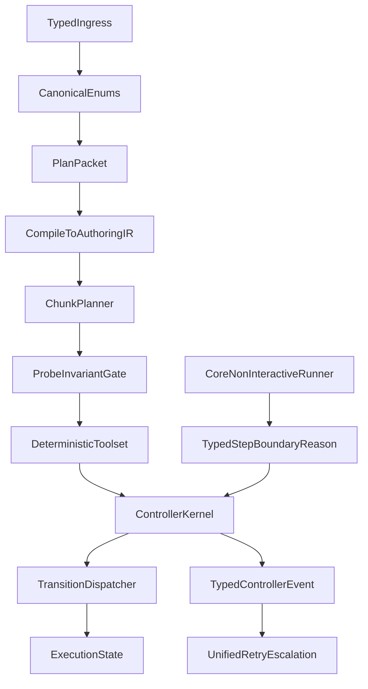

# Upstream DRY Simplification Plan

## Goals

- Make multi-dataset chunk execution deterministic and scalable.
- Move dataset/field/probe/failure semantics to typed contracts at source.
- Centralize transition + retry + lock side effects into one controller surface.
- Hard cutover only: no migration path, no legacy branches, no compatibility shims.

## Hard Cutover Constraints

- Delete all string-based routing for core control discriminators (`agent_type`, `plan_kind`, phase/failure guards, tool operation kinds).
- Delete duplicate retry/lock message builders outside the central policy/kernel.
- Delete compatibility parsing paths once typed boundaries are in place.
- Any path that cannot satisfy typed contracts must fail fast with a canonical error enum.

## Target Architecture

## Phase 0: Canonical enums and string-routing deletion

- Introduce canonical enums for:
  - `AgentType`, `PlanKind`, `ToolName`, `FileOperation`, `DbtResourceType`, `ArtifactKind`.
- Change suite entrypoints and execution context to accept typed enums, not strings.
- Remove runtime string `match`/`if` branches for these domains.
- Make compile fail if a new enum variant is not handled (exhaustive matching).

Primary files:

- [crates/react-suites/src/data_engineer/mod.rs](crates/react-suites/src/data_engineer/mod.rs)
- [react/core/src/session/mod.rs](react/core/src/session/mod.rs)
- [react/core/src/tools/mod.rs](react/core/src/tools/mod.rs)
- [crates/react-suites/src/data_engineer/tools/dbt_files.rs](crates/react-suites/src/data_engineer/tools/dbt_files.rs)

## Phase 1: Typed references and chunk-safe planning

- Add shared typed references (`DatasetRef`, `ColumnRef`) and migrate parsing to one canonical path.
- Replace repeated `<catalog>.<schema>.<table>` string parsing with typed construction + validation once.
- Make chunk planner operate on typed refs and attach probe/invariant requirements per chunk.

Primary files:

- [react/core/src/providers/dataset_catalog_provider.rs](react/core/src/providers/dataset_catalog_provider.rs)
- [react/core/src/providers/warehouse.rs](react/core/src/providers/warehouse.rs)
- [crates/react-suites/src/data_engineer/dataset_truth.rs](crates/react-suites/src/data_engineer/dataset_truth.rs)
- [crates/react-suites/src/data_engineer/tools/staging_model.rs](crates/react-suites/src/data_engineer/tools/staging_model.rs)
- [crates/react-suites/src/data_engineer/tools/sql_stats.rs](crates/react-suites/src/data_engineer/tools/sql_stats.rs)
- [crates/react-suites/src/data_engineer/tools/sql_sample.rs](crates/react-suites/src/data_engineer/tools/sql_sample.rs)

## Phase 2: Typed AuthoringIR compiler pipeline

- Introduce `authoring_ir.rs` with typed `ModelIntent`, `ColumnIntent`, `TestsIntent` (reuse existing `FieldKind`/spec types where possible).
- Compile memo/plan specs into IR before SQL/YAML generation.
- Use deterministic codegen from IR to SQL/YAML; keep probes/validation as separate deterministic post-pass.
- Remove direct memo/text-to-patch paths in authoring once IR codegen is active.

Primary files:

- [crates/react-suites/src/data_engineer/prompt_packets.rs](crates/react-suites/src/data_engineer/prompt_packets.rs)
- [crates/react-suites/src/data_engineer/plan.rs](crates/react-suites/src/data_engineer/plan.rs)
- [crates/react-suites/src/data_engineer/tools/staging_model.rs](crates/react-suites/src/data_engineer/tools/staging_model.rs)
- [crates/react-suites/src/data_engineer/tools/gold_model.rs](crates/react-suites/src/data_engineer/tools/gold_model.rs)
- [crates/react-suites/src/data_engineer/tools/apply_next_schema_batch.rs](crates/react-suites/src/data_engineer/tools/apply_next_schema_batch.rs)

## Phase 3: Capability-typed toolsets

- Type-separate deterministic vs interactive tool registries.
- Enforce compile-time: deterministic authoring phases cannot register interactive tools.
- Enforce probe-required states with probe-capable deterministic toolset only.
- Remove runtime fallback checks that compensate for wrong registry composition.

Primary files:

- [crates/react-suites/src/data_engineer/mod.rs](crates/react-suites/src/data_engineer/mod.rs)
- [react/core/src/agent/mod.rs](react/core/src/agent/mod.rs)

## Phase 4: Canonical enums at source

- Emit canonical typed failure/guard reason enums directly at tool boundaries.
- Remove downstream text heuristics and enum mapping layers entirely.
- Store canonical typed failure/guard values directly in `ExecutionState`.

Primary files:

- [crates/react-suites/src/data_engineer/controller_event.rs](crates/react-suites/src/data_engineer/controller_event.rs)
- [crates/react-suites/src/data_engineer/failure_classifier.rs](crates/react-suites/src/data_engineer/failure_classifier.rs)
- [crates/react-suites/src/data_engineer/control_flow.rs](crates/react-suites/src/data_engineer/control_flow.rs)
- [crates/react-suites/src/data_engineer/progress_controller.rs](crates/react-suites/src/data_engineer/progress_controller.rs)

## Phase 5: ControllerKernel + single transition dispatcher

- Create a central `controller_kernel.rs` owning retry, escalation, fingerprinting, lock message policy, and bounded counters.
- Move all phase transition side effects through one dispatcher entrypoint (append phase, mutate execution state, backtrack/retry updates).
- Remove duplicated per-tool/per-phase lock/retry branching.
- Add one canonical lock outcome shape (`kind=batch_locked`, canonical reason enum, deterministic next action).
- Ensure both cleanse and model schema batch paths consume the same lock policy.

Primary files:

- [crates/react-suites/src/data_engineer/control_flow.rs](crates/react-suites/src/data_engineer/control_flow.rs)
- [crates/react-suites/src/data_engineer/retry_budget.rs](crates/react-suites/src/data_engineer/retry_budget.rs)
- [crates/react-suites/src/data_engineer/mod.rs](crates/react-suites/src/data_engineer/mod.rs)
- [crates/react-suites/src/data_engineer/tools/apply_next_batch.rs](crates/react-suites/src/data_engineer/tools/apply_next_batch.rs)
- [crates/react-suites/src/data_engineer/tools/apply_next_schema_batch.rs](crates/react-suites/src/data_engineer/tools/apply_next_schema_batch.rs)

## Chunked multi-dataset reliability contract

- Each chunk carries: typed dataset set, invariant set, probe plan, expected output fields, retry budget snapshot.
- Chunk completion requires: deterministic mutation(s) OR explicit no-op reason, then typed validate event.
- Cross-chunk progress model: monotonic checklist and failure fingerprint history in `ExecutionState`, never inferred from free text.
- Add global progress guard: bounded total transition attempts per chunk group (independent of per-phase backtrack resets).
- Add explicit chunk terminal states: `Completed`, `Locked`, `FailedInvariant`, `FailedBudget`, `FailedTransition`.

## Phase 6: Non-interactive step-boundary type contract

- Replace prompt-text prefix matching for step-boundary detection with a typed core-agent fallback reason.
- Return `RunOutcomeNonInteractive::StepBoundary { reason: StepBoundaryReason }`.
- Remove string parsing from non-interactive contract enforcement.

Primary files:

- [react/core/src/agent/mod.rs](react/core/src/agent/mod.rs)
- [crates/react-suites/src/data_engineer/mod.rs](crates/react-suites/src/data_engineer/mod.rs)

## Verification strategy

- Add focused tests for:
  - canonical enum exhaustiveness and rejection of stringly invalid inputs,
  - typed dataset parsing parity across providers/tools,
  - AuthoringIR compile/codegen determinism,
  - deterministic toolset compile-time exclusions,
  - unified retry/lock/escalation behavior parity,
  - transition dispatcher ownership of side effects,
  - typed non-interactive step-boundary reason propagation,
  - global chunk transition cap behavior.
- Keep existing end-to-end suite; add stress tests with dozens of datasets split into multiple chunks.

## Execution Order (hard cutover)

1. Phase 0 (canonical enums and deletion of string routing).
2. Phase 1 (typed dataset/column refs).
3. Phase 2 (AuthoringIR compiler and removal of direct text-to-patch paths).
4. Phase 3 (capability-typed tool registries).
5. Phase 4 (single failure/guard enum family at source).
6. Phase 5 (ControllerKernel + single transition dispatcher + unified lock policy).
7. Phase 6 (typed non-interactive step-boundary reason contract).
8. Run full regression + scale tests; remove any remaining dead/legacy branches before merge.
